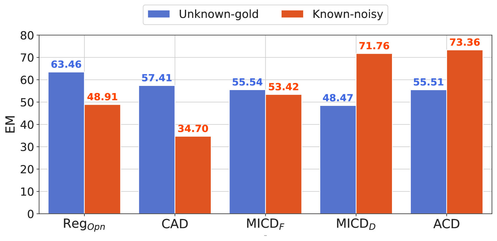
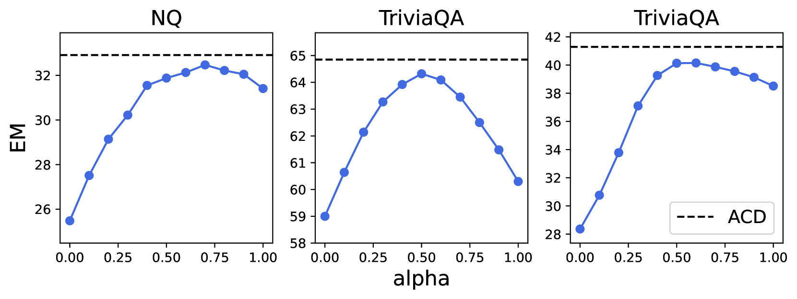
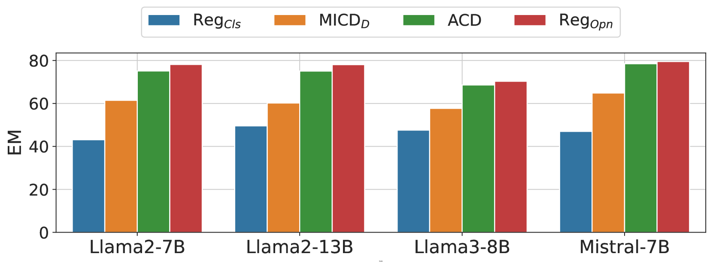

# 针对噪声上下文的处理，检索增强生成采用了自适应对比解码技术。

发布时间：2024年08月02日

`LLM应用` `问答系统` `人工智能`

> Adaptive Contrastive Decoding in Retrieval-Augmented Generation for Handling Noisy Contexts

# 摘要

> 在开放领域问答等知识密集型任务中，大型语言模型（LLM）借助外部上下文，能更好地融合外部与内部知识。近期研究通过对比解码技术，强化了上下文知识的作用。然而，这些技术在噪声环境下表现欠佳。为此，我们拓展研究范围，引入噪声上下文，并提出自适应对比解码（ACD）策略，有效提升上下文利用效率。实验表明，ACD在开放领域问答任务中，不仅性能超越传统方法，更在噪声环境下展现出更强的稳定性。

> When using large language models (LLMs) in knowledge-intensive tasks, such as open-domain question answering, external context can bridge a gap between external knowledge and LLM's parametric knowledge. Recent research has been developed to amplify contextual knowledge over the parametric knowledge of LLM with contrastive decoding approaches. While these approaches could yield truthful responses when relevant context is provided, they are prone to vulnerabilities when faced with noisy contexts. We extend the scope of previous studies to encompass noisy contexts and propose adaptive contrastive decoding (ACD) to leverage contextual influence effectively. ACD demonstrates improvements in open-domain question answering tasks compared to baselines, especially in robustness by remaining undistracted by noisy contexts in retrieval-augmented generation.

[Arxiv](https://arxiv.org/abs/2408.01084)