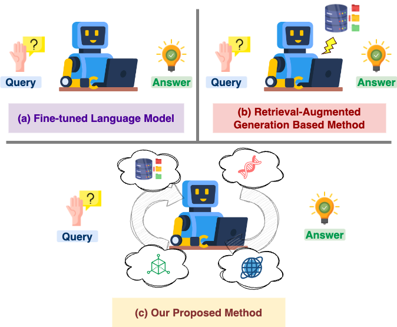
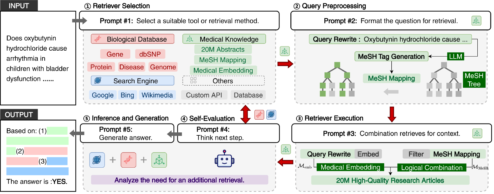
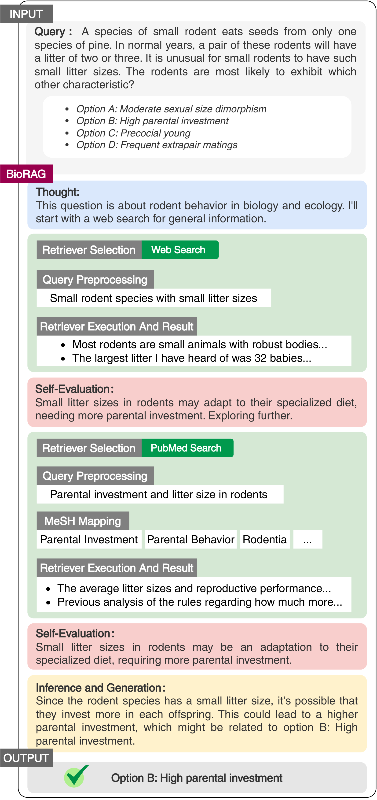
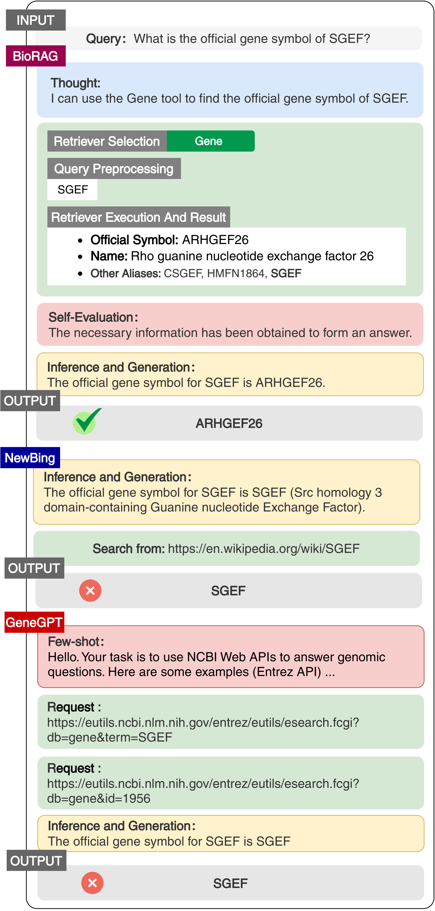
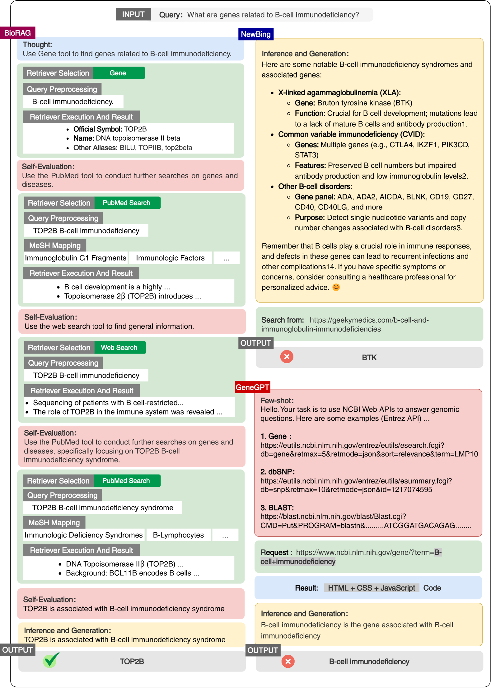

# BioRAG：专为生物学问题推理设计的 RAG-LLM 框架

发布时间：2024年08月02日

`RAG` `生命科学` `问答系统`

> BioRAG: A RAG-LLM Framework for Biological Question Reasoning

# 摘要

> 生命科学领域的问答系统面临快速发现、见解演变及知识实体复杂交互的挑战，需维护全面知识库与精准检索。为此，我们推出BioRAG，结合大型语言模型的检索增强生成框架。首先，我们解析、索引并分割2200万篇论文，构建基础知识库，并训练特定领域嵌入模型。通过融入领域知识层次，我们优化向量检索，解析查询与上下文间复杂关系。对于时效性强的查询，BioRAG拆解问题，借助搜索引擎进行迭代检索与推理。实验证明，BioRAG在多项生命科学问答任务中表现卓越，超越了微调LLM、集成搜索引擎的LLM及其他科学RAG框架。

> The question-answering system for Life science research, which is characterized by the rapid pace of discovery, evolving insights, and complex interactions among knowledge entities, presents unique challenges in maintaining a comprehensive knowledge warehouse and accurate information retrieval. To address these issues, we introduce BioRAG, a novel Retrieval-Augmented Generation (RAG) with the Large Language Models (LLMs) framework. Our approach starts with parsing, indexing, and segmenting an extensive collection of 22 million scientific papers as the basic knowledge, followed by training a specialized embedding model tailored to this domain. Additionally, we enhance the vector retrieval process by incorporating a domain-specific knowledge hierarchy, which aids in modeling the intricate interrelationships among each query and context. For queries requiring the most current information, BioRAG deconstructs the question and employs an iterative retrieval process incorporated with the search engine for step-by-step reasoning. Rigorous experiments have demonstrated that our model outperforms fine-tuned LLM, LLM with search engines, and other scientific RAG frameworks across multiple life science question-answering tasks.

[Arxiv](https://arxiv.org/abs/2408.01107)