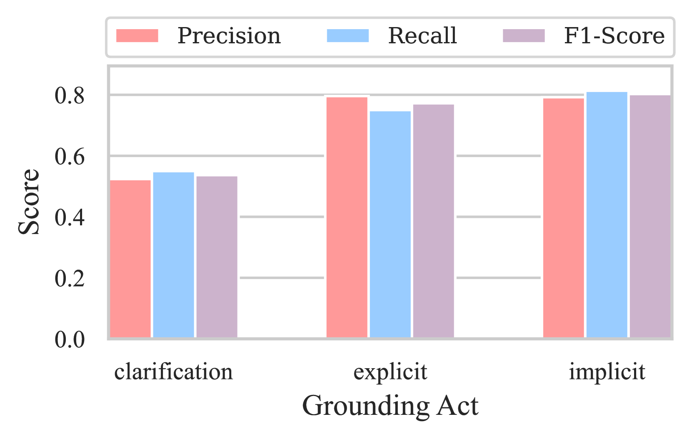
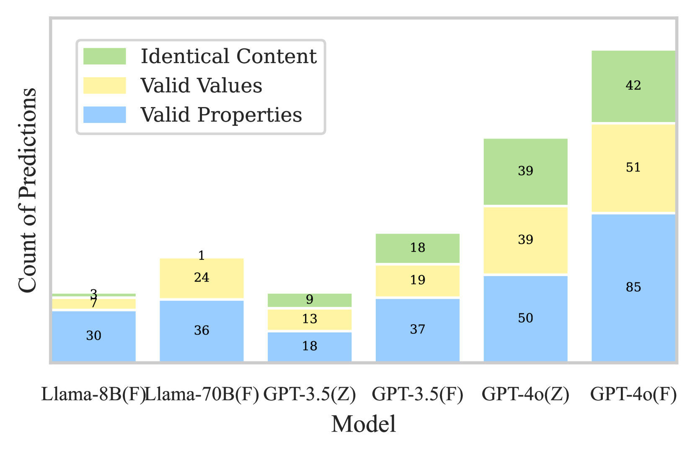
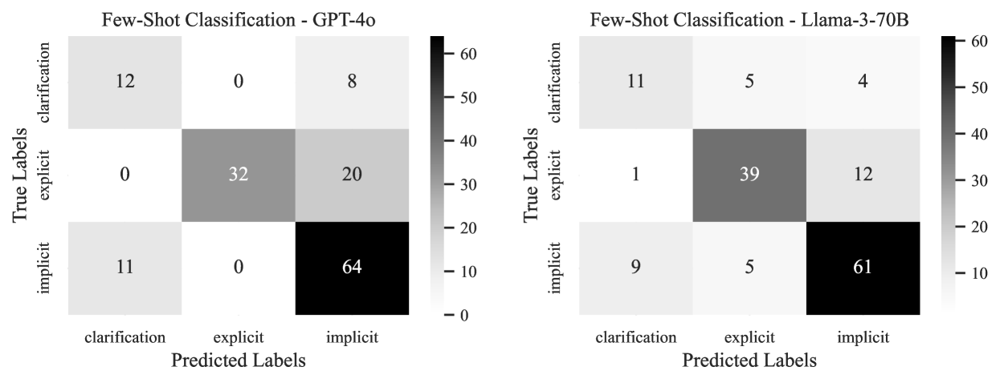

# 借助知识图谱，通过基于事实的交流来弥合对话中的信息鸿沟

发布时间：2024年08月02日

`LLM应用` `对话系统` `知识图谱`

> Bridging Information Gaps in Dialogues With Grounded Exchanges Using Knowledge Graphs

# 摘要

> 知识模型是构建对话系统的基石，尤其在处理特定领域知识时。为确保信息传递的效率，系统需将用户理解与自身知识库对齐。然而，自然语言与系统内部知识间的语义差异常导致沟通障碍。为此，我们探索了大型语言模型在对话基础中的应用，旨在通过建立共享知识来填补信息鸿沟。我们通过标注五个领域的对话，构建了名为BridgeKG的新语料库，并进行实验以评估模型在分类基础行为和识别知识图谱中信息项的能力。研究揭示了模型如何利用上下文学习应对对话基础任务，并指出了常见的预测错误。此外，我们还探讨了模型如何利用知识图谱作为连接非结构化对话与结构化信息的桥梁。

> Knowledge models are fundamental to dialogue systems for enabling conversational interactions, which require handling domain-specific knowledge. Ensuring effective communication in information-providing conversations entails aligning user understanding with the knowledge available to the system. However, dialogue systems often face challenges arising from semantic inconsistencies in how information is expressed in natural language compared to how it is represented within the system's internal knowledge. To address this problem, we study the potential of large language models for conversational grounding, a mechanism to bridge information gaps by establishing shared knowledge between dialogue participants. Our approach involves annotating human conversations across five knowledge domains to create a new dialogue corpus called BridgeKG. Through a series of experiments on this dataset, we empirically evaluate the capabilities of large language models in classifying grounding acts and identifying grounded information items within a knowledge graph structure. Our findings offer insights into how these models use in-context learning for conversational grounding tasks and common prediction errors, which we illustrate with examples from challenging dialogues. We discuss how the models handle knowledge graphs as a semantic layer between unstructured dialogue utterances and structured information items.

[Arxiv](https://arxiv.org/abs/2408.01088)