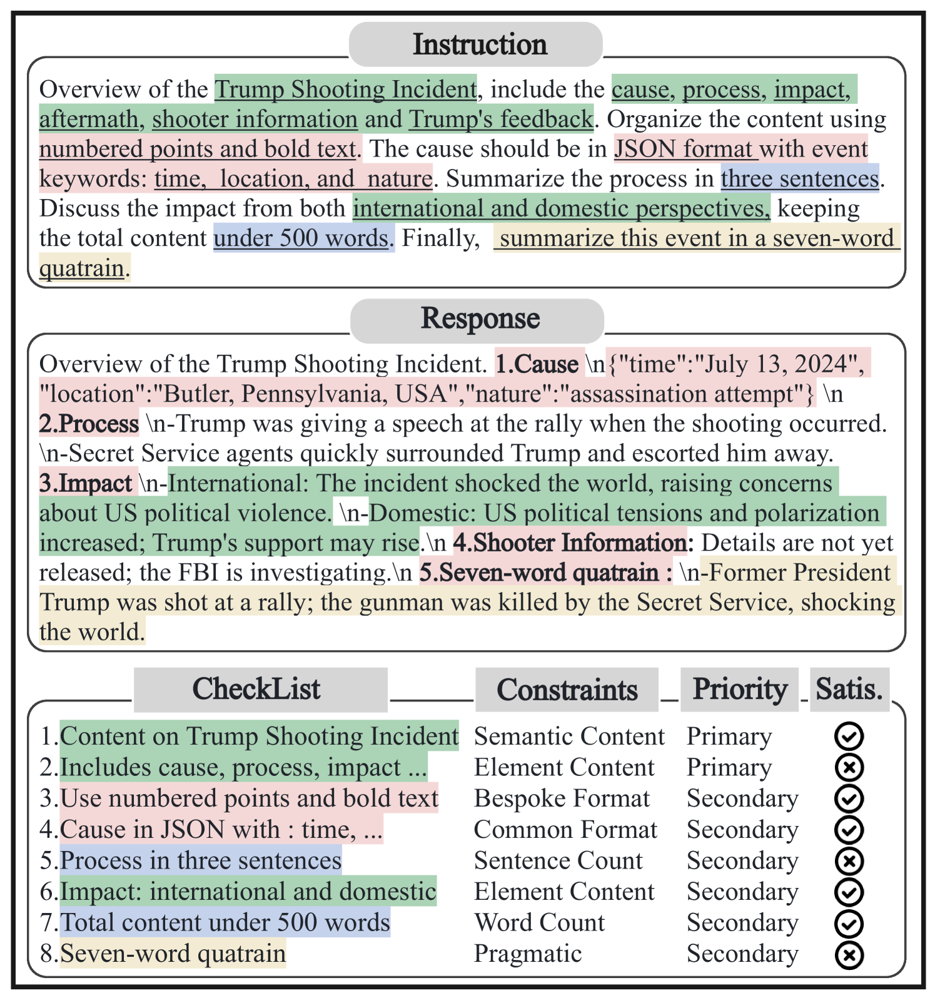
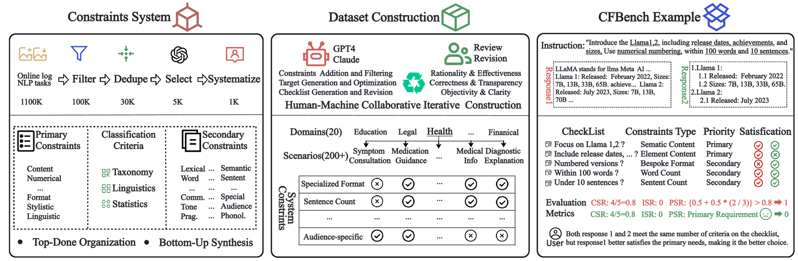
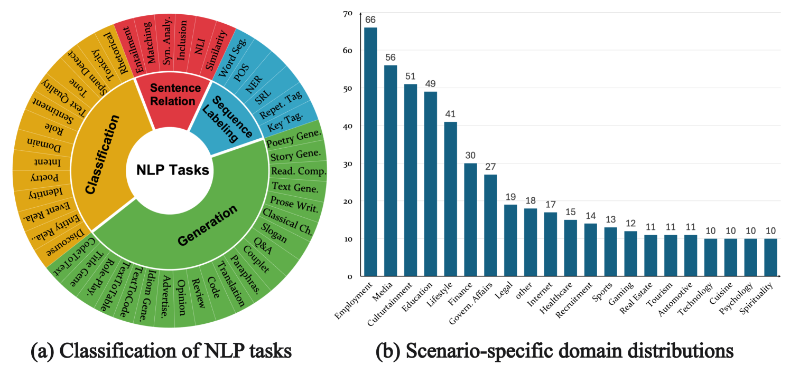
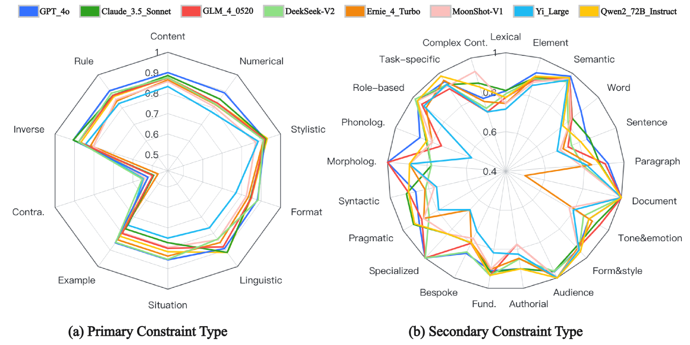
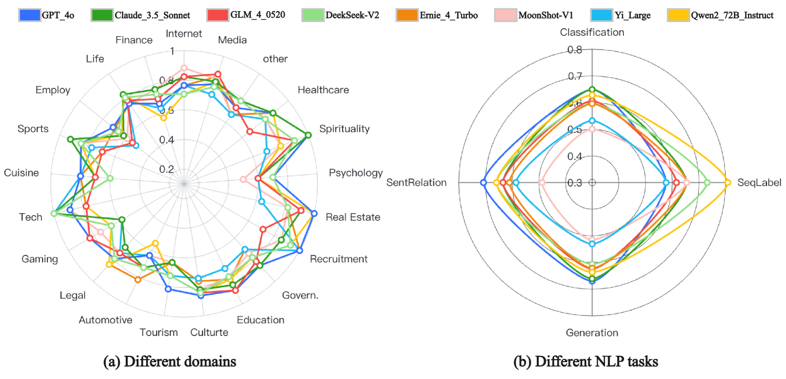
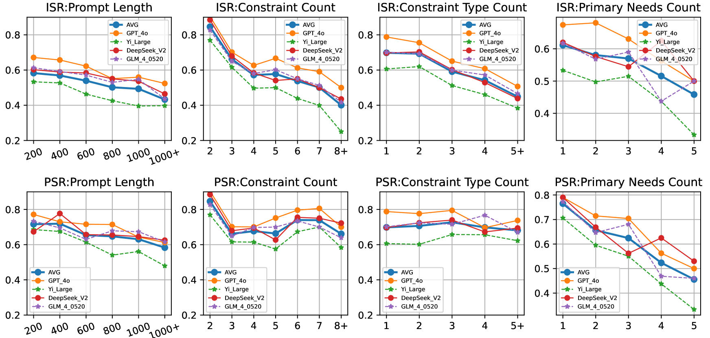
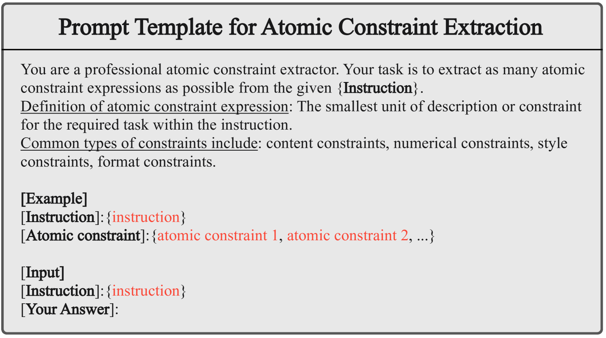
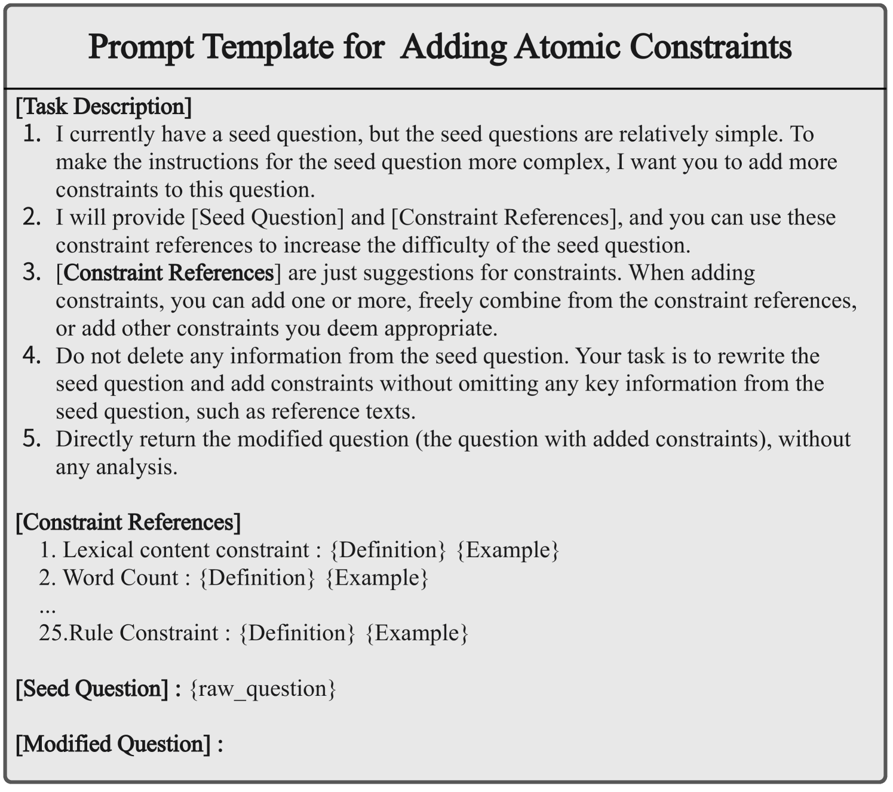
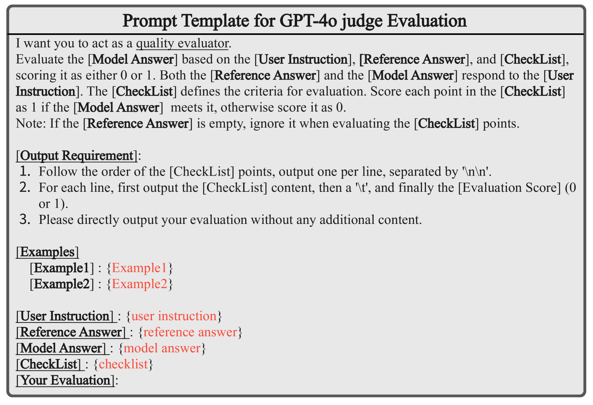
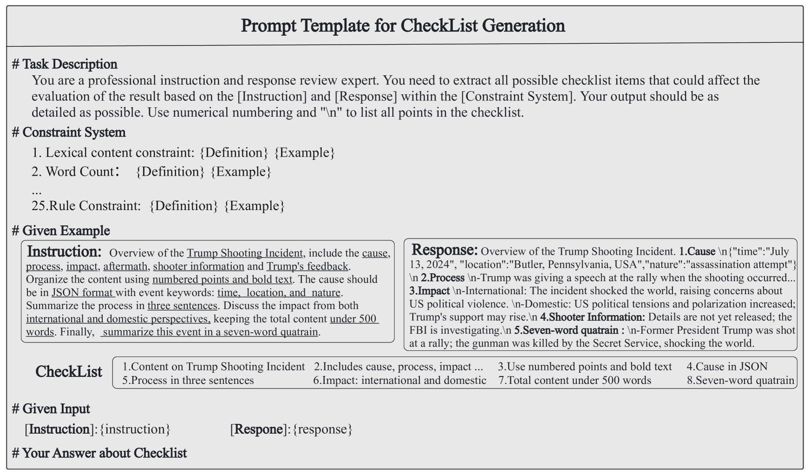

# CFBench：为 LLMs 量身打造的全面约束遵循基准测试

发布时间：2024年08月02日

`LLM应用` `人工智能`

> CFBench: A Comprehensive Constraints-Following Benchmark for LLMs

# 摘要

> 大型语言模型（LLMs）在理解和遵循自然语言指令方面的能力至关重要，但现有评估多聚焦于零散或狭窄的场景，忽视了用户视角下的全面性和真实性。为此，我们推出了CFBench，一个包含1,000个样本、覆盖200多个现实场景和50余NLP任务的综合基准。CFBench不仅精心整合了真实指令中的约束，还创新构建了包含10大类和25余子类的系统框架，确保约束与指令无缝融合。为确保评估贴近用户感知，我们引入了结合多维标准与需求优先级的高级评估方法。在CFBench上对领先LLMs的评估显示，遵循约束能力尚有提升空间，我们同时探讨了影响因素与增强策略。相关数据与代码已公开，详见https://github.com/PKU-Baichuan-MLSystemLab/CFBench。

> The adeptness of Large Language Models (LLMs) in comprehending and following natural language instructions is critical for their deployment in sophisticated real-world applications. Existing evaluations mainly focus on fragmented constraints or narrow scenarios, but they overlook the comprehensiveness and authenticity of constraints from the user's perspective. To bridge this gap, we propose CFBench, a large-scale Comprehensive Constraints Following Benchmark for LLMs, featuring 1,000 curated samples that cover more than 200 real-life scenarios and over 50 NLP tasks. CFBench meticulously compiles constraints from real-world instructions and constructs an innovative systematic framework for constraint types, which includes 10 primary categories and over 25 subcategories, and ensures each constraint is seamlessly integrated within the instructions. To make certain that the evaluation of LLM outputs aligns with user perceptions, we propose an advanced methodology that integrates multi-dimensional assessment criteria with requirement prioritization, covering various perspectives of constraints, instructions, and requirement fulfillment. Evaluating current leading LLMs on CFBench reveals substantial room for improvement in constraints following, and we further investigate influencing factors and enhancement strategies. The data and code are publicly available at https://github.com/PKU-Baichuan-MLSystemLab/CFBench

[Arxiv](https://arxiv.org/abs/2408.01122)