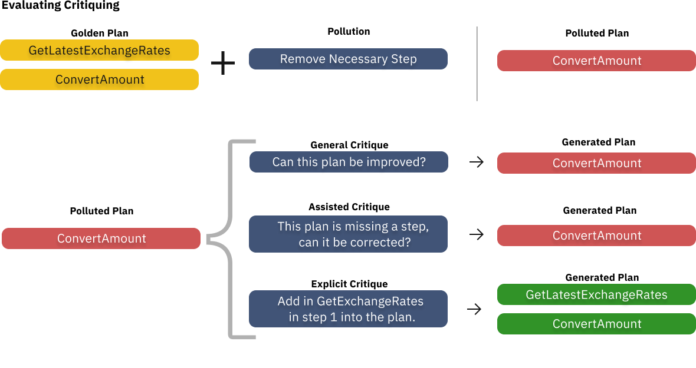

# 通过组建大型语言模型联盟，AI代理的鲁健性得到了显著提升。

发布时间：2024年08月02日

`LLM应用` `人工智能` `软件开发`

> Coalitions of Large Language Models Increase the Robustness of AI Agents

# 摘要

> 大型语言模型（LLM）的兴起，不仅重塑了我们与数字世界的互动，还引领了以LLM为核心的AI助手的发展，以优化日常工作流程。然而，尽管LLM功能强大，能展现某些新特性，它们在逻辑推理上却显不足，尤其在执行复杂工作流程的各项子任务时表现欠佳。现有研究通过大规模通用预训练或针对特定工具的精细调整来弥补这一短板。我们探索了一种新思路：结合多个在特定子任务上表现卓越的预训练LLM，形成一个联盟，以期达到甚至超越单一模型代理的性能。这种模型联盟策略不仅有望增强AI助手的鲁棒性，还能降低运营成本。我们的研究表明，通过整合预训练模型联盟，可以减少对微调的依赖，这一策略同样适用于其他基于LLM的系统。

> The emergence of Large Language Models (LLMs) have fundamentally altered the way we interact with digital systems and have led to the pursuit of LLM powered AI agents to assist in daily workflows. LLMs, whilst powerful and capable of demonstrating some emergent properties, are not logical reasoners and often struggle to perform well at all sub-tasks carried out by an AI agent to plan and execute a workflow. While existing studies tackle this lack of proficiency by generalised pretraining at a huge scale or by specialised fine-tuning for tool use, we assess if a system comprising of a coalition of pretrained LLMs, each exhibiting specialised performance at individual sub-tasks, can match the performance of single model agents. The coalition of models approach showcases its potential for building robustness and reducing the operational costs of these AI agents by leveraging traits exhibited by specific models. Our findings demonstrate that fine-tuning can be mitigated by considering a coalition of pretrained models and believe that this approach can be applied to other non-agentic systems which utilise LLMs.

[Arxiv](https://arxiv.org/abs/2408.01380)