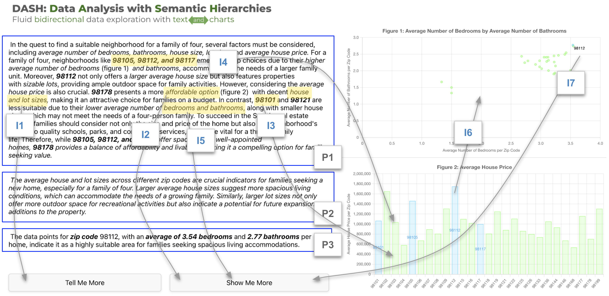

# DASH：一款双模态数据探索工具，专为交互式文本与可视化设计。

发布时间：2024年08月02日

`LLM应用` `数据分析` `可视化`

> DASH: A Bimodal Data Exploration Tool for Interactive Text and Visualizations

# 摘要

> 结合文本内容（如标题、注释和字幕）与可视化，能显著提升数据探索的理解和信息获取。然而，现有工具往往未能有效整合长篇有意义的散文与视觉数据。本文推出的DASH工具，创新地将语义层次融入可视化与文本分析的交互中，通过拖放操作，利用大型语言模型的文本生成能力，轻松构建数据驱动的故事。初步用户评估显示，DASH在数据探索中的文本与图表集成功能极具实用价值。

> Integrating textual content, such as titles, annotations, and captions, with visualizations facilitates comprehension and takeaways during data exploration. Yet current tools often lack mechanisms for integrating meaningful long-form prose with visual data. This paper introduces DASH, a bimodal data exploration tool that supports integrating semantic levels into the interactive process of visualization and text-based analysis. DASH operationalizes a modified version of Lundgard et al.'s semantic hierarchy model that categorizes data descriptions into four levels ranging from basic encodings to high-level insights. By leveraging this structured semantic level framework and a large language model's text generation capabilities, DASH enables the creation of data-driven narratives via drag-and-drop user interaction. Through a preliminary user evaluation, we discuss the utility of DASH's text and chart integration capabilities when participants perform data exploration with the tool.

[Arxiv](https://arxiv.org/abs/2408.01011)