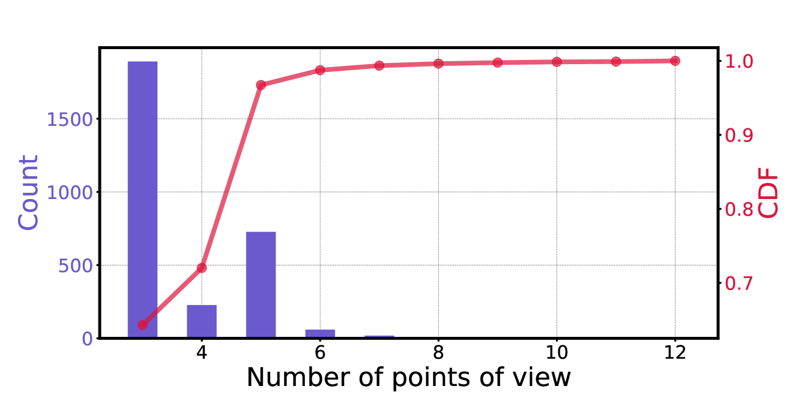

# DebateQA：探讨在争议知识领域的问答评估

发布时间：2024年08月02日

`LLM应用` `人工智能`

> DebateQA: Evaluating Question Answering on Debatable Knowledge

# 摘要

> 随着大型语言模型（LLM）的兴起，我们迫切需要一种可靠的方法来评估它们在处理争议性问题上的能力。传统的QA基准已不再适用，因为它们假设的固定答案无法满足这一需求。为此，我们推出了DebateQA数据集，包含2,941个争议性问题，每个问题都附有多个人工注释的部分答案，全面捕捉不同观点。我们设计了两个评估指标：观点多样性，衡量观点的全面性；争议意识，评估模型是否意识到问题的争议性。实验结果显示，这两个指标不仅符合人类偏好，而且在不同模型中表现稳定。通过DebateQA数据集和这两个指标，我们对12个流行的LLM及检索增强生成方法进行了评估。结果表明，尽管LLM在识别争议问题上表现出色，但在提供包含多样观点的全面答案方面，各模型的能力存在显著差异。

> The rise of large language models (LLMs) has enabled us to seek answers to inherently debatable questions on LLM chatbots, necessitating a reliable way to evaluate their ability. However, traditional QA benchmarks assume fixed answers are inadequate for this purpose. To address this, we introduce DebateQA, a dataset of 2,941 debatable questions, each accompanied by multiple human-annotated partial answers that capture a variety of perspectives. We develop two metrics: Perspective Diversity, which evaluates the comprehensiveness of perspectives, and Dispute Awareness, which assesses if the LLM acknowledges the question's debatable nature. Experiments demonstrate that both metrics align with human preferences and are stable across different underlying models. Using DebateQA with two metrics, we assess 12 popular LLMs and retrieval-augmented generation methods. Our findings reveal that while LLMs generally excel at recognizing debatable issues, their ability to provide comprehensive answers encompassing diverse perspectives varies considerably.

[Arxiv](https://arxiv.org/abs/2408.01419)