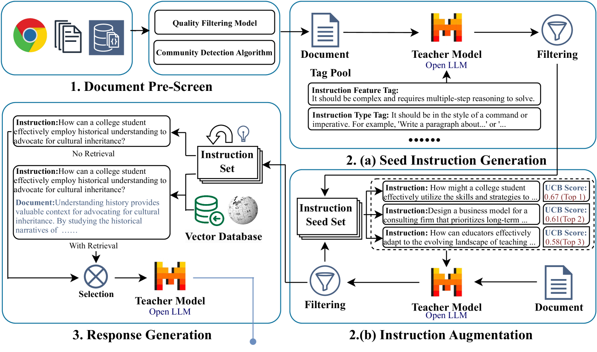
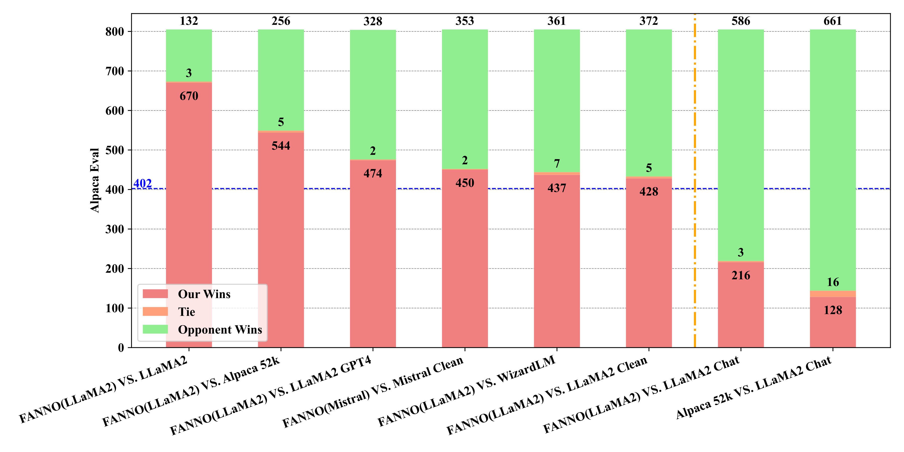
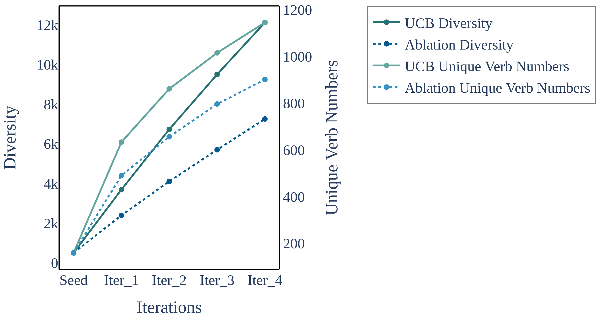
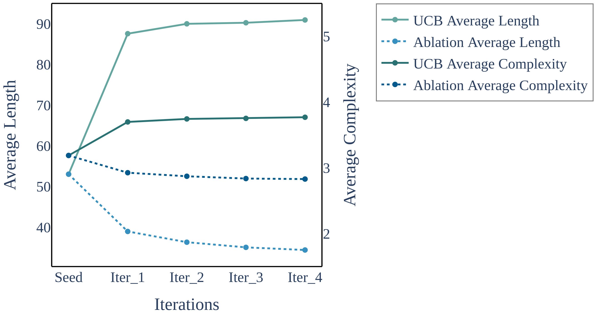
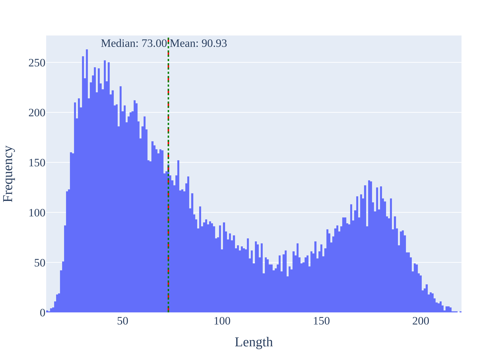
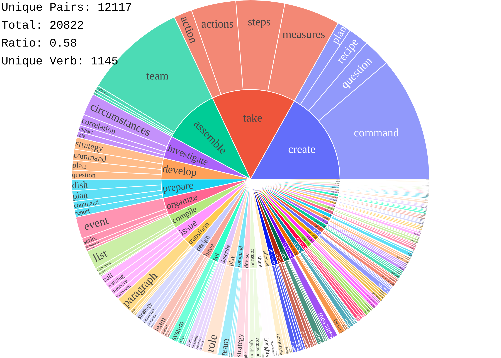
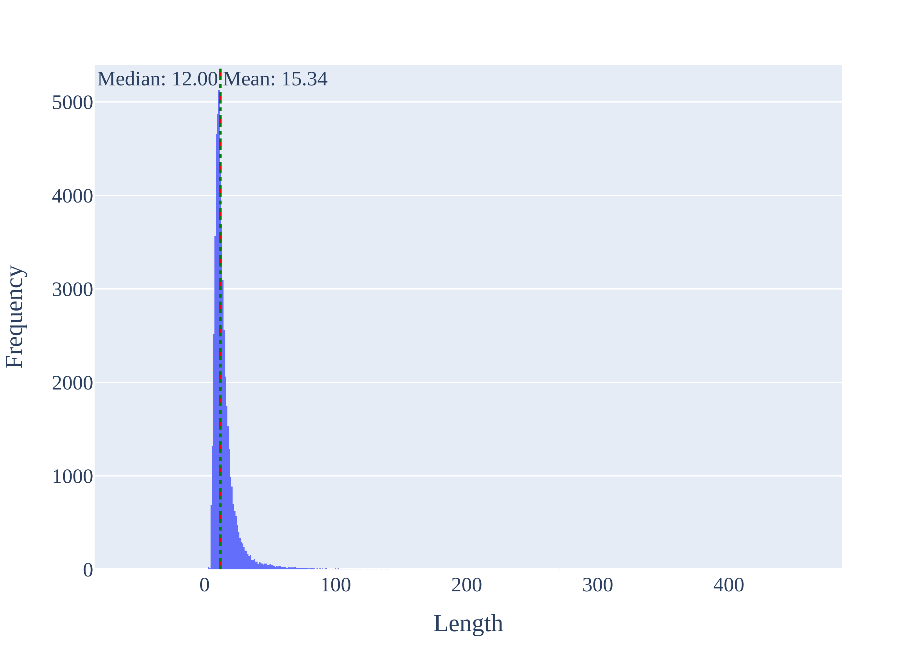
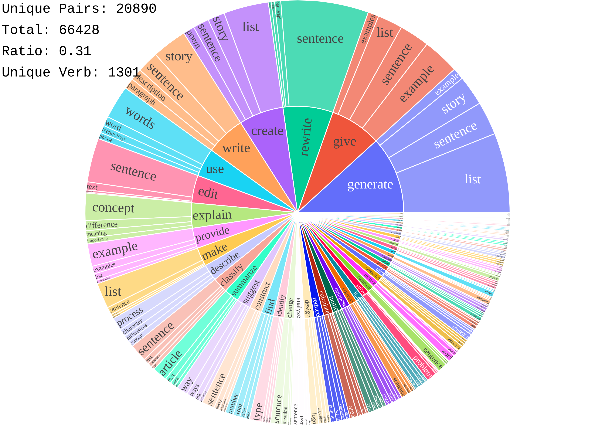
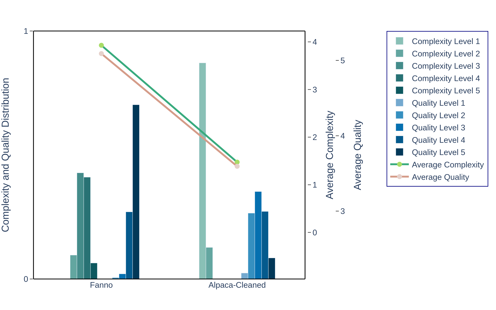

# FANNO：借助开源LLM，提升高质量指令数据的丰富性

发布时间：2024年08月02日

`LLM应用` `人工智能` `开源软件`

> FANNO: Augmenting High-Quality Instruction Data with Open-Sourced LLMs Only

# 摘要

> 指令微调是提升大型语言模型 (LLM) 任务性能的关键技术。然而，传统上指令数据集的标注成本高昂且耗时，常需手动或通过昂贵的专有 LLM API 调用。为此，我们推出了 FANNO，一个全自主、开源的框架，它革新了标注流程，无需预先标注数据。借助 Mistral-7b-instruct 模型，FANNO 通过文档预筛选、指令生成和响应生成的结构化流程，高效产出多样化高质量数据集。实验显示，FANNO 生成的数据质量与人工标注或清洗的数据集如 Alpaca-GPT4-Cleaned 相当，且完全免费。

> Instruction fine-tuning stands as a crucial advancement in leveraging large language models (LLMs) for enhanced task performance. However, the annotation of instruction datasets has traditionally been expensive and laborious, often relying on manual annotations or costly API calls of proprietary LLMs. To address these challenges, we introduce FANNO, a fully autonomous, open-sourced framework that revolutionizes the annotation process without the need for pre-existing annotated data. Utilizing a Mistral-7b-instruct model, FANNO efficiently produces diverse and high-quality datasets through a structured process involving document pre-screening, instruction generation, and response generation. Experiments on Open LLM Leaderboard and AlpacaEval benchmark show that the FANNO can generate high-quality data with diversity and complexity for free, comparable to human-annotated or cleaned datasets like Alpaca-GPT4-Cleaned.

[Arxiv](https://arxiv.org/abs/2408.01323)