# FBSDiff：一种即插即用的技术，通过替换扩散特征的频率带来实现高度可控的文本驱动图像转换。

发布时间：2024年08月02日

`LLM应用` `内容创作` `人工智能`

> FBSDiff: Plug-and-Play Frequency Band Substitution of Diffusion Features for Highly Controllable Text-Driven Image Translation

# 摘要

> 大规模文本到图像扩散模型在生成式AI领域取得了突破性进展，能根据文本提示创造出惊人的图像。然而，这些模型的不可控性限制了其在实际内容创作中的应用。本文提出了一种创新方法，通过即插即用的方式，将预训练的T2I模型转换为I2I模型，实现了高质量、多功能的文本驱动图像翻译，无需额外的模型训练或优化。我们通过在DCT频谱空间中建模不同的扩散特征频率带，设计了一种动态替换层，以参考图像指导生成过程，从而在图像翻译中实现高度灵活和可控的效果。实验结果表明，我们的方法在视觉质量、多功能性和可控性方面均优于现有技术。

> Large-scale text-to-image diffusion models have been a revolutionary milestone in the evolution of generative AI and multimodal technology, allowing extraordinary image generation based on natural-language text prompts. However, the issue of lacking controllability of such models restricts their practical applicability for real-life content creation, for which attention has been focused on leveraging a reference image to control text-to-image synthesis. Due to the close correlation between the reference image and the generated image, this problem can also be regarded as the task of manipulating (or editing) the reference image as per the text, namely text-driven image-to-image translation. This paper contributes a novel, concise, and efficient approach that adapts the pre-trained large-scale text-to-image (T2I) diffusion model to the image-to-image (I2I) paradigm in a plug-and-play manner, realizing high-quality and versatile text-driven I2I translation without any model training, model fine-tuning, or online optimization process. To guide T2I generation with a reference image, we propose to model diverse guiding factors with correspondingly different frequency bands of diffusion features in the DCT spectral space, and accordingly devise a novel frequency band substitution layer that dynamically substitutes a certain DCT frequency band of the diffusion features with the corresponding counterpart of the reference image along the reverse sampling process. We demonstrate that our method flexibly enables highly controllable text-driven I2I translation both in the guiding factor and guiding intensity of the reference image, simply by tuning the type and bandwidth of the substituted frequency band, respectively. Extensive qualitative and quantitative experiments verify the superiority of our approach over related methods in I2I translation visual quality, versatility, and controllability.

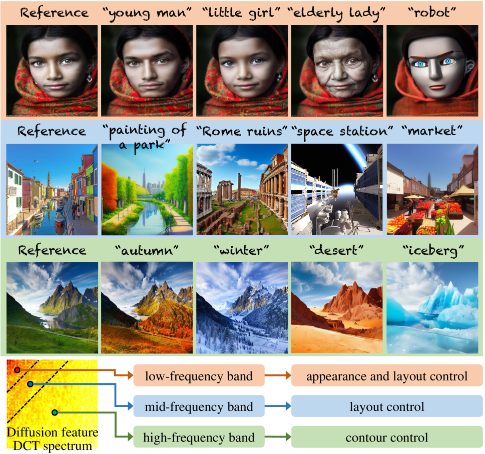

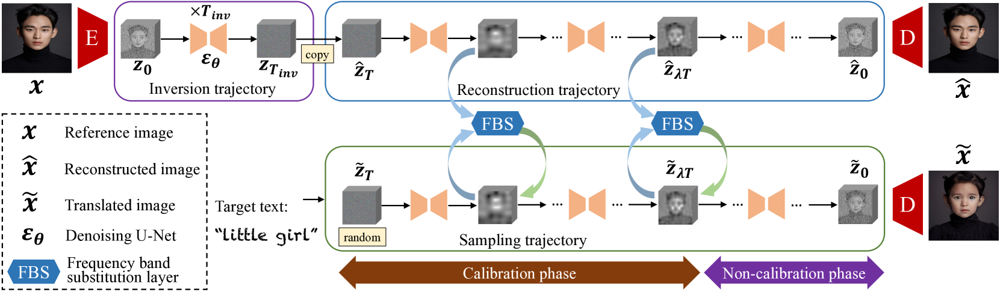

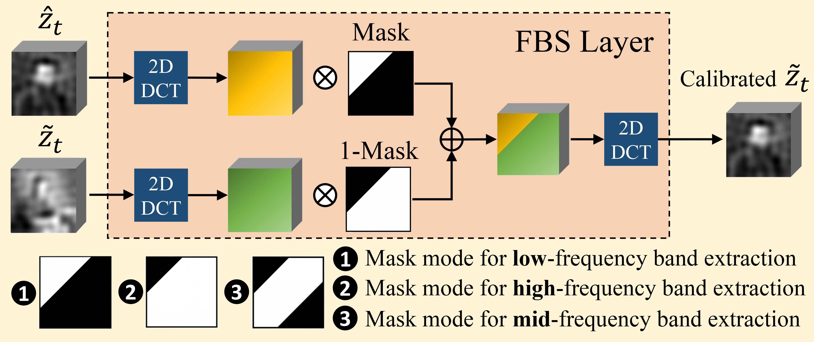

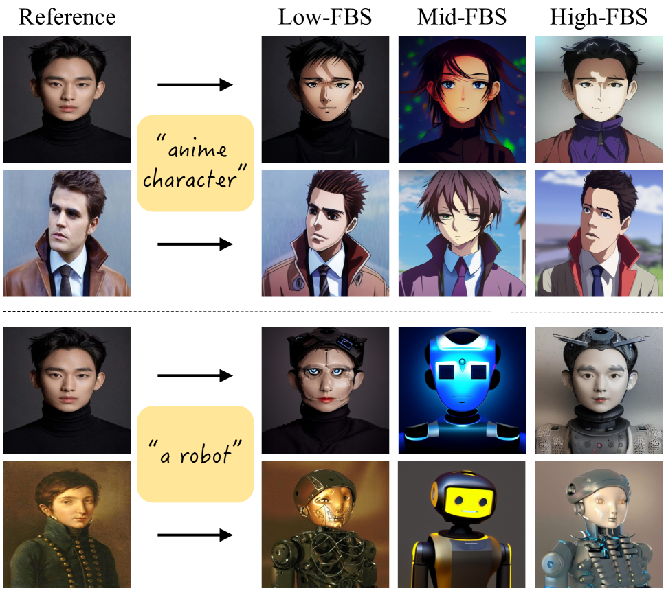

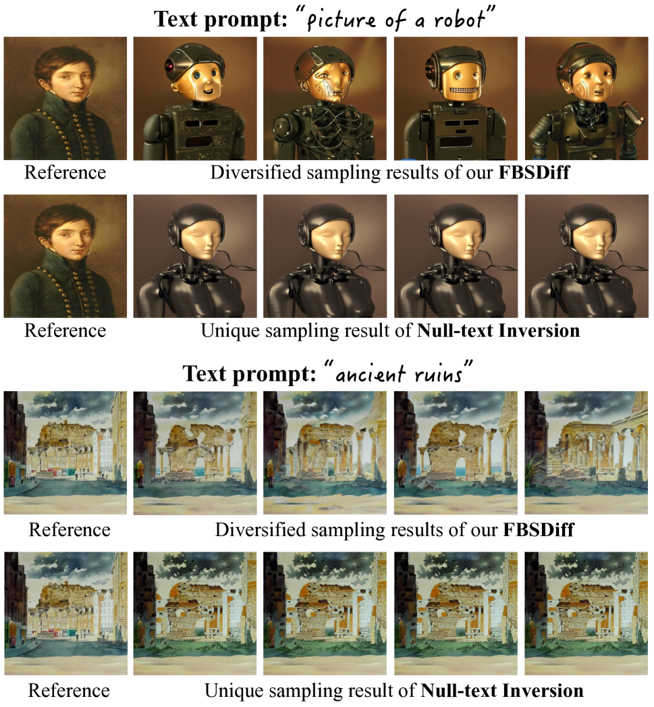

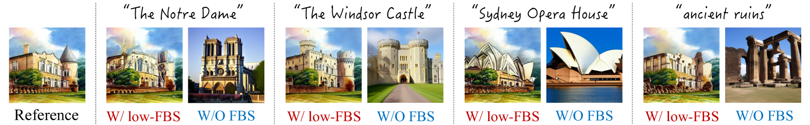

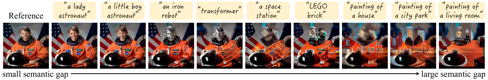

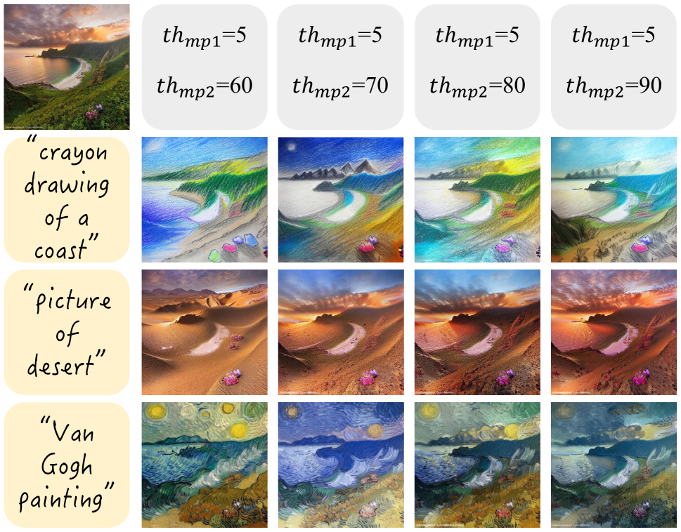

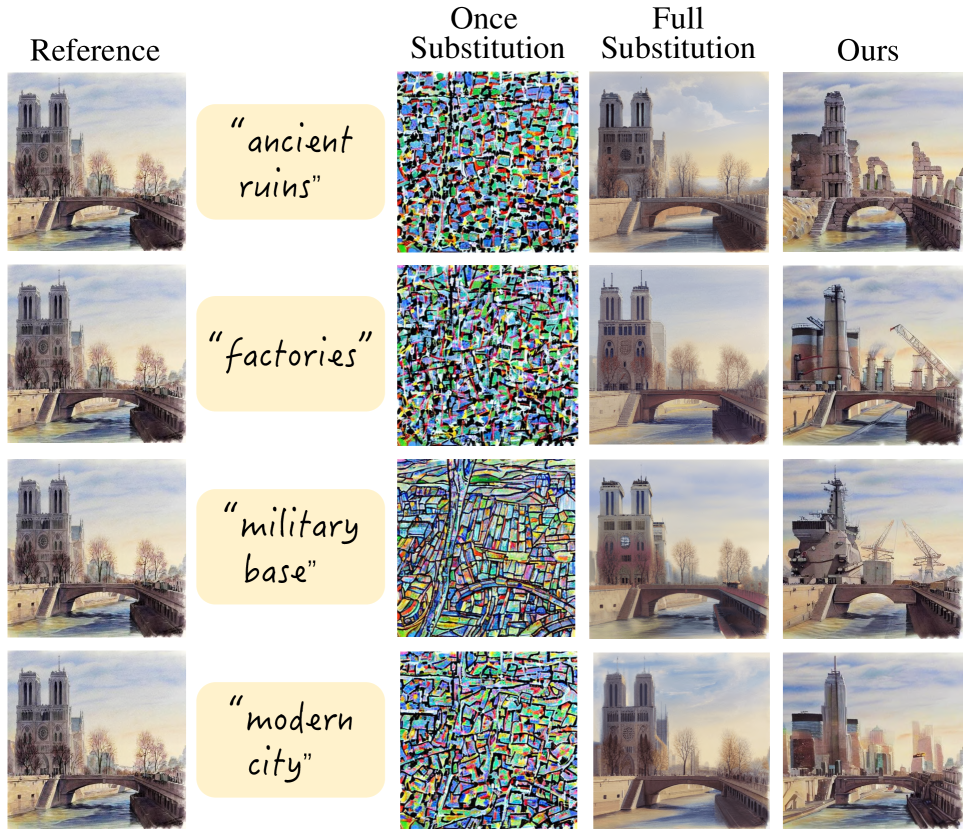

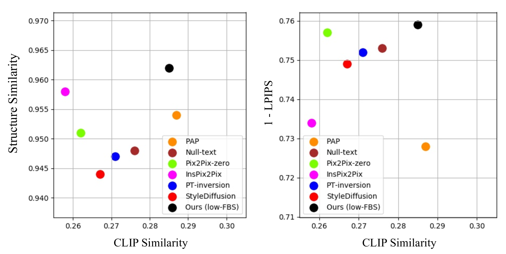

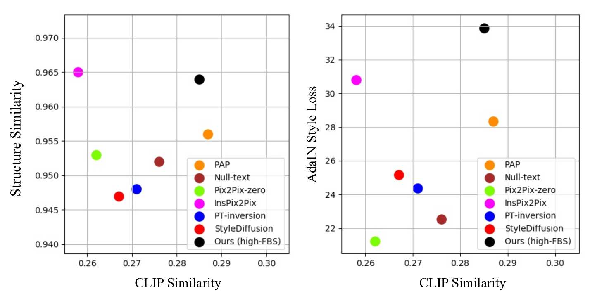

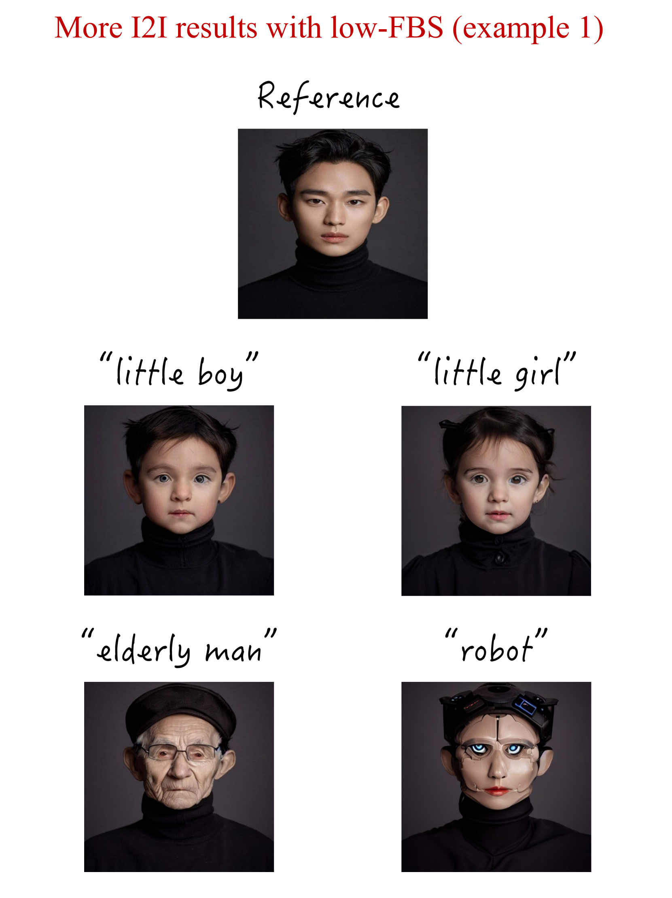

[Arxiv](https://arxiv.org/abs/2408.00998)