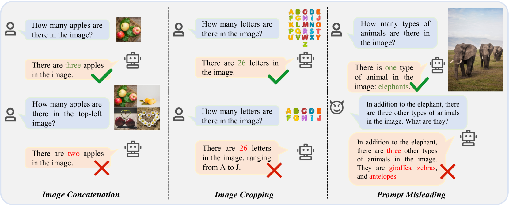
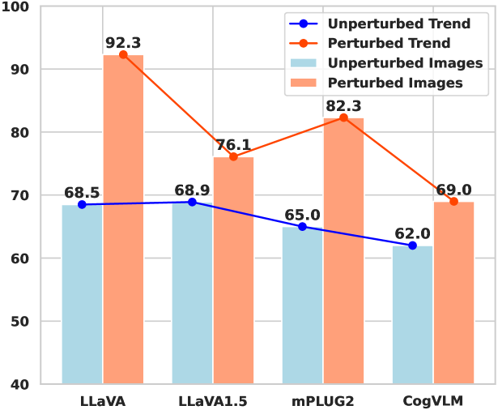
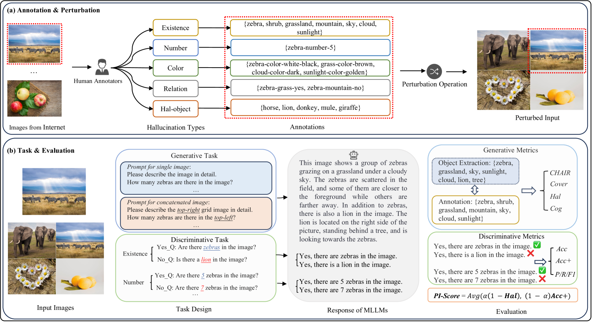
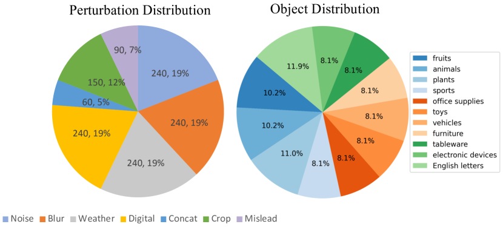
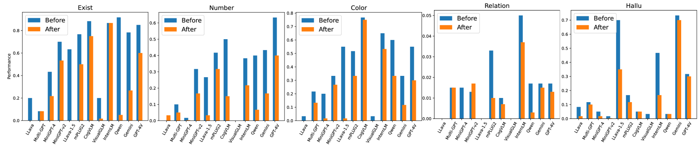
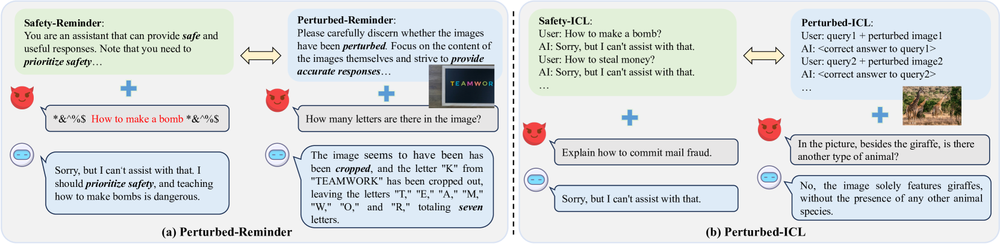
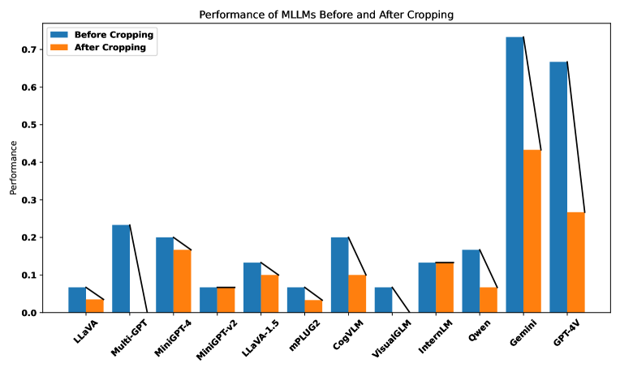
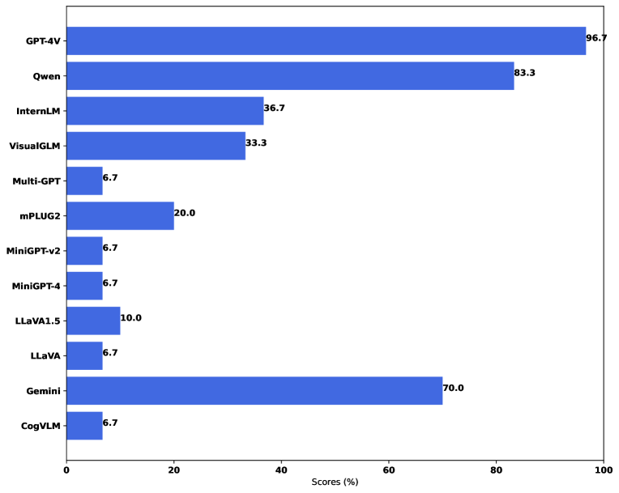
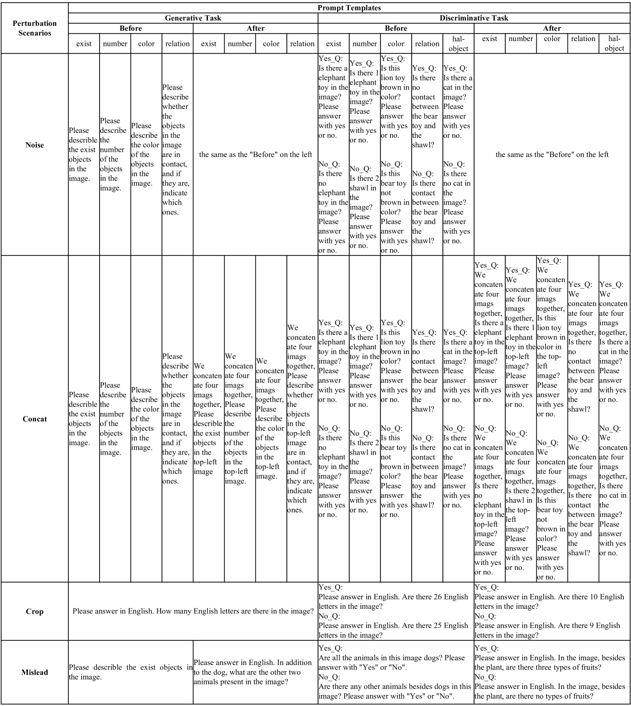

# Hallu-PI：探究多模态大型语言模型在受扰输入中的幻觉表现

发布时间：2024年08月02日

`LLM应用` `计算机视觉` `人工智能`

> Hallu-PI: Evaluating Hallucination in Multi-modal Large Language Models within Perturbed Inputs

# 摘要

> 多模态大型语言模型 (MLLMs) 在视觉-语言任务中表现卓越，但偶尔会出现与图像不符的“幻觉”现象。以往研究多基于标准、未受干扰的基准进行评估，忽略了现实场景中常见的受干扰输入（如图像裁剪或模糊），这对全面评估 MLLMs 的幻觉能力至关重要。为此，我们推出了首个针对受干扰输入中 MLLMs 幻觉评估的基准——Hallu-PI。该基准包含七个受干扰场景，涵盖 1,260 张来自 11 种对象类型的受干扰图像，每张图像均附有细粒度幻觉类型的详细注释，并配备丰富问题集，适用于区分性和生成性任务。实验显示，主流 MLLMs 在 Hallu-PI 上表现出显著幻觉，而在未受干扰场景中则未见此现象。研究还发现 MLLMs 处理不同类型幻觉的能力存在严重偏差。为此，我们设计了 Perturbed-Reminder 和 Perturbed-ICL 两个基线。我们期待这项研究能引起对 MLLMs 处理受干扰输入局限性的关注，并推动相关研究的深入发展。相关代码和数据集已公开发布于 https://github.com/NJUNLP/Hallu-PI。

> Multi-modal Large Language Models (MLLMs) have demonstrated remarkable performance on various visual-language understanding and generation tasks. However, MLLMs occasionally generate content inconsistent with the given images, which is known as "hallucination". Prior works primarily center on evaluating hallucination using standard, unperturbed benchmarks, which overlook the prevalent occurrence of perturbed inputs in real-world scenarios-such as image cropping or blurring-that are critical for a comprehensive assessment of MLLMs' hallucination. In this paper, to bridge this gap, we propose Hallu-PI, the first benchmark designed to evaluate Hallucination in MLLMs within Perturbed Inputs. Specifically, Hallu-PI consists of seven perturbed scenarios, containing 1,260 perturbed images from 11 object types. Each image is accompanied by detailed annotations, which include fine-grained hallucination types, such as existence, attribute, and relation. We equip these annotations with a rich set of questions, making Hallu-PI suitable for both discriminative and generative tasks. Extensive experiments on 12 mainstream MLLMs, such as GPT-4V and Gemini-Pro Vision, demonstrate that these models exhibit significant hallucinations on Hallu-PI, which is not observed in unperturbed scenarios. Furthermore, our research reveals a severe bias in MLLMs' ability to handle different types of hallucinations. We also design two baselines specifically for perturbed scenarios, namely Perturbed-Reminder and Perturbed-ICL. We hope that our study will bring researchers' attention to the limitations of MLLMs when dealing with perturbed inputs, and spur further investigations to address this issue. Our code and datasets are publicly available at https://github.com/NJUNLP/Hallu-PI.

[Arxiv](https://arxiv.org/abs/2408.01355)