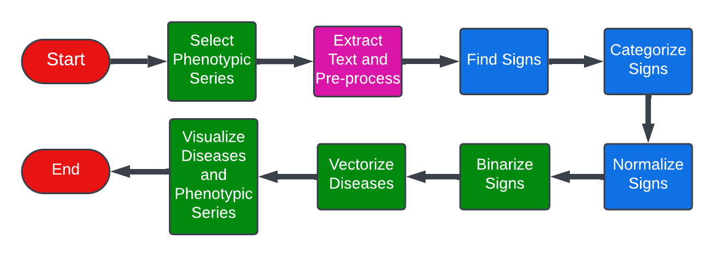
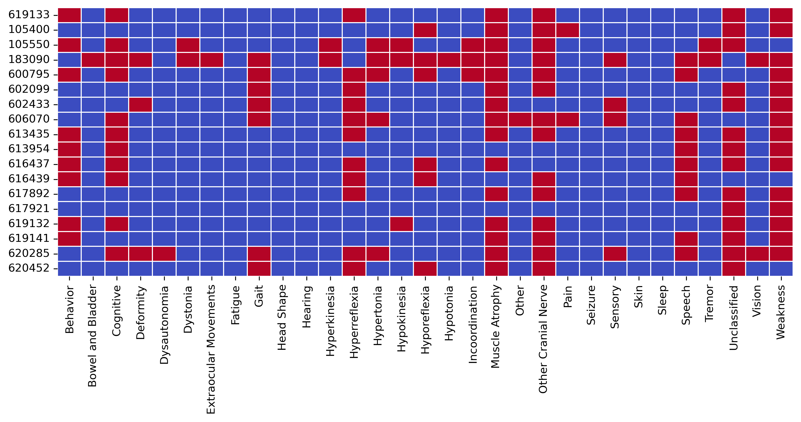
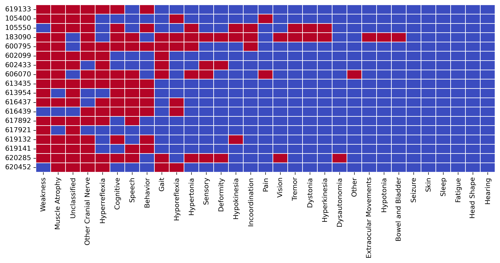
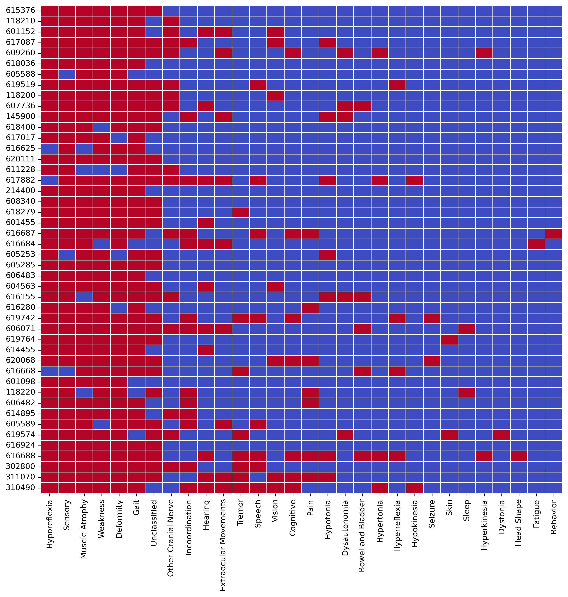
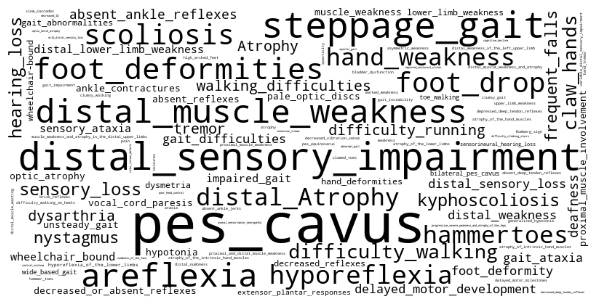
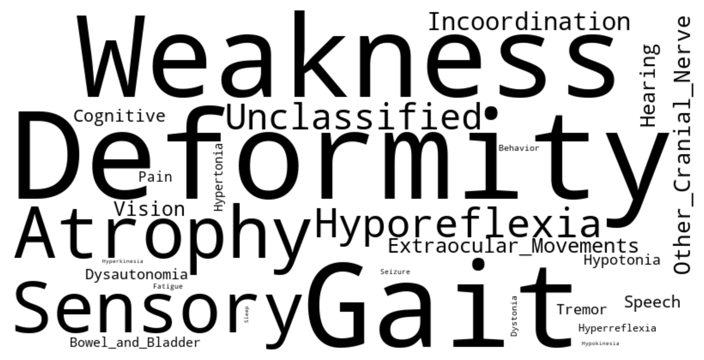
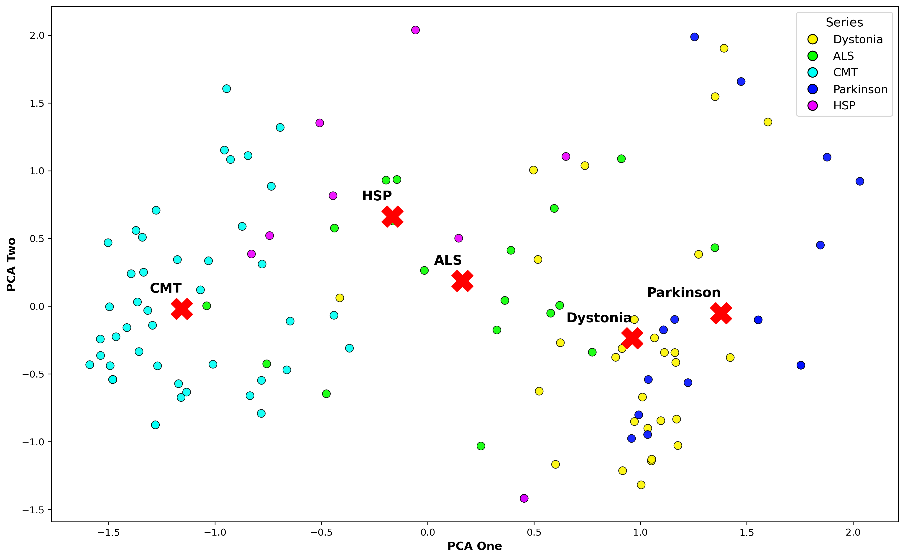

# 利用大型语言模型高效分析临床文本表型

发布时间：2024年08月02日

`LLM应用` `人工智能`

> High-Throughput Phenotyping of Clinical Text Using Large Language Models

# 摘要

> 高通量表型分析的自动化，将患者症状精准映射至标准本体，是精准医疗的关键。本研究利用大型语言模型，对OMIM数据库中的临床摘要进行自动表型分析。这些富含表型数据的摘要，可替代医生笔记。我们对比了GPT-4与GPT-3.5-Turbo的性能，发现GPT-4在症状的识别、分类与规范化上更胜一筹，其表现与人工注释者的高度一致。尽管在症状规范化上略有不足，GPT-4的广泛预训练确保了其在多样的表型任务中的卓越性能与泛化能力，且无需依赖人工注释的训练数据。大型语言模型有望成为临床文本高通量表型自动化的首选方法。

> High-throughput phenotyping automates the mapping of patient signs to standardized ontology concepts and is essential for precision medicine. This study evaluates the automation of phenotyping of clinical summaries from the Online Mendelian Inheritance in Man (OMIM) database using large language models. Due to their rich phenotype data, these summaries can be surrogates for physician notes. We conduct a performance comparison of GPT-4 and GPT-3.5-Turbo. Our results indicate that GPT-4 surpasses GPT-3.5-Turbo in identifying, categorizing, and normalizing signs, achieving concordance with manual annotators comparable to inter-rater agreement. Despite some limitations in sign normalization, the extensive pre-training of GPT-4 results in high performance and generalizability across several phenotyping tasks while obviating the need for manually annotated training data. Large language models are expected to be the dominant method for automating high-throughput phenotyping of clinical text.

[Arxiv](https://arxiv.org/abs/2408.01214)