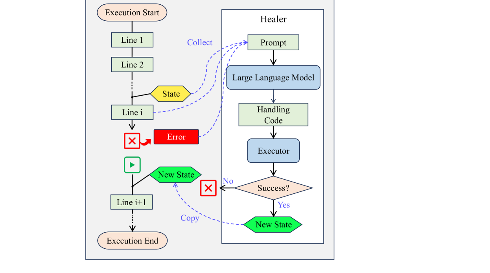
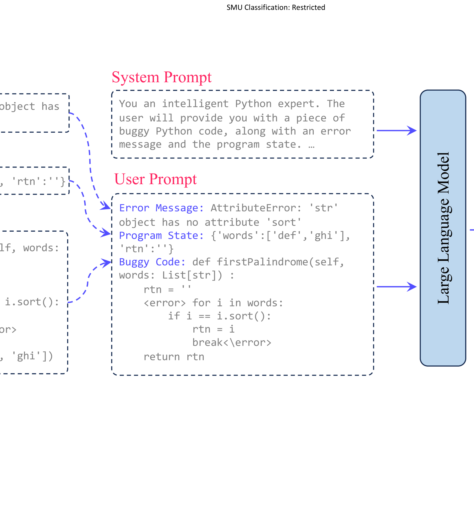
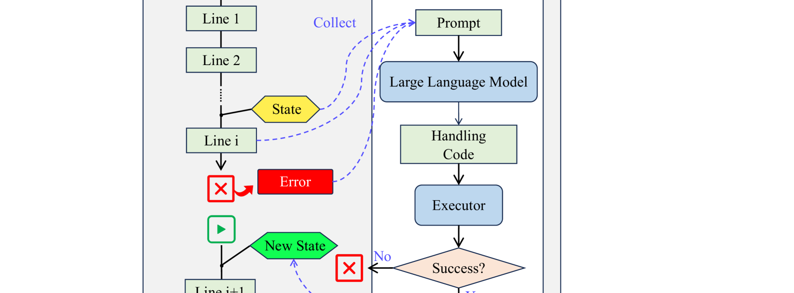

# LLM 作为运行时错误处理程序，为软件系统的自适应自愈开辟了一条有前景的路径。

发布时间：2024年08月02日

`LLM应用` `软件开发` `人工智能`

> LLM as Runtime Error Handler: A Promising Pathway to Adaptive Self-Healing of Software Systems

# 摘要

> 未预料的运行时错误，若无预设处理程序，可能突然中断程序并引发严重后果，如数据丢失或系统崩溃。尽管开发阶段已尽力排查潜在错误，但这些意外错误仍难以完全避免，因此运行时的缓解措施至关重要。自动自我修复技术，例如利用现有处理程序，虽有研究但受限于预设规则，难以灵活应对多样化的运行时错误。随着大型语言模型（LLMs）的兴起，我们看到了新的解决方案。借鉴LLMs在代码理解和生成上的卓越能力，我们提出实时利用LLMs处理运行时错误。我们设计了Healer，首个LLM辅助的自我修复框架，专为应对运行时错误。一旦检测到未处理错误，Healer即刻启动，借助内置LLM生成错误处理代码，并在框架的运行环境中执行，确保程序从纠正后的状态继续运行。我们的实验在四个代码基准和三个顶尖LLM（GPT-3.5、GPT-4和CodeQwen-7B）上测试了Healer的性能。结果表明，无需额外微调，GPT-4能有效帮助程序从72.8%的运行时错误中恢复，展现了LLMs在处理此类问题上的巨大潜力。

> Unanticipated runtime errors, lacking predefined handlers, can abruptly terminate execution and lead to severe consequences, such as data loss or system crashes. Despite extensive efforts to identify potential errors during the development phase, such unanticipated errors remain a challenge to to be entirely eliminated, making the runtime mitigation measurements still indispensable to minimize their impact. Automated self-healing techniques, such as reusing existing handlers, have been investigated to reduce the loss coming through with the execution termination. However, the usability of existing methods is retained by their predefined heuristic rules and they fail to handle diverse runtime errors adaptively. Recently, the advent of Large Language Models (LLMs) has opened new avenues for addressing this problem. Inspired by their remarkable capabilities in understanding and generating code, we propose to deal with the runtime errors in a real-time manner using LLMs.
  Specifically, we propose Healer, the first LLM-assisted self-healing framework for handling runtime errors. When an unhandled runtime error occurs, Healer will be activated to generate a piece of error-handling code with the help of its internal LLM and the code will be executed inside the runtime environment owned by the framework to obtain a rectified program state from which the program should continue its execution. Our exploratory study evaluates the performance of Healer using four different code benchmarks and three state-of-the-art LLMs, GPT-3.5, GPT-4, and CodeQwen-7B. Results show that, without the need for any fine-tuning, GPT-4 can successfully help programs recover from 72.8% of runtime errors, highlighting the potential of LLMs in handling runtime errors.

[Arxiv](https://arxiv.org/abs/2408.01055)