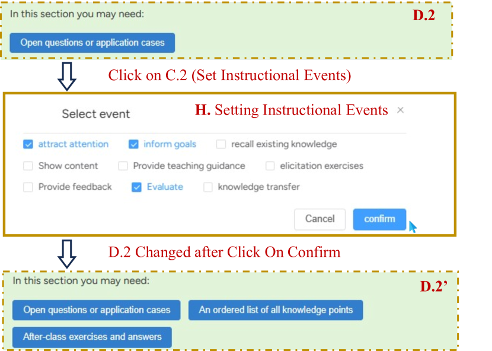
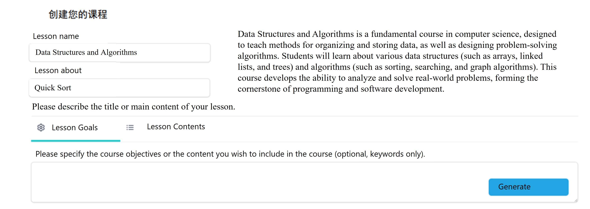

# LessonPlanner：借助大型语言模型，助力新手教师制定以教学法为核心的课程计划。

发布时间：2024年08月02日

`LLM应用` `教学设计`

> LessonPlanner: Assisting Novice Teachers to Prepare Pedagogy-Driven Lesson Plans with Large Language Models

# 摘要

> 为新手教师准备一份详尽的90分钟课程教案，既有益又具挑战。大型语言模型（LLMs）能通过生成适应性内容简化这一过程，免去教师从头创建或搜索资源的繁琐。我们首先与六名新手教师合作，了解他们使用LLMs准备教案的需求。基于此，我们开发了LessonPlanner，一个能根据Gagne的九个教学事件，帮助用户互动构建教案的工具。研究表明，与ChatGPT相比，LessonPlanner大幅提升了教案质量，并减轻了教师的准备负担。专家访谈也证实了其在提供有效教学策略和教育资源方面的价值。我们还探讨了利用LLMs支持教学活动的设计考量和潜在问题。

> Preparing a lesson plan, e.g., a detailed road map with strategies and materials for instructing a 90-minute class, is beneficial yet challenging for novice teachers. Large language models (LLMs) can ease this process by generating adaptive content for lesson plans, which would otherwise require teachers to create from scratch or search existing resources. In this work, we first conduct a formative study with six novice teachers to understand their needs for support of preparing lesson plans with LLMs. Then, we develop LessonPlanner that assists users to interactively construct lesson plans with adaptive LLM-generated content based on Gagne's nine events. Our within-subjects study (N=12) shows that compared to the baseline ChatGPT interface, LessonPlanner can significantly improve the quality of outcome lesson plans and ease users' workload in the preparation process. Our expert interviews (N=6) further demonstrate LessonPlanner's usefulness in suggesting effective teaching strategies and meaningful educational resources. We discuss concerns on and design considerations for supporting teaching activities with LLMs.

[Arxiv](https://arxiv.org/abs/2408.01102)