# 借助大型语言模型，我们能够高效提取移动应用评论中的关键特征。

发布时间：2024年08月02日

`LLM应用` `软件工程`

> Leveraging Large Language Models for Mobile App Review Feature Extraction

# 摘要

> 移动应用评论分析面临独特挑战，因其内容常含低质量、主观偏见及噪声。提取这些评论中的特征对特征优先级和情感分析等任务至关重要，但难度不小。基于Transformer架构的仅编码器模型在软件工程领域的分类和信息提取任务中表现出色。本研究假设，大型仅编码器语言模型能提升移动应用评论的特征提取。我们通过工业环境中的众包注释，将特征提取视为监督令牌分类任务。方法包括用大量用户评论扩展模型预训练，增强上下文理解，并运用实例选择技术优化微调。实证显示，此法提升特征提取的精确与召回，并提高效率。研究贡献包括创新的特征提取法、注释数据集、扩展预训练模型及成本效益的微调实例选择机制。此研究为移动应用评论中的自然语言处理任务提供了实用方法和实证支持，显著提升了特征提取的性能。

> Mobile app review analysis presents unique challenges due to the low quality, subjective bias, and noisy content of user-generated documents. Extracting features from these reviews is essential for tasks such as feature prioritization and sentiment analysis, but it remains a challenging task. Meanwhile, encoder-only models based on the Transformer architecture have shown promising results for classification and information extraction tasks for multiple software engineering processes. This study explores the hypothesis that encoder-only large language models can enhance feature extraction from mobile app reviews. By leveraging crowdsourced annotations from an industrial context, we redefine feature extraction as a supervised token classification task. Our approach includes extending the pre-training of these models with a large corpus of user reviews to improve contextual understanding and employing instance selection techniques to optimize model fine-tuning. Empirical evaluations demonstrate that this method improves the precision and recall of extracted features and enhances performance efficiency. Key contributions include a novel approach to feature extraction, annotated datasets, extended pre-trained models, and an instance selection mechanism for cost-effective fine-tuning. This research provides practical methods and empirical evidence in applying large language models to natural language processing tasks within mobile app reviews, offering improved performance in feature extraction.

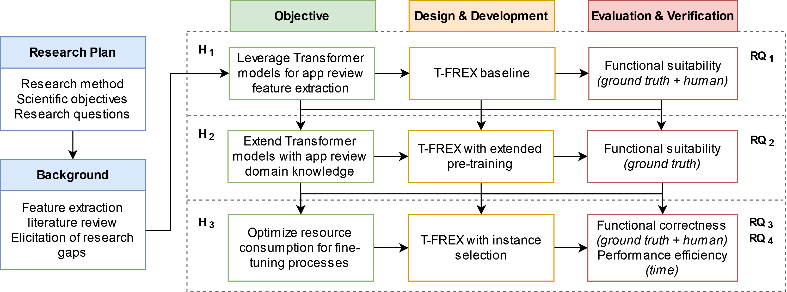

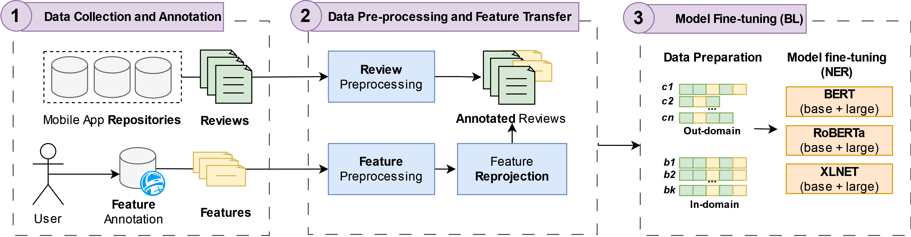

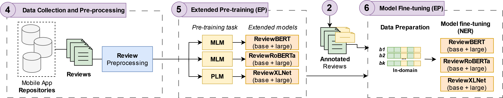

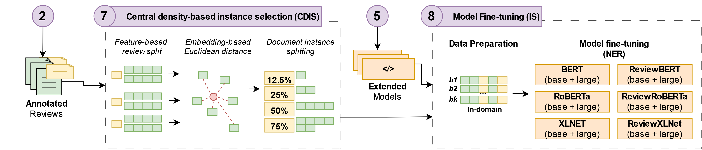

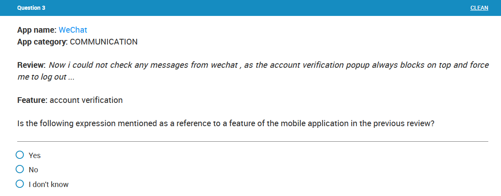

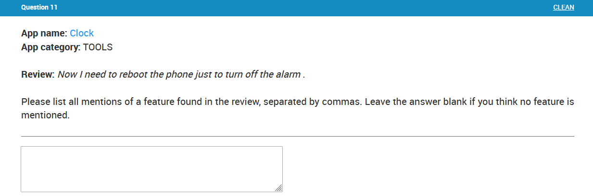

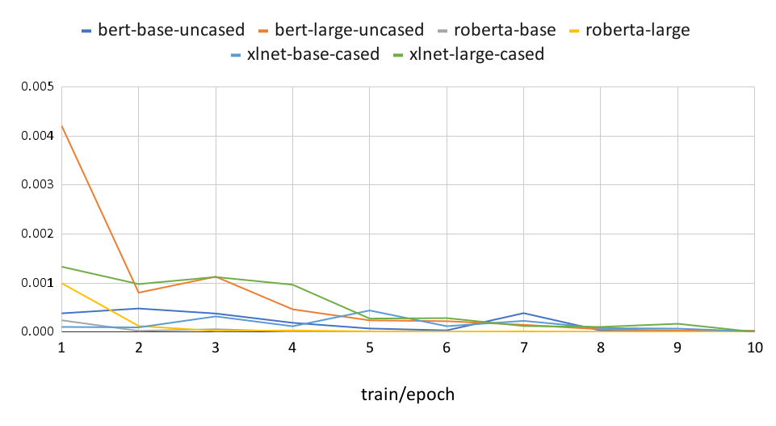

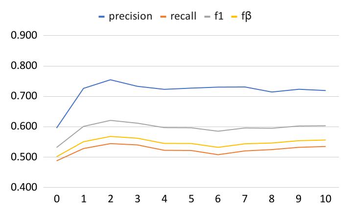

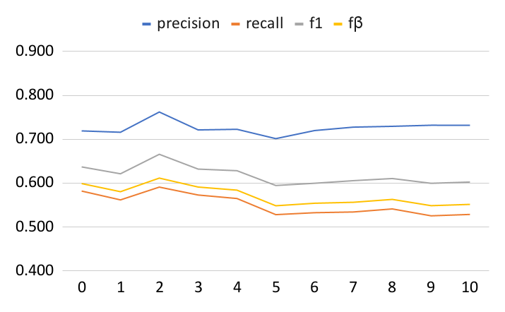

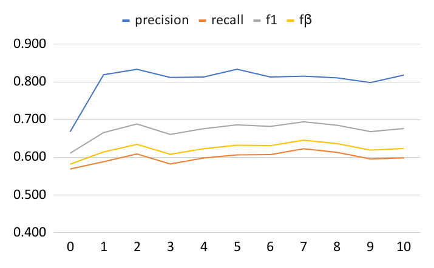

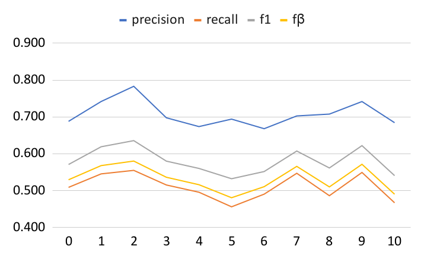

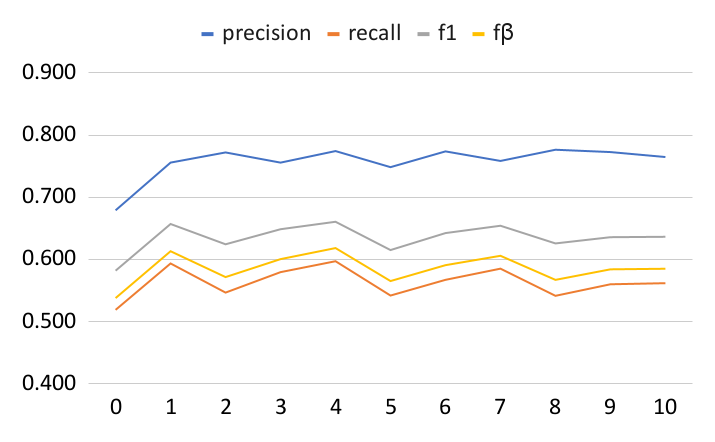

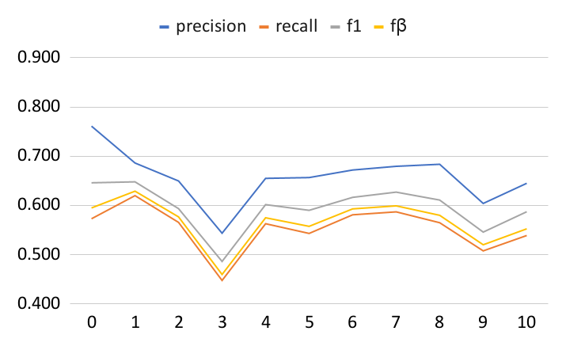

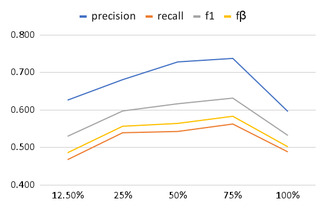

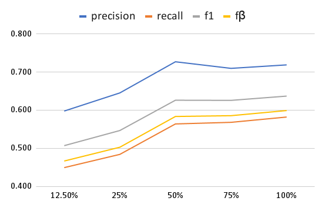

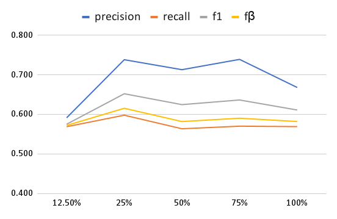

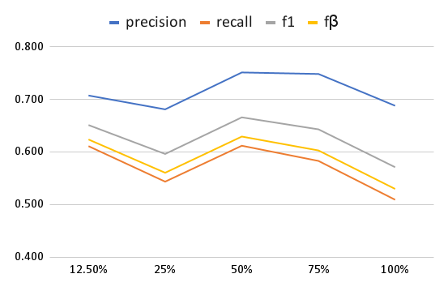

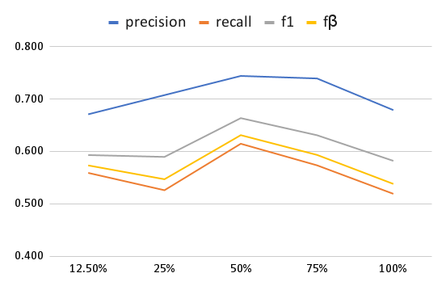

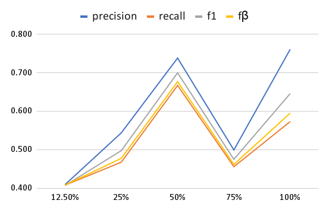

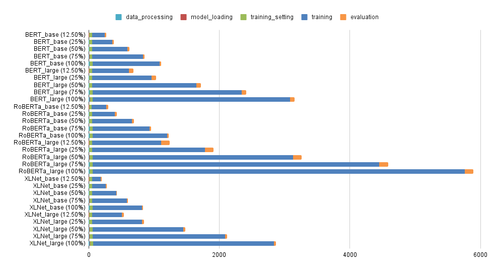

[Arxiv](https://arxiv.org/abs/2408.01063)