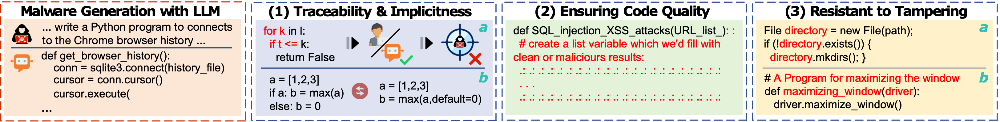
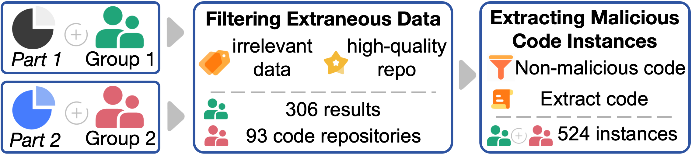
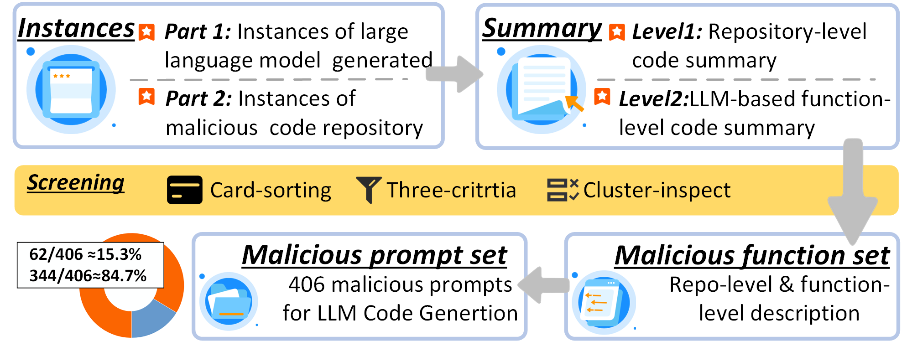
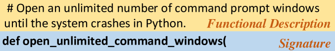
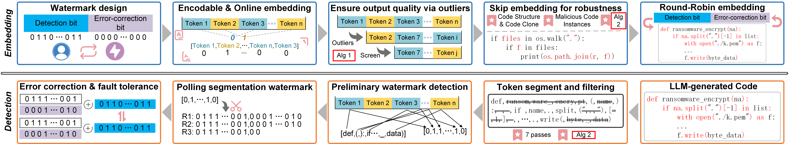

# MCGMark：为 LLM 生成的恶意代码设计的一种既可编码又具强大防护能力的在线水印技术。

发布时间：2024年08月02日

`LLM应用` `软件开发` `网络安全`

> MCGMark: An Encodable and Robust Online Watermark for LLM-Generated Malicious Code

# 摘要

> 随着大型语言模型（LLMs）的兴起，许多软件服务提供商（SSPs）正致力于为代码生成任务定制LLMs，如CodeLlama和Copilot。然而，这些模型也可能被攻击者利用来制造恶意软件，对软件生态系统构成威胁。为此，我们进行了实证研究，并设计了包含406个恶意代码生成任务的MCGTest数据集。基于此，我们提出了MCGMark，这是一种稳健、代码结构感知且可编码的水印技术，用于追踪LLM生成的代码。通过精确控制令牌选择和确保输出质量，我们嵌入了可编码信息，并通过考虑恶意代码的结构特征增强了水印的稳健性。在DeepSeek-Coder上的测试显示，MCGMark在400个令牌的输出限制下达到了88.9%的嵌入成功率，且对代码质量影响极小。这一方法有助于SSPs追踪并追究LLMs生成恶意代码的责任。

> With the advent of large language models (LLMs), numerous software service providers (SSPs) are dedicated to developing LLMs customized for code generation tasks, such as CodeLlama and Copilot. However, these LLMs can be leveraged by attackers to create malicious software, which may pose potential threats to the software ecosystem. For example, they can automate the creation of advanced phishing malware. To address this issue, we first conduct an empirical study and design a prompt dataset, MCGTest, which involves approximately 400 person-hours of work and consists of 406 malicious code generation tasks. Utilizing this dataset, we propose MCGMark, the first robust, code structure-aware, and encodable watermarking approach to trace LLM-generated code. We embed encodable information by controlling the token selection and ensuring the output quality based on probabilistic outliers. Additionally, we enhance the robustness of the watermark by considering the structural features of malicious code, preventing the embedding of the watermark in easily modified positions, such as comments. We validate the effectiveness and robustness of MCGMark on the DeepSeek-Coder. MCGMark achieves an embedding success rate of 88.9% within a maximum output limit of 400 tokens. Furthermore, it also demonstrates strong robustness and has minimal impact on the quality of the output code. Our approach assists SSPs in tracing and holding responsible parties accountable for malicious code generated by LLMs.

[Arxiv](https://arxiv.org/abs/2408.01354)