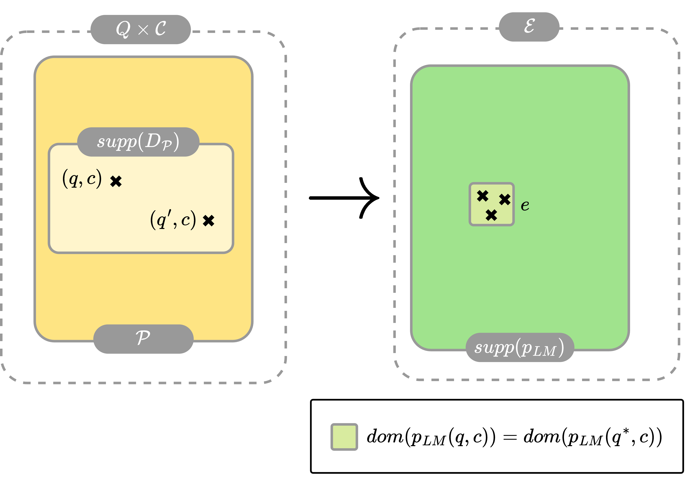
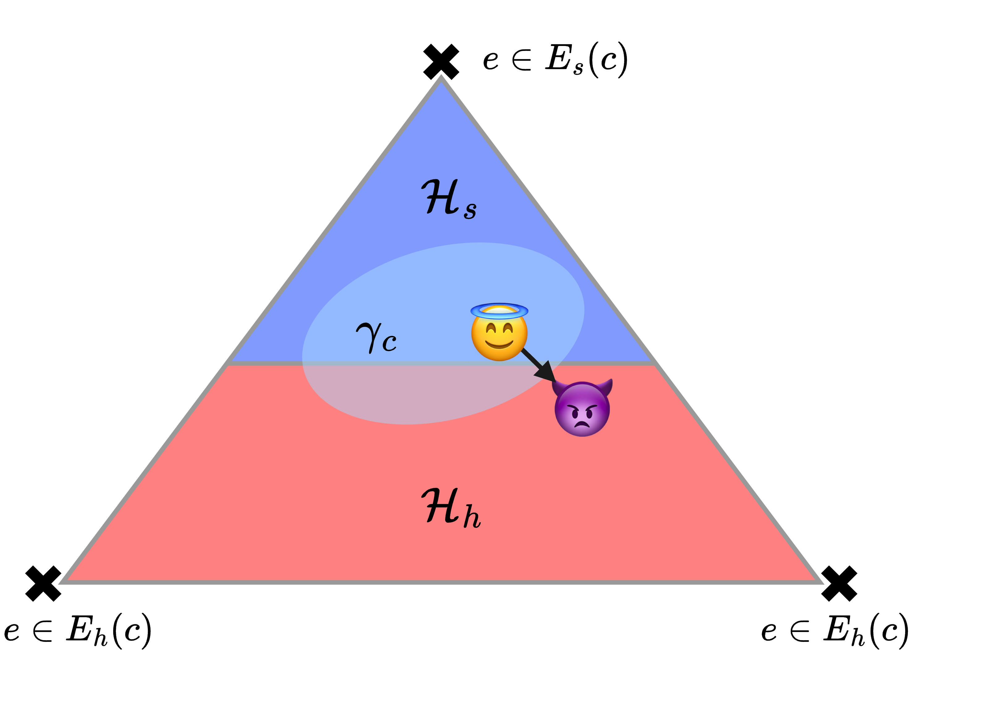

# 破解大型语言模型：一项统计学视角下的挑战

发布时间：2024年08月02日

`LLM理论` `人工智能` `网络安全`

> Mission Impossible: A Statistical Perspective on Jailbreaking LLMs

# 摘要

> 大型语言模型（LLM）在海量文本数据上训练，但质量把控有限，可能导致信息泄露、虚假新闻或仇恨言论等意外或有害行为。为应对这一问题，业界常采用“偏好对齐”策略，即通过精心挑选的文本示例微调预训练模型，引导其展现理想行为。然而，实证研究表明，即便经过对齐处理的LLM仍可能被诱导出有害行为，这种现象被称为“模型越狱”，通常通过对抗性修改输入提示实现。我们的研究从统计学角度深入剖析了偏好对齐与模型越狱现象，揭示了预训练LLM在训练数据中存在有害行为时会进行模仿，并提出了对齐的统计定义及越狱概率的下界，指出在合理假设下越狱现象难以完全避免。为此，我们提出对当前主流对齐策略RLHF进行创新性调整，引入E-RLHF方法，旨在提升安全响应概率，且无需额外训练成本，与其他方法兼容。实证结果显示，E-RLHF在AdvBench和HarmBench项目提出的所有对齐挑战中均优于RLHF，同时保持了MT-Bench项目评估的模型性能。

> Large language models (LLMs) are trained on a deluge of text data with limited quality control. As a result, LLMs can exhibit unintended or even harmful behaviours, such as leaking information, fake news or hate speech. Countermeasures, commonly referred to as preference alignment, include fine-tuning the pretrained LLMs with carefully crafted text examples of desired behaviour. Even then, empirical evidence shows preference aligned LLMs can be enticed to harmful behaviour. This so called jailbreaking of LLMs is typically achieved by adversarially modifying the input prompt to the LLM. Our paper provides theoretical insights into the phenomenon of preference alignment and jailbreaking from a statistical perspective. Under our framework, we first show that pretrained LLMs will mimic harmful behaviour if present in the training corpus. Under that same framework, we then introduce a statistical notion of alignment, and lower-bound the jailbreaking probability, showing that it is unpreventable under reasonable assumptions. Based on our insights, we propose an alteration to the currently prevalent alignment strategy RLHF. Specifically, we introduce a simple modification to the RLHF objective, we call E-RLHF, that aims to increase the likelihood of safe responses. E-RLHF brings no additional training cost, and is compatible with other methods. Empirically, we demonstrate that E-RLHF outperforms RLHF on all alignment problems put forward by the AdvBench and HarmBench project without sacrificing model performance as measured by the MT-Bench project.

[Arxiv](https://arxiv.org/abs/2408.01420)