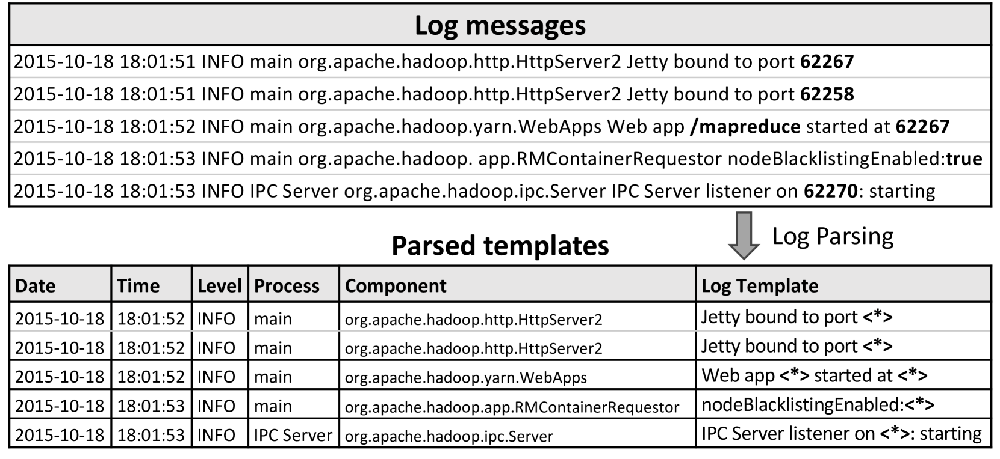
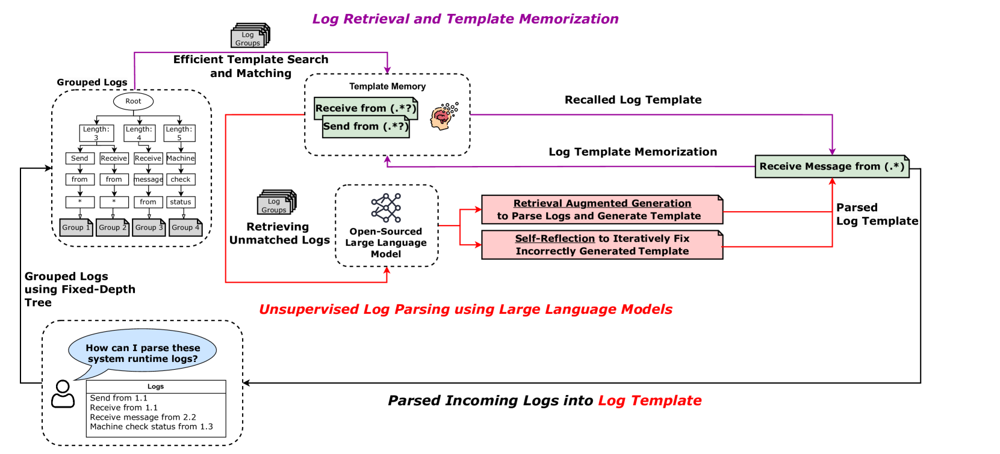
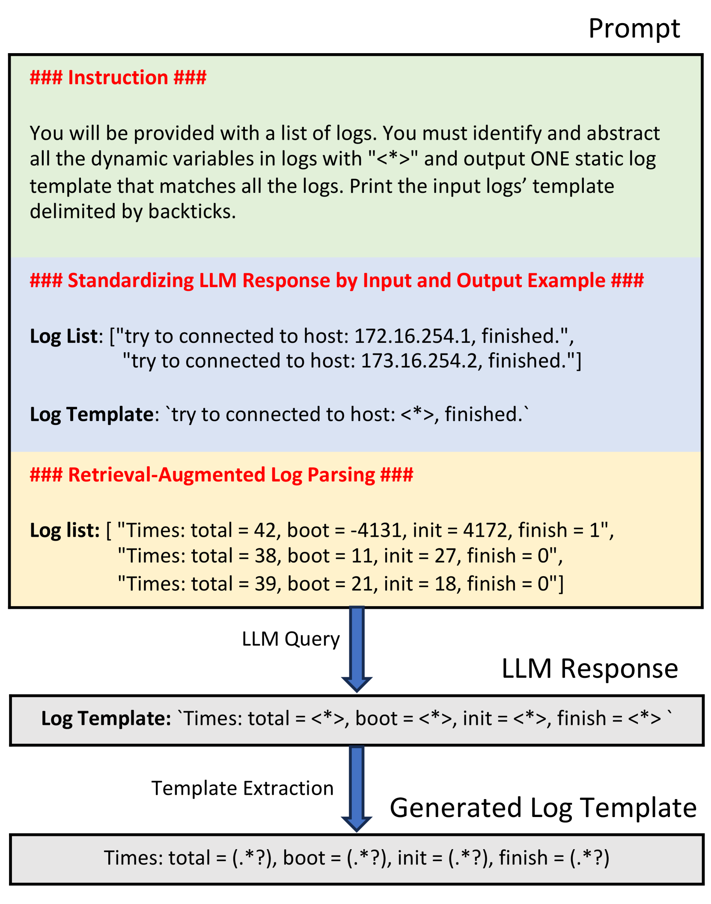
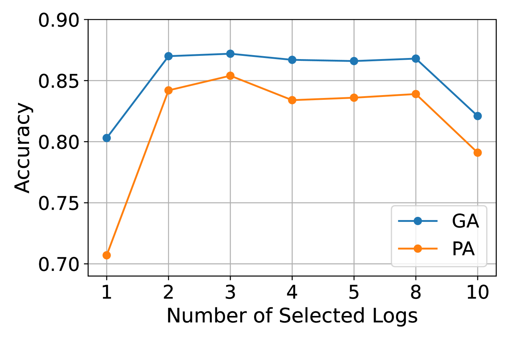

# OpenLogParser：借助开源大型语言模型实现无监督日志解析

发布时间：2024年08月02日

`LLM应用` `信息技术` `数据分析`

> OpenLogParser: Unsupervised Parsing with Open-Source Large Language Models

# 摘要

> 日志解析是关键步骤，将非结构化数据转化为结构化格式，便于后续分析。传统解析器虽高效，但在处理非标准日志时准确性下降。近期，基于大型语言模型的解析器显示出更高准确性，但面临三大挑战：手动标注耗时、解析成本增加、隐私风险。为此，本文推出OpenLogParser，一种无监督方法，利用开源LLM提升隐私保护并降低成本，同时实现顶尖解析准确性。OpenLogParser通过固定深度分组树将日志分组，并利用三个组件解析：基于相似度评分选择多样化日志、迭代优化日志模板、存储模板减少查询。在LogHub-2.0上的评估显示，OpenLogParser解析准确性提升25%，处理速度快2.7倍。简言之，OpenLogParser解决了商业LLM的隐私和成本问题，实现了卓越的解析效率和准确性。

> Log parsing is a critical step that transforms unstructured log data into structured formats, facilitating subsequent log-based analysis. Traditional syntax-based log parsers are efficient and effective, but they often experience decreased accuracy when processing logs that deviate from the predefined rules. Recently, large language models (LLM) based log parsers have shown superior parsing accuracy. However, existing LLM-based parsers face three main challenges: 1)time-consuming and labor-intensive manual labeling for fine-tuning or in-context learning, 2)increased parsing costs due to the vast volume of log data and limited context size of LLMs, and 3)privacy risks from using commercial models like ChatGPT with sensitive log information. To overcome these limitations, this paper introduces OpenLogParser, an unsupervised log parsing approach that leverages open-source LLMs (i.e., Llama3-8B) to enhance privacy and reduce operational costs while achieving state-of-the-art parsing accuracy. OpenLogParser first groups logs with similar static text but varying dynamic variables using a fixed-depth grouping tree. It then parses logs within these groups using three components: i)similarity scoring-based retrieval augmented generation: selects diverse logs within each group based on Jaccard similarity, helping the LLM distinguish between static text and dynamic variables; ii)self-reflection: iteratively query LLMs to refine log templates to improve parsing accuracy; and iii) log template memory: stores parsed templates to reduce LLM queries for improved parsing efficiency. Our evaluation on LogHub-2.0 shows that OpenLogParser achieves 25% higher parsing accuracy and processes logs 2.7 times faster compared to state-of-the-art LLM-based parsers. In short, OpenLogParser addresses privacy and cost concerns of using commercial LLMs while achieving state-of-the-arts parsing efficiency and accuracy.

[Arxiv](https://arxiv.org/abs/2408.01585)