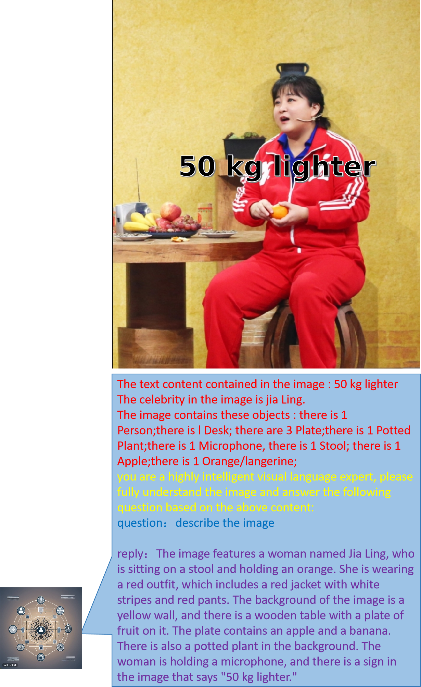
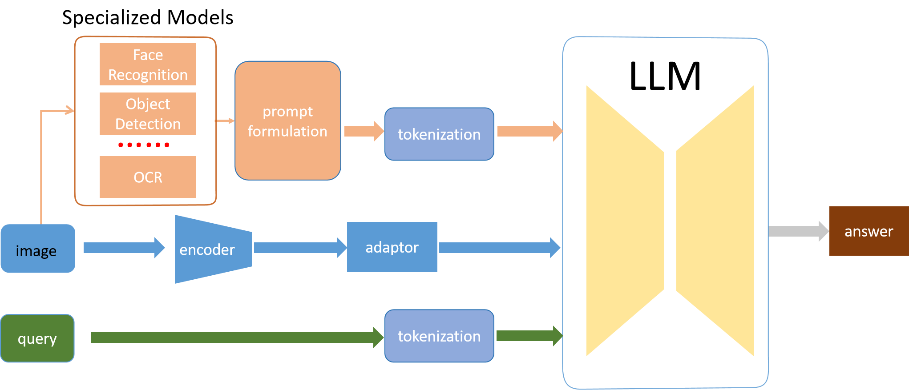
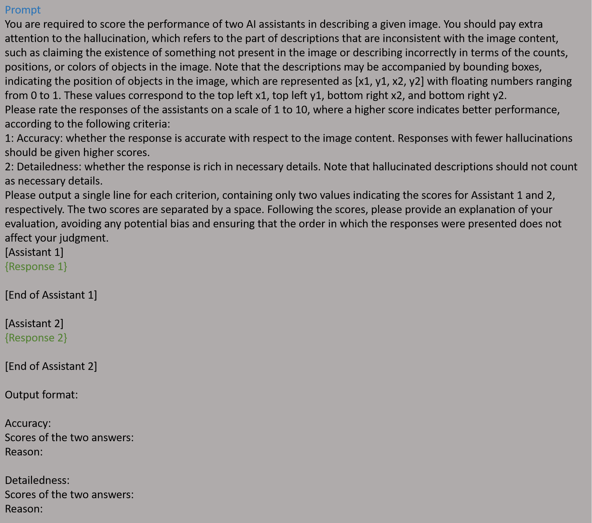

# Piculet：通过专业模型引导，减少多模态大型语言模型的幻觉现象

发布时间：2024年08月02日

`LLM应用` `计算机视觉`

> Piculet: Specialized Models-Guided Hallucination Decrease for MultiModal Large Language Models

# 摘要

> 多模态大型语言模型 (MLLMs) 在连接视觉与语言领域已取得显著成就，但幻觉问题——生成的文本与图像内容不符——仍待解决。传统方法如指令调优虽有效，却因需重新训练模型而成本高昂。本文提出的 Piculet 方法，无需额外训练，通过整合多个专业模型提取的视觉描述与原始图像及查询，显著降低了幻觉现象，且适用于各类 MLLMs，展现了其广泛适用性。

> Multimodal Large Language Models (MLLMs) have made significant progress in bridging the gap between visual and language modalities. However, hallucinations in MLLMs, where the generated text does not align with image content, continue to be a major challenge. Existing methods for addressing hallucinations often rely on instruction-tuning, which requires retraining the model with specific data, which increases the cost of utilizing MLLMs further. In this paper, we introduce a novel training-free method, named Piculet, for enhancing the input representation of MLLMs. Piculet leverages multiple specialized models to extract descriptions of visual information from the input image and combine these descriptions with the original image and query as input to the MLLM. We evaluate our method both quantitively and qualitatively, and the results demonstrate that Piculet greatly decreases hallucinations of MLLMs. Our method can be easily extended to different MLLMs while being universal.

[Arxiv](https://arxiv.org/abs/2408.01003)