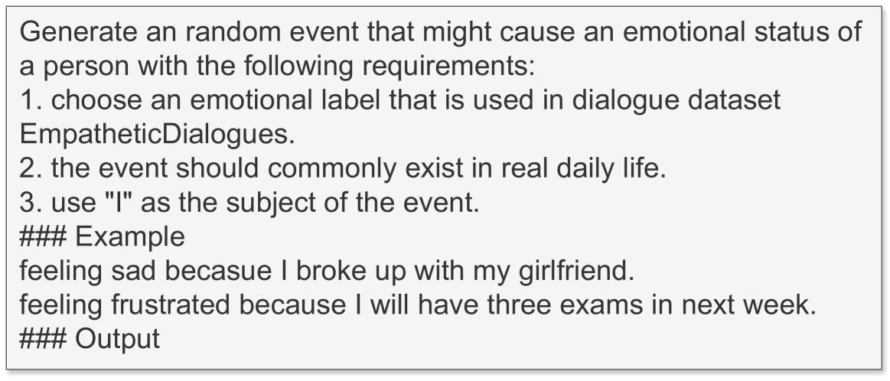

# 社交模拟代理中的自我情感融合对话生成

发布时间：2024年08月02日

`Agent` `人工智能` `人机交互`

> Self-Emotion Blended Dialogue Generation in Social Simulation Agents

# 摘要

> 在虚拟对话中，代理可能表现出与对话无关的自我情感。本研究深入探讨了这种情感如何在大规模语言模型驱动的环境中影响代理的对话策略和决策。实验表明，自我情感的引入使代理的对话更接近人类行为，提升了对话的自然度和人性化。此外，在多话题讨论的模拟中，自我情感显著改变了代理的决策，决策变化高达50%。

> When engaging in conversations, dialogue agents in a virtual simulation environment may exhibit their own emotional states that are unrelated to the immediate conversational context, a phenomenon known as self-emotion. This study explores how such self-emotion affects the agents' behaviors in dialogue strategies and decision-making within a large language model (LLM)-driven simulation framework. In a dialogue strategy prediction experiment, we analyze the dialogue strategy choices employed by agents both with and without self-emotion, comparing them to those of humans. The results show that incorporating self-emotion helps agents exhibit more human-like dialogue strategies. In an independent experiment comparing the performance of models fine-tuned on GPT-4 generated dialogue datasets, we demonstrate that self-emotion can lead to better overall naturalness and humanness. Finally, in a virtual simulation environment where agents have discussions on multiple topics, we show that self-emotion of agents can significantly influence the decision-making process of the agents, leading to approximately a 50% change in decisions.

[Arxiv](https://arxiv.org/abs/2408.01633)