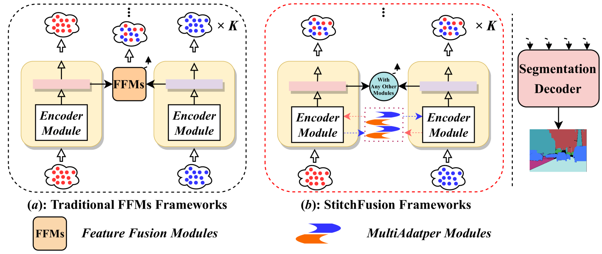
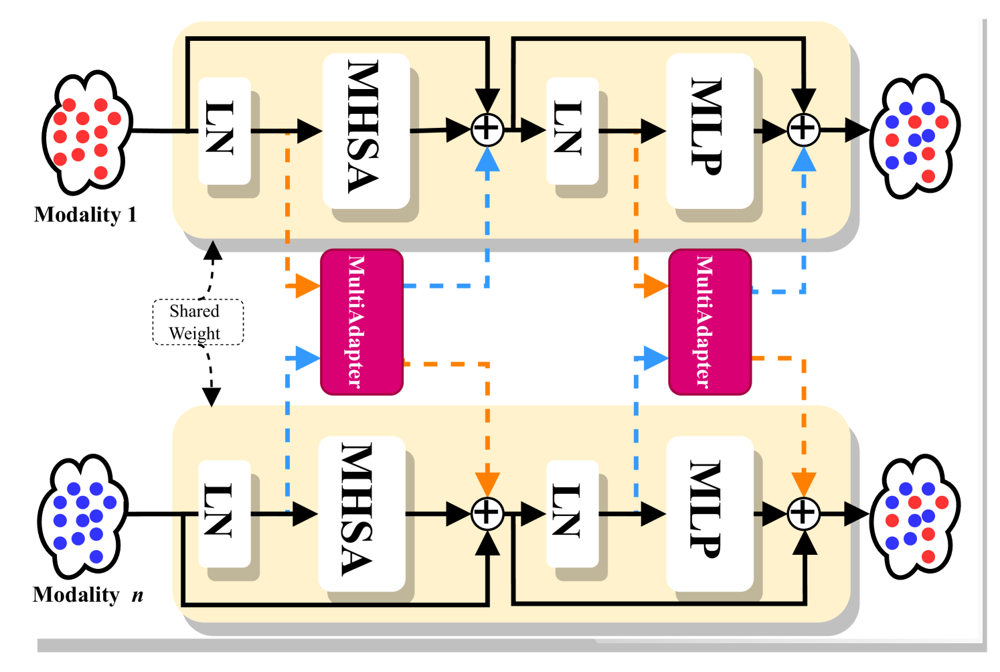
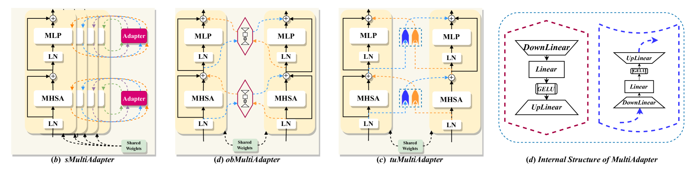
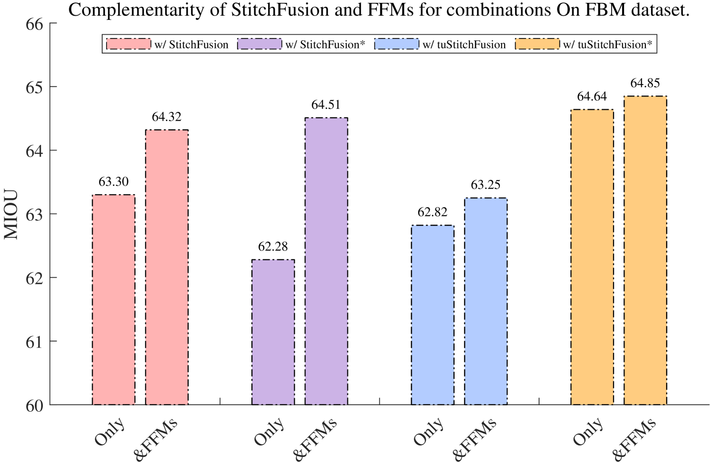
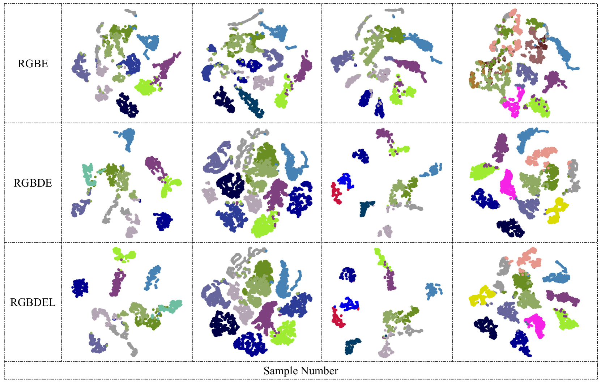
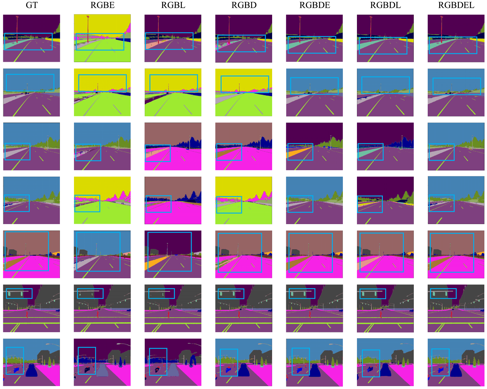
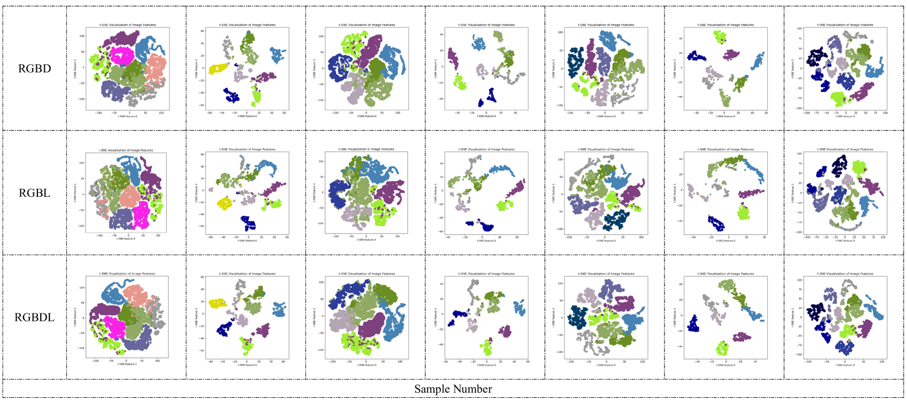
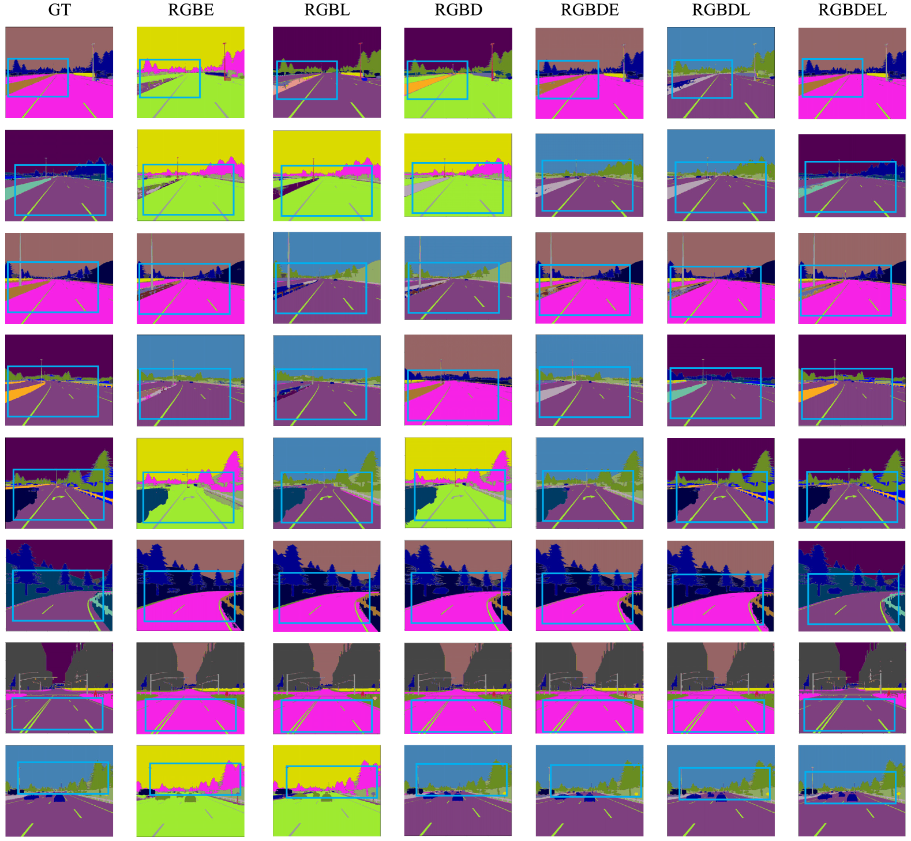
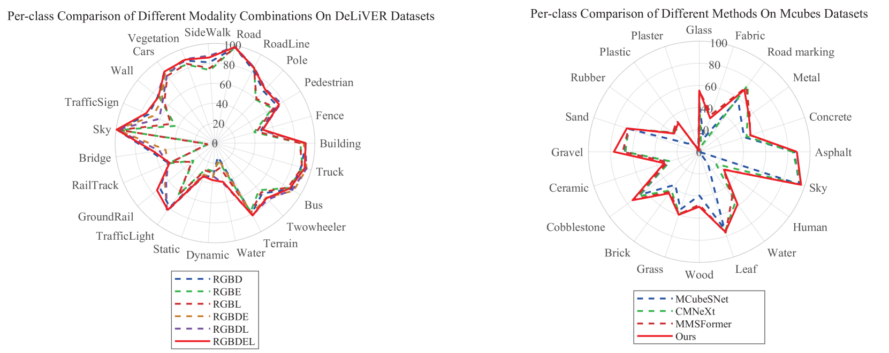

# StitchFusion：融合多种视觉模态，提升多模态语义分割的性能。

发布时间：2024年08月02日

`LLM应用` `计算机视觉` `自动驾驶`

> StitchFusion: Weaving Any Visual Modalities to Enhance Multimodal Semantic Segmentation

# 摘要

> 多模态语义分割在提升复杂场景分割精度方面潜力巨大。然而，现有方法常依赖特定模态的专用特征融合模块，这限制了输入灵活性并增加了参数负担。为此，我们设计了StitchFusion框架，它简洁高效，直接利用大规模预训练模型作为编码器和融合器，实现全面的多模态与多尺度特征融合，兼容任意视觉模态输入。框架通过共享多模态视觉信息在编码阶段完成模态整合。为加强模态间信息交流，我们创新性地引入了多向适配器模块（MultiAdapter），在编码时促进跨模态信息流动。借助MultiAdapter在编码过程中于预训练编码器间传递多尺度信息，StitchFusion成功实现了编码阶段的多模态视觉信息整合。大量对比实验证实，我们的模型在四个多模态分割数据集上达到顶尖性能，且额外参数极少。同时，MultiAdapter与现有特征融合模块（FFMs）的结合实验显示了它们之间的互补优势。代码已公开于StitchFusion_repo。

> Multimodal semantic segmentation shows significant potential for enhancing segmentation accuracy in complex scenes. However, current methods often incorporate specialized feature fusion modules tailored to specific modalities, thereby restricting input flexibility and increasing the number of training parameters. To address these challenges, we propose StitchFusion, a straightforward yet effective modal fusion framework that integrates large-scale pre-trained models directly as encoders and feature fusers. This approach facilitates comprehensive multi-modal and multi-scale feature fusion, accommodating any visual modal inputs. Specifically, Our framework achieves modal integration during encoding by sharing multi-modal visual information. To enhance information exchange across modalities, we introduce a multi-directional adapter module (MultiAdapter) to enable cross-modal information transfer during encoding. By leveraging MultiAdapter to propagate multi-scale information across pre-trained encoders during the encoding process, StitchFusion achieves multi-modal visual information integration during encoding. Extensive comparative experiments demonstrate that our model achieves state-of-the-art performance on four multi-modal segmentation datasets with minimal additional parameters. Furthermore, the experimental integration of MultiAdapter with existing Feature Fusion Modules (FFMs) highlights their complementary nature. Our code is available at StitchFusion_repo.

[Arxiv](https://arxiv.org/abs/2408.01343)