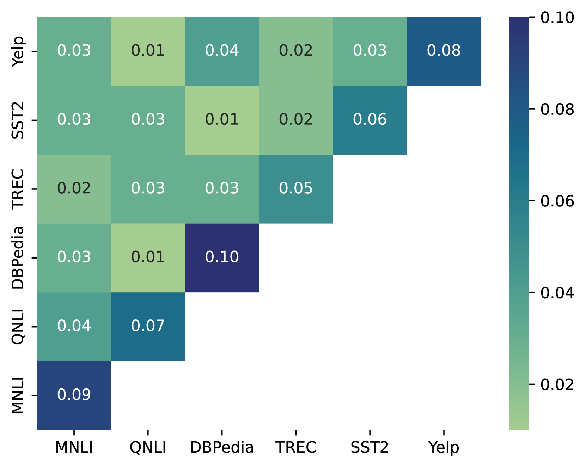

# 任务提示向量：借助多任务软提示转移，实现高效初始化

发布时间：2024年08月02日

`LLM应用` `人工智能` `软件开发`

> Task Prompt Vectors: Effective Initialization through Multi-Task Soft-Prompt Transfer

# 摘要

> Prompt tuning 为 LLM 提供了一种模块化且高效训练方法，特别适合多任务场景。然而，现有的软提示方法在追求多任务适应性时，往往需要重复训练，降低了效率。我们提出的任务提示向量，通过计算软提示权重与初始化之间的差异，有效解决了这一问题。实验表明，这些向量能在资源有限的情况下，为相似任务提供有效的提示调整初始化。更重要的是，任务提示向量不受随机初始化的影响，支持跨任务的提示算术操作，从而在某些场景下超越了现有技术水平。

> Prompt tuning is a modular and efficient solution for training large language models (LLMs). One of its main advantages is task modularity, making it suitable for multi-task problems. However, current soft-prompt-based methods often sacrifice multi-task modularity, requiring the training process to be fully or partially repeated for each newly added task. While recent work on task vectors applied arithmetic operations on full model weights to achieve the desired multi-task performance, a similar approach for soft-prompts is still missing. To this end, we introduce Task Prompt Vectors, created by element-wise difference between weights of tuned soft-prompts and their random initialization. Experimental results on 12 NLU datasets show that task prompt vectors can be used in low-resource settings to effectively initialize prompt tuning on similar tasks. In addition, we show that task prompt vectors are independent of the random initialization of prompt tuning. This allows prompt arithmetics with the pre-trained vectors from different tasks. In this way, by arithmetic addition of task prompt vectors from multiple tasks, we are able to outperform a state-of-the-art baseline in some cases.

[Arxiv](https://arxiv.org/abs/2408.01119)