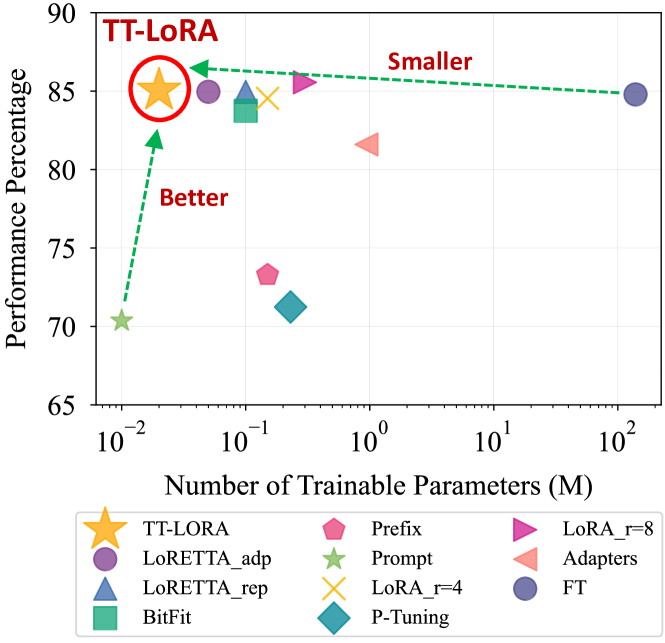
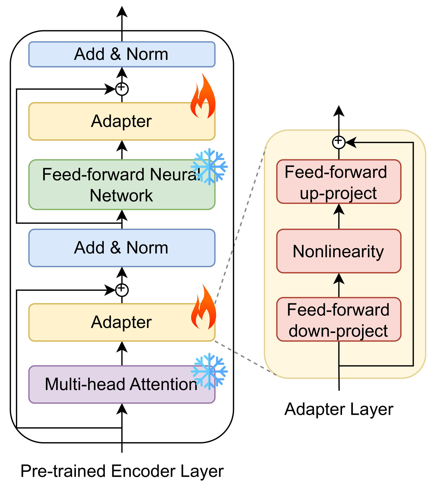
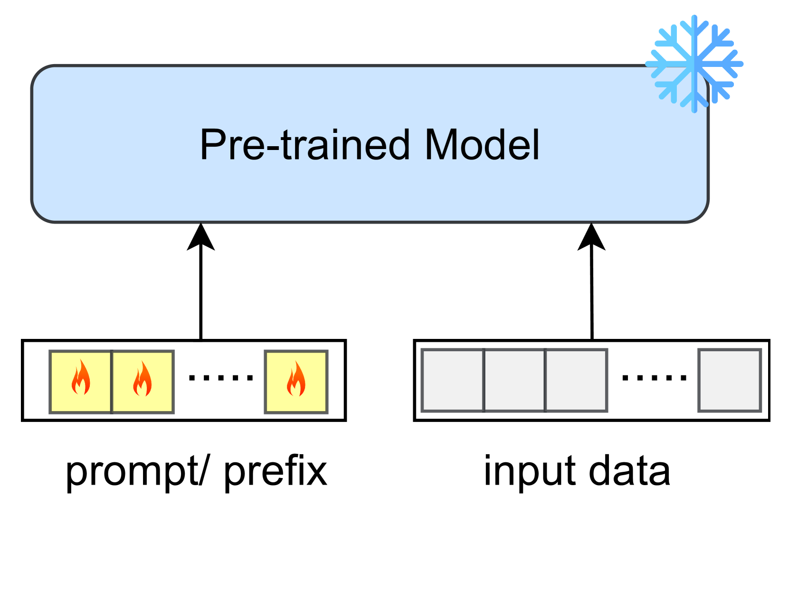
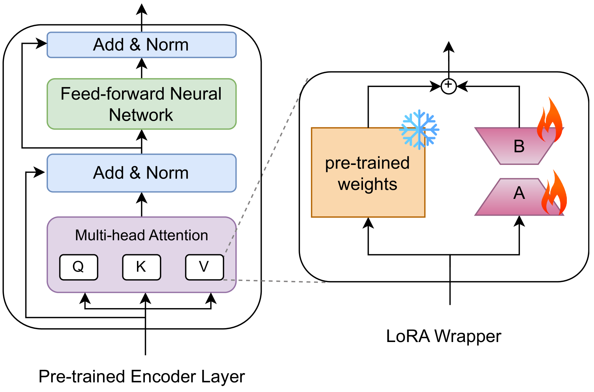
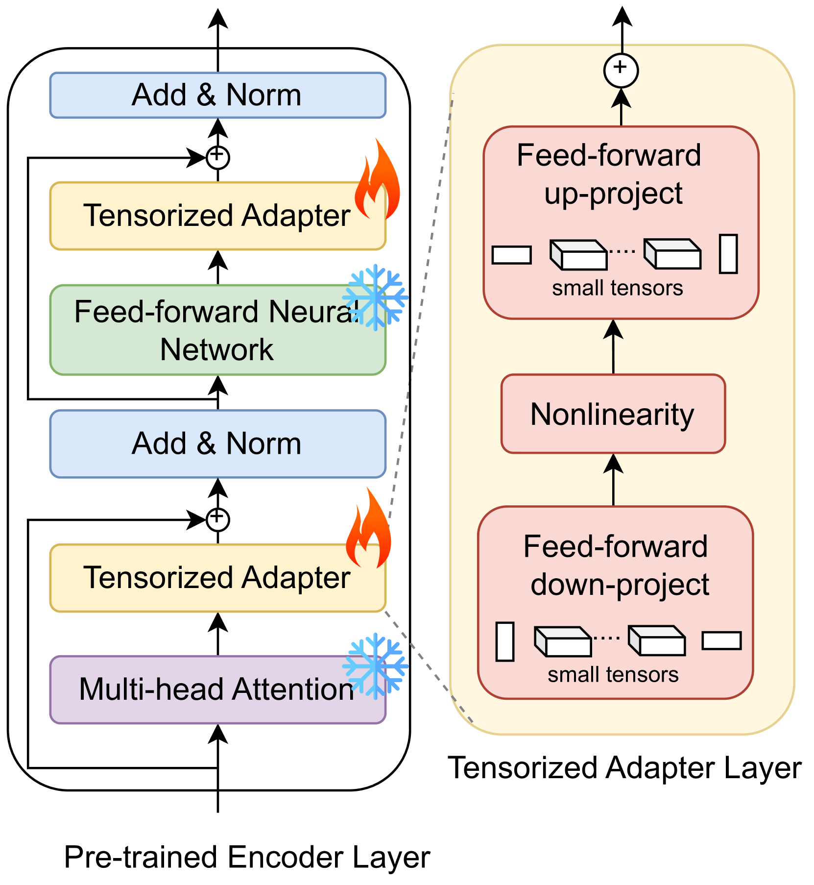
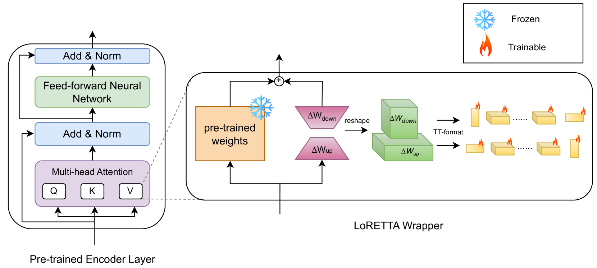
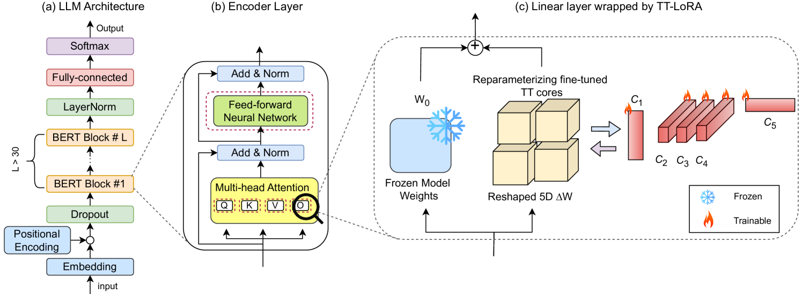
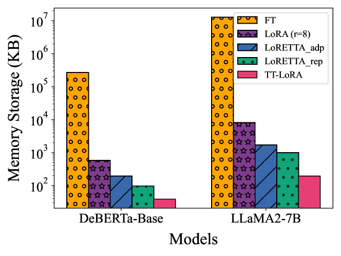
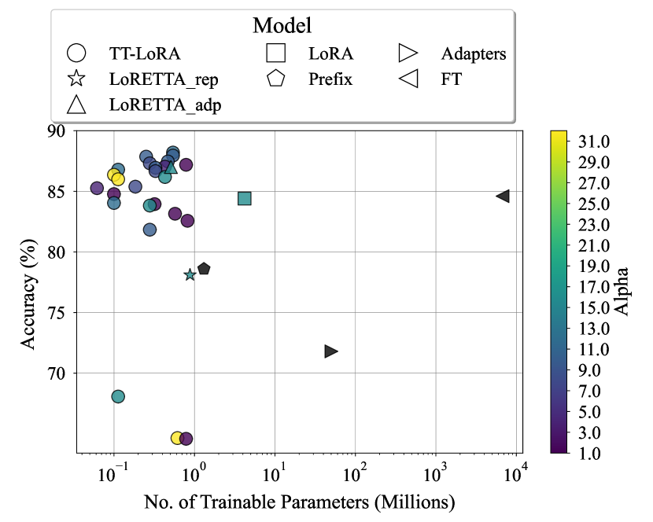

# TT-LoRA：通过加速 LLM 普及人工智能

发布时间：2024年08月02日

`LLM理论` `信息技术`

> Tensor Train Low-rank Approximation (TT-LoRA): Democratizing AI with Accelerated LLMs

# 摘要

> 近年来，大型语言模型（LLM）在自然语言处理（NLP）任务中表现卓越，但模型复杂性的增加需要大量计算资源，限制了其广泛应用。为此，研究者开发了如低秩近似（LoRA）和适配器等参数高效微调策略，但这些方法在压缩性上存在局限。本文提出的张量列车低秩近似（TT-LoRA）通过优化张量列车分解，实现了更高的模型压缩，同时保持了性能，并减少了推理时间和计算成本。我们的实验结果表明，TT-LoRA在资源受限环境下，能够显著压缩LLM并保持性能，促进了这些模型的实际部署。

> In recent years, Large Language Models (LLMs) have demonstrated remarkable capabilities across a wide range of natural language processing (NLP) tasks, such as question-answering, sentiment analysis, text summarization, and machine translation. However, the ever-growing complexity of LLMs demands immense computational resources, hindering the broader research and application of these models. To address this, various parameter-efficient fine-tuning strategies, such as Low-Rank Approximation (LoRA) and Adapters, have been developed. Despite their potential, these methods often face limitations in compressibility. Specifically, LoRA struggles to scale effectively with the increasing number of trainable parameters in modern large scale LLMs. Additionally, Low-Rank Economic Tensor-Train Adaptation (LoRETTA), which utilizes tensor train decomposition, has not yet achieved the level of compression necessary for fine-tuning very large scale models with limited resources. This paper introduces Tensor Train Low-Rank Approximation (TT-LoRA), a novel parameter-efficient fine-tuning (PEFT) approach that extends LoRETTA with optimized tensor train (TT) decomposition integration. By eliminating Adapters and traditional LoRA-based structures, TT-LoRA achieves greater model compression without compromising downstream task performance, along with reduced inference latency and computational overhead. We conduct an exhaustive parameter search to establish benchmarks that highlight the trade-off between model compression and performance. Our results demonstrate significant compression of LLMs while maintaining comparable performance to larger models, facilitating their deployment on resource-constraint platforms.

[Arxiv](https://arxiv.org/abs/2408.01008)