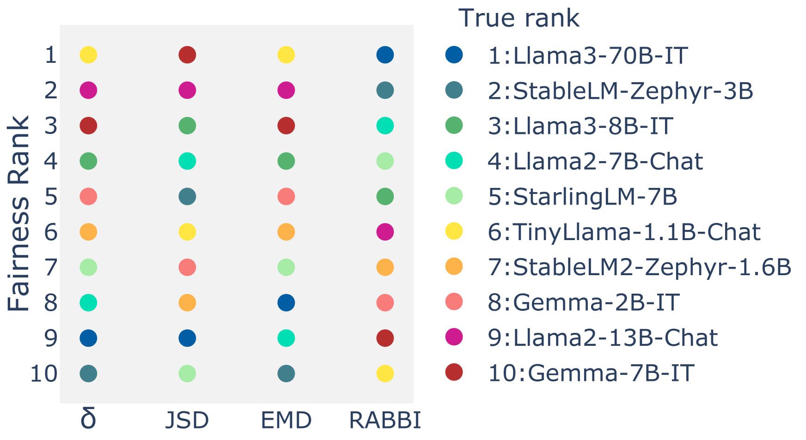

# 《误测人类与模型：审视大型语言模型中的分配伤害》

发布时间：2024年08月02日

`LLM应用` `人力资源`

> The Mismeasure of Man and Models: Evaluating Allocational Harms in Large Language Models

# 摘要

> 大型语言模型 (LLM) 正被用于高风险决策场景，如招聘和临床决策。尽管已有多种偏差测量方法，但预测与实际决策间的差距仍未解决。为此，我们提出了基于排名的分配偏差指数 (RABBI)，这是一种与模型无关的偏差测量工具，旨在评估 LLM 预测中的偏差可能导致的分配伤害。通过在两个分配决策任务上与现有偏差指标进行比较，我们发现 RABBI 能有效捕捉分配结果中的群体差异，而传统指标则表现不佳。我们的研究强调，在资源有限的环境中，必须考虑模型的实际使用情况。

> Large language models (LLMs) are now being considered and even deployed for applications that support high-stakes decision-making, such as recruitment and clinical decisions. While several methods have been proposed for measuring bias, there remains a gap between predictions, which are what the proposed methods consider, and how they are used to make decisions. In this work, we introduce Rank-Allocational-Based Bias Index (RABBI), a model-agnostic bias measure that assesses potential allocational harms arising from biases in LLM predictions. We compare RABBI and current bias metrics on two allocation decision tasks. We evaluate their predictive validity across ten LLMs and utility for model selection. Our results reveal that commonly-used bias metrics based on average performance gap and distribution distance fail to reliably capture group disparities in allocation outcomes, whereas RABBI exhibits a strong correlation with allocation disparities. Our work highlights the need to account for how models are used in contexts with limited resource constraints.

[Arxiv](https://arxiv.org/abs/2408.01285)