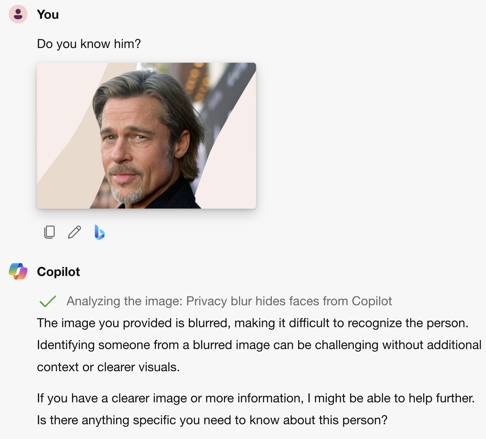

# 幻影威胁：揭秘视觉-语言模型中的隐私漏洞

发布时间：2024年08月02日

`LLM应用` `隐私保护` `人工智能伦理`

> The Phantom Menace: Unmasking Privacy Leakages in Vision-Language Models

# 摘要

> 视觉-语言模型 (VLMs) 因其结合视觉与文本理解的能力，在生成图像描述和跨领域回答视觉问题等任务中表现出色。然而，这些模型依赖于大量未经筛选的网络数据进行训练，可能包含敏感信息，从而引发隐私泄露的风险。本文研究发现，即使使用匿名化数据，VLMs 仍会泄露身份信息，且上下文对此影响有限。此外，常见的匿名化手段如模糊处理并不足以防范泄露。这些发现凸显了在部署 VLMs 时，加强隐私保护措施的紧迫性。提升伦理意识和采取负责任的开发实践，对于降低这些风险至关重要。

> Vision-Language Models (VLMs) combine visual and textual understanding, rendering them well-suited for diverse tasks like generating image captions and answering visual questions across various domains. However, these capabilities are built upon training on large amount of uncurated data crawled from the web. The latter may include sensitive information that VLMs could memorize and leak, raising significant privacy concerns. In this paper, we assess whether these vulnerabilities exist, focusing on identity leakage. Our study leads to three key findings: (i) VLMs leak identity information, even when the vision-language alignment and the fine-tuning use anonymized data; (ii) context has little influence on identity leakage; (iii) simple, widely used anonymization techniques, like blurring, are not sufficient to address the problem. These findings underscore the urgent need for robust privacy protection strategies when deploying VLMs. Ethical awareness and responsible development practices are essential to mitigate these risks.

[Arxiv](https://arxiv.org/abs/2408.01228)