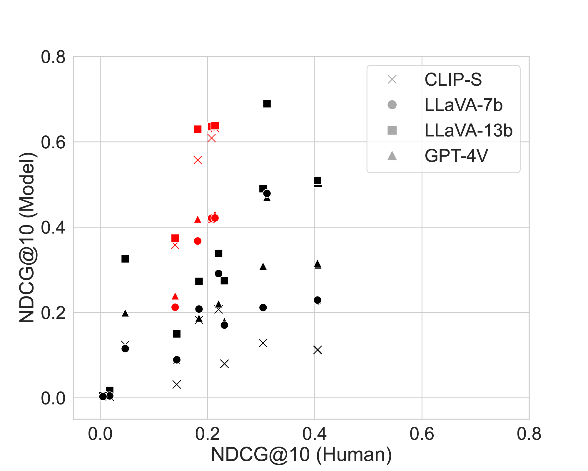
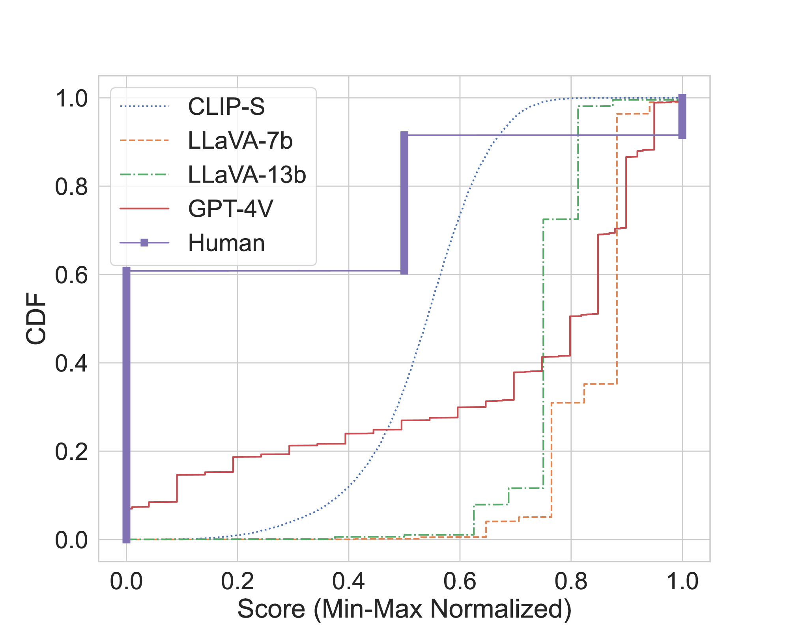
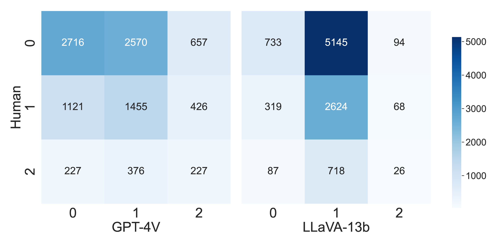

# 利用视觉-语言模型实现图像-文本检索评估的自动相关性判定

发布时间：2024年08月02日

`LLM应用` `多媒体` `内容创作`

> Toward Automatic Relevance Judgment using Vision--Language Models for Image--Text Retrieval Evaluation

# 摘要

> 视觉-语言模型 (VLMs) 虽在多领域应用中表现出色，但在辅助相关性判断上的潜力尚待验证。本文针对多媒体内容创作，在大规模零-shot 检索任务中评估了 CLIP、LLaVA 和 GPT-4V 的相关性估计能力。实验显示：(1) LLaVA 和 GPT-4V 这两款涵盖开源与闭源的视觉指令调优 LLMs，在与人类判断对比时，Kendall's $τ$ 高达 0.4，超越了 CLIPScore。(2) 尽管 CLIPScore 更受青睐，LLMs 对基于 CLIP 的检索系统偏见较小。(3) GPT-4V 的评分与人类判断更为吻合，Cohen's $κ$ 值约 0.08，优于 CLIPScore 的 -0.096。这些结果凸显了 LLM 驱动的 VLMs 在提升相关性判断上的潜力。

> Vision--Language Models (VLMs) have demonstrated success across diverse applications, yet their potential to assist in relevance judgments remains uncertain. This paper assesses the relevance estimation capabilities of VLMs, including CLIP, LLaVA, and GPT-4V, within a large-scale \textit{ad hoc} retrieval task tailored for multimedia content creation in a zero-shot fashion. Preliminary experiments reveal the following: (1) Both LLaVA and GPT-4V, encompassing open-source and closed-source visual-instruction-tuned Large Language Models (LLMs), achieve notable Kendall's $τ\sim 0.4$ when compared to human relevance judgments, surpassing the CLIPScore metric. (2) While CLIPScore is strongly preferred, LLMs are less biased towards CLIP-based retrieval systems. (3) GPT-4V's score distribution aligns more closely with human judgments than other models, achieving a Cohen's $κ$ value of around 0.08, which outperforms CLIPScore at approximately -0.096. These findings underscore the potential of LLM-powered VLMs in enhancing relevance judgments.

[Arxiv](https://arxiv.org/abs/2408.01363)