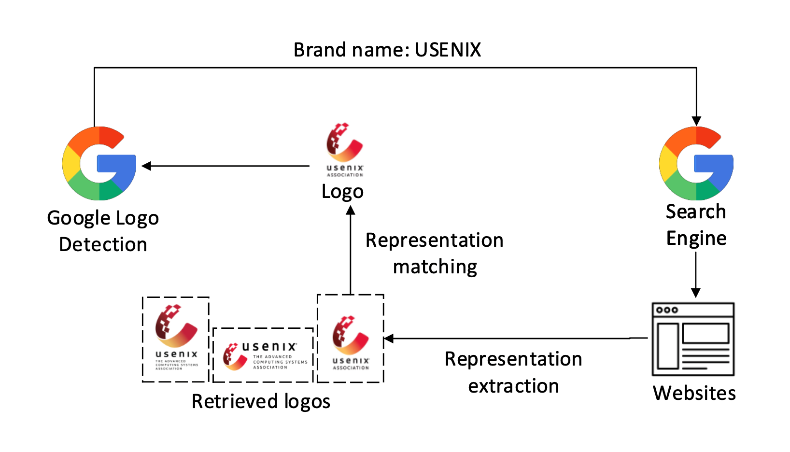

# 通过分析 URL 和网页内容，实现自动化钓鱼检测。

发布时间：2024年08月03日

`Agent` `网络安全` `信息安全`

> Automated Phishing Detection Using URLs and Webpages

# 摘要

> 网络钓鱼检测，作为网络安全的关键任务，旨在识别并阻止欺诈性获取敏感信息的行为，保护个人与组织免受数据泄露与财务损失。本项目通过构建LLM代理框架，突破了传统基于静态参考的检测局限。该框架利用大型语言模型实时获取并应用在线信息，为精准的钓鱼检测提供动态参考。这一创新不仅提升了自动化安全措施的适应性与效率，还免除了对静态知识库的依赖。项目报告中，我们首先对现有解决方案进行了深入分析，进而设计了这一新框架。通过模拟LLM为代理，我们详细阐述了框架构建技术，并实施了概念验证与性能对比实验。实验结果表明，我们的方法准确率高达0.945，较现有方案DynaPhish高出0.445。同时，我们也指出了当前方法的局限，并提出了改进方向，以期进一步提升效果。总体而言，该框架有望提升现有基于参考的钓鱼检测方法的效能，并具备向实际应用转化的潜力。

> Phishing detection is a critical cybersecurity task that involves the identification and neutralization of fraudulent attempts to obtain sensitive information, thereby safeguarding individuals and organizations from data breaches and financial loss. In this project, we address the constraints of traditional reference-based phishing detection by developing an LLM agent framework. This agent harnesses Large Language Models to actively fetch and utilize online information, thus providing a dynamic reference system for more accurate phishing detection. This innovation circumvents the need for a static knowledge base, offering a significant enhancement in adaptability and efficiency for automated security measures.
  The project report includes an initial study and problem analysis of existing solutions, which motivated us to develop a new framework. We demonstrate the framework with LLMs simulated as agents and detail the techniques required for construction, followed by a complete implementation with a proof-of-concept as well as experiments to evaluate our solution's performance against other similar solutions. The results show that our approach has achieved with accuracy of 0.945, significantly outperforms the existing solution(DynaPhish) by 0.445. Furthermore, we discuss the limitations of our approach and suggest improvements that could make it more effective.
  Overall, the proposed framework has the potential to enhance the effectiveness of current reference-based phishing detection approaches and could be adapted for real-world applications.

[Arxiv](https://arxiv.org/abs/2408.01667)