# MALADE：通过检索增强生成技术，编排大型语言模型驱动的代理，助力药物警戒工作

发布时间：2024年08月03日

`Agent` `药物警戒`

> MALADE: Orchestration of LLM-powered Agents with Retrieval Augmented Generation for Pharmacovigilance

# 摘要

> 在大型语言模型（LLM）的黄金时代，我们拥有前所未有的机遇，利用这些模型强大的文本理解和生成能力，开发全新的、基于LLM的可信医学知识综合、提取和总结方法。本文深入探讨药物警戒（PhV）领域，该领域面临的核心挑战是从多元文本源（如医学文献、临床笔记和药品标签）中精准识别不良药物事件（ADE）。然而，这一任务因药物和结果术语的多样性以及ADE描述常隐匿于海量叙述文本中而受阻。为此，我们创新性地提出了MALADE系统，这是首个结合LLM和检索增强生成技术的协作多代理系统，专门用于从药品标签数据中高效提取ADE。MALADE通过整合外部资源（如医学文献、药品标签及FDA工具），以结构化格式揭示药物-结果关联及其强度，并提供关联解释，展现了其通用性和独特优势。通过与GPT-4 Turbo或GPT-4o结合，并利用FDA药品标签数据，MALADE在ROC曲线下面积达到0.90，显著提升了ADE识别的准确性。该系统的实现基于Langroid多代理LLM框架，相关代码已公开于https://github.com/jihyechoi77/malade。

> In the era of Large Language Models (LLMs), given their remarkable text understanding and generation abilities, there is an unprecedented opportunity to develop new, LLM-based methods for trustworthy medical knowledge synthesis, extraction and summarization. This paper focuses on the problem of Pharmacovigilance (PhV), where the significance and challenges lie in identifying Adverse Drug Events (ADEs) from diverse text sources, such as medical literature, clinical notes, and drug labels. Unfortunately, this task is hindered by factors including variations in the terminologies of drugs and outcomes, and ADE descriptions often being buried in large amounts of narrative text. We present MALADE, the first effective collaborative multi-agent system powered by LLM with Retrieval Augmented Generation for ADE extraction from drug label data. This technique involves augmenting a query to an LLM with relevant information extracted from text resources, and instructing the LLM to compose a response consistent with the augmented data. MALADE is a general LLM-agnostic architecture, and its unique capabilities are: (1) leveraging a variety of external sources, such as medical literature, drug labels, and FDA tools (e.g., OpenFDA drug information API), (2) extracting drug-outcome association in a structured format along with the strength of the association, and (3) providing explanations for established associations. Instantiated with GPT-4 Turbo or GPT-4o, and FDA drug label data, MALADE demonstrates its efficacy with an Area Under ROC Curve of 0.90 against the OMOP Ground Truth table of ADEs. Our implementation leverages the Langroid multi-agent LLM framework and can be found at https://github.com/jihyechoi77/malade.

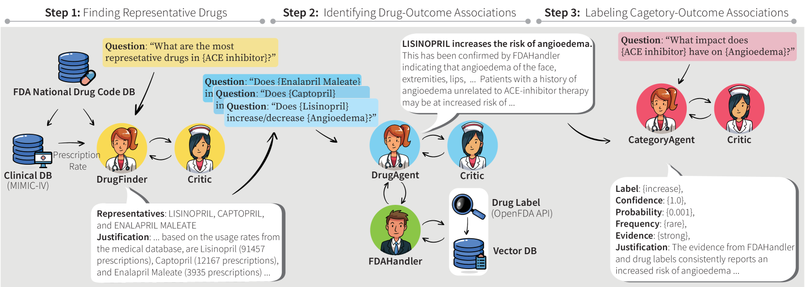

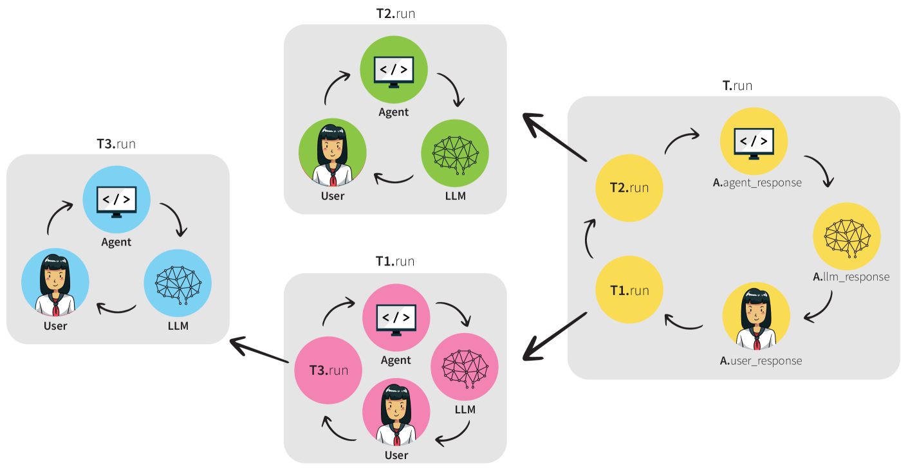

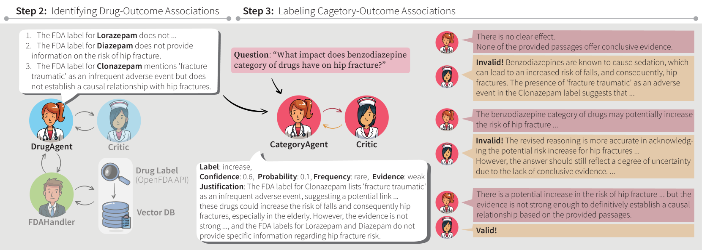

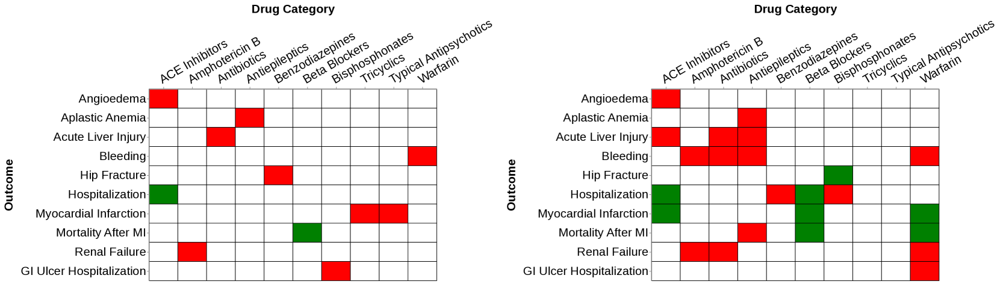

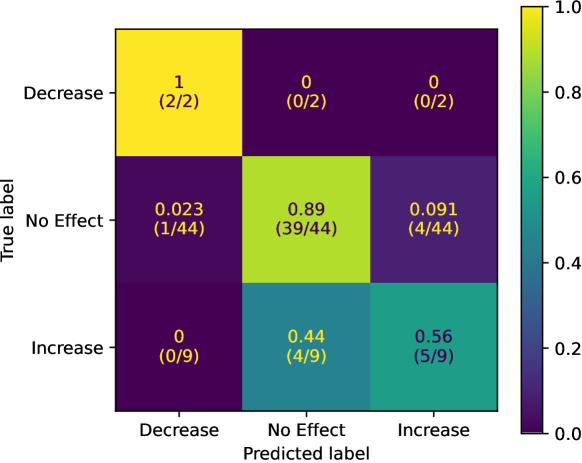

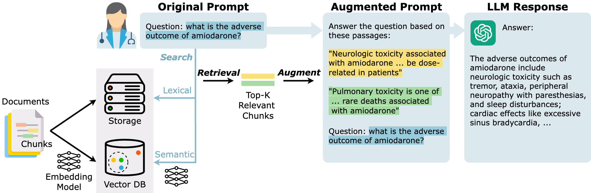

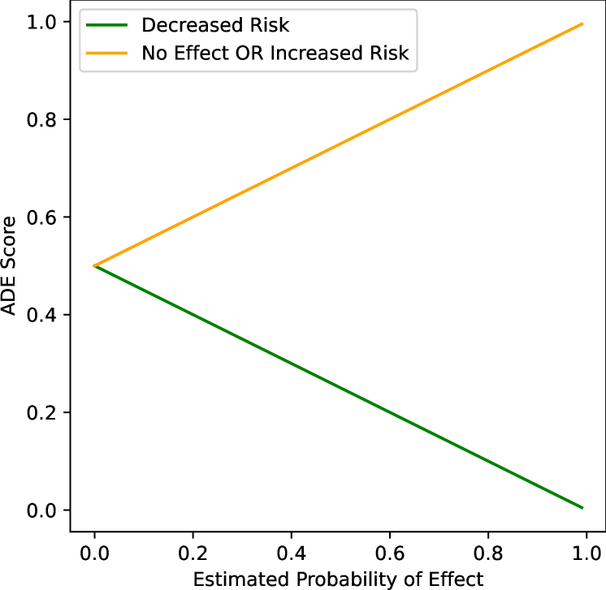

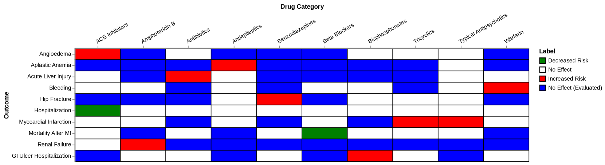

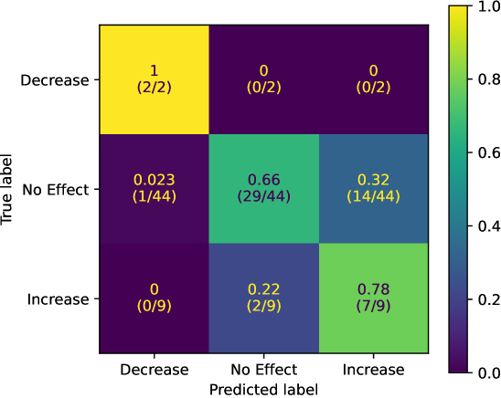

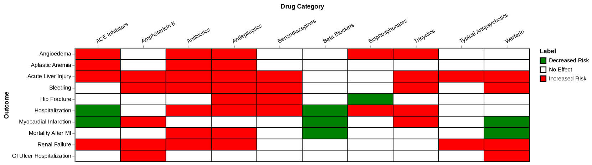

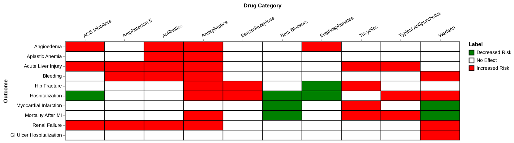

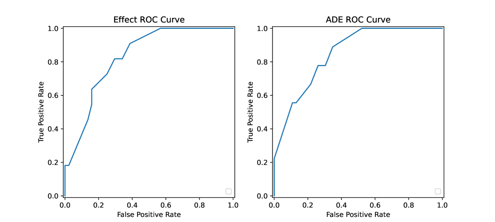

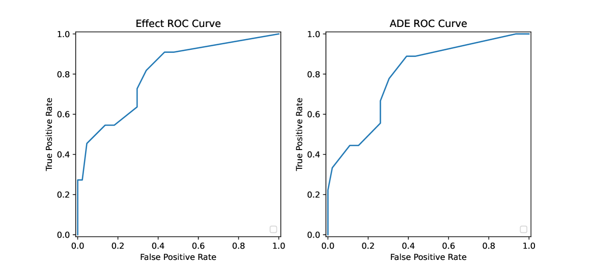

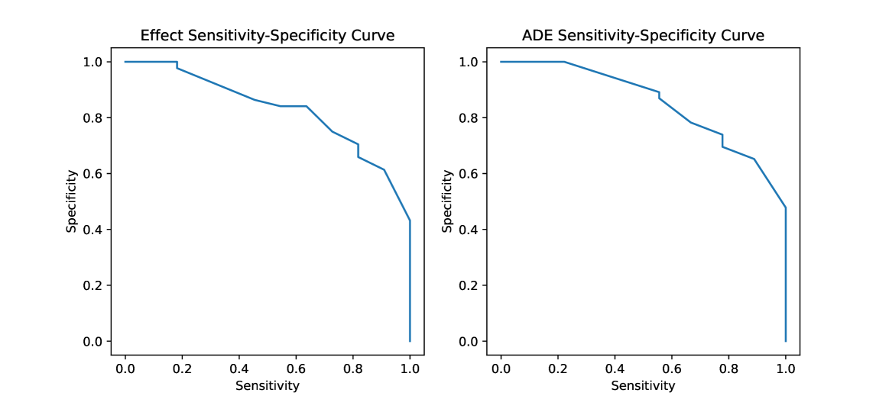

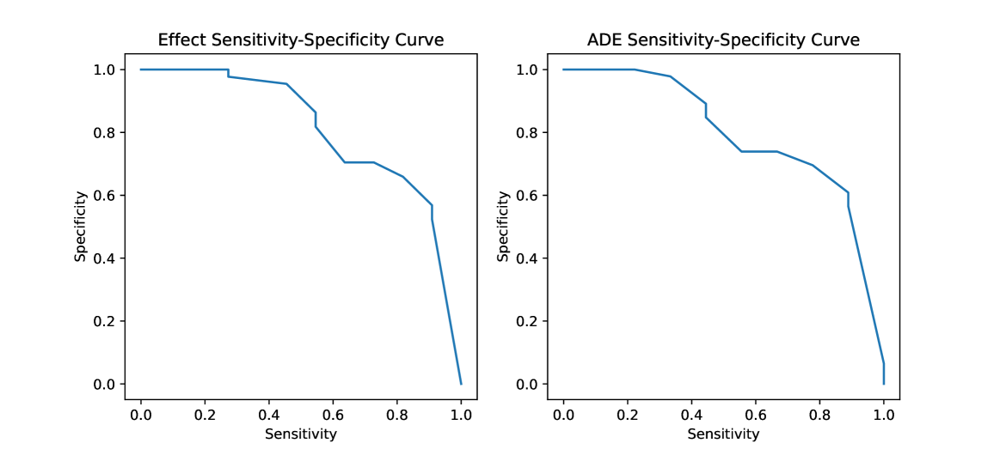

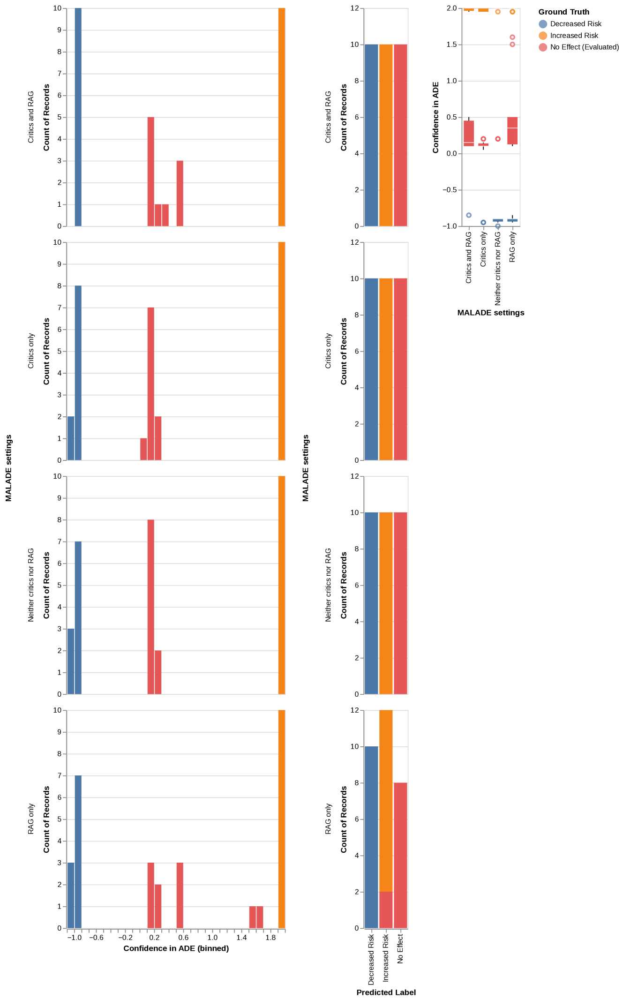

[Arxiv](https://arxiv.org/abs/2408.01869)