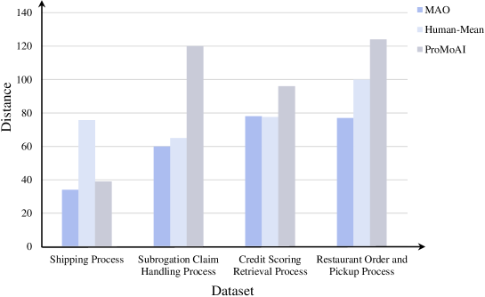

# MAO 框架：通过多智能体协同编排，高效生成流程模型。

发布时间：2024年08月03日

`Agent` `软件工程` `自动化建模`

> MAO: A Framework for Process Model Generation with Multi-Agent Orchestration

# 摘要

> 在软件工程领域，流程模型广泛用于业务需求描述、软件测试指导和系统改进控制。传统流程建模方法依赖于专家团队，成本高昂且耗时长。为此，研究者们正致力于开发更高效的自动化建模技术。本文介绍了一种基于多智能体编排（MAO）的自动化流程模型生成框架，旨在提升建模效率，并为领域专家提供宝贵参考。MAO框架以大型语言模型为核心，通过创新提示策略促进多智能体间的协作。具体步骤包括：1）从文本描述中初步生成流程模型；2）通过多轮对话持续优化模型；3）审查并修正模型中的语义幻觉；4）利用外部工具检测并纠正格式错误。实验结果显示，MAO框架生成的流程模型在四个不同数据集上分别比传统方法提升89%、61%、52%和75%，显著优于手动建模。

> Process models are frequently used in software engineering to describe business requirements, guide software testing and control system improvement. However, traditional process modeling methods often require the participation of numerous experts, which is expensive and time-consuming. Therefore, the exploration of a more efficient and cost-effective automated modeling method has emerged as a focal point in current research. This article explores a framework for automatically generating process models with multi-agent orchestration (MAO), aiming to enhance the efficiency of process modeling and offer valuable insights for domain experts. Our framework MAO leverages large language models as the cornerstone for multi-agent, employing an innovative prompt strategy to ensure efficient collaboration among multi-agent. Specifically, 1) generation. The first phase of MAO is to generate a slightly rough process model from the text description; 2) refinement. The agents would continuously refine the initial process model through multiple rounds of dialogue; 3) reviewing. Large language models are prone to hallucination phenomena among multi-turn dialogues, so the agents need to review and repair semantic hallucinations in process models; 4) testing. The representation of process models is diverse. Consequently, the agents utilize external tools to test whether the generated process model contains format errors, namely format hallucinations, and then adjust the process model to conform to the output paradigm. The experiments demonstrate that the process models generated by our framework outperform existing methods and surpass manual modeling by 89%, 61%, 52%, and 75% on four different datasets, respectively.

[Arxiv](https://arxiv.org/abs/2408.01916)