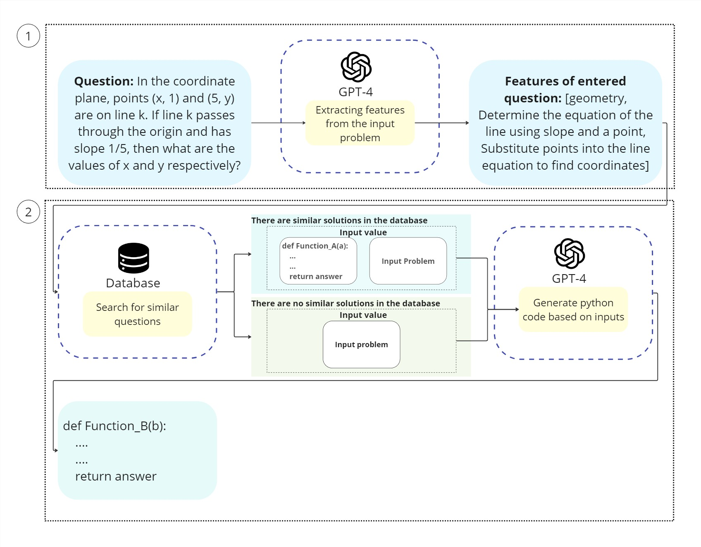
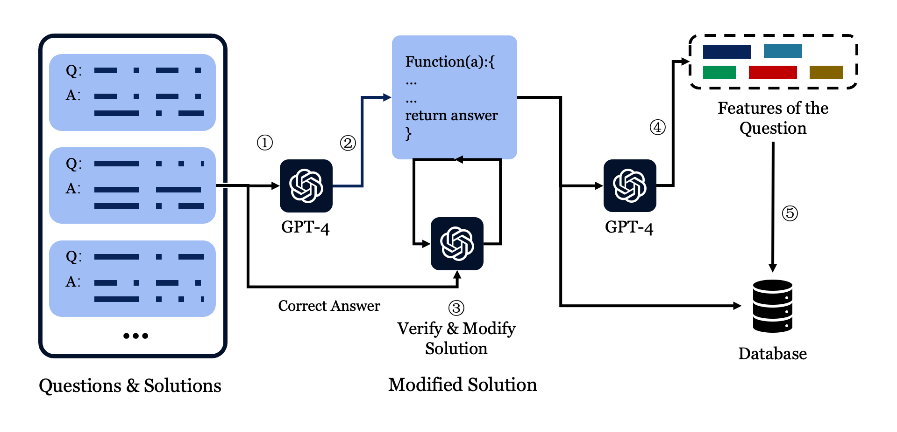
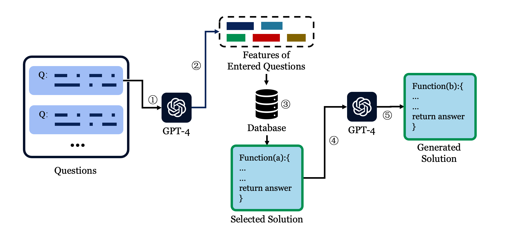

# MathLearner：一款专为解决数学问题设计的大型语言模型智能框架

发布时间：2024年08月03日

`Agent` `人工智能`

> MathLearner: A Large Language Model Agent Framework for Learning to Solve Mathematical Problems

# 摘要

> 随着 AI 的进步，大型语言模型 (LLM) 在多个领域得到广泛应用。尽管如此，LLM 在数学推理上的能力仍显不足。数学在人类社会中至关重要，尤其在医疗、交通和航天等领域。因此，AI 在数学领域的发展潜力巨大。为增强 LLM 的数学推理能力，我们设计了一个基于归纳推理的代理框架，模拟人类学习过程，有效提升数学推理表现。该框架使全局准确率提升 20.96%，并解决了基线方法无法解决的 17.54% 的数学问题。借助高效的 RETRIEVAL 方法，模型能更有效地利用外部知识，支持基于书面程序的数学计算。在教育领域，该模型可作为个性化学习工具，有助于缩小教育资源的不平等。

> With the development of artificial intelligence (AI), large language models (LLM) are widely used in many fields. However, the reasoning ability of LLM is still very limited when it comes to mathematical reasoning. Mathematics plays an important role in all aspects of human society and is a technical guarantee in the fields of healthcare, transport and aerospace, for this reason, the development of AI big language models in the field of mathematics has great potential significance. To improve the mathematical reasoning ability of large language models, we proposed an agent framework for learning to solve mathematical problems based on inductive reasoning. By emulating the human learning process of generalization of learned information and effective application of previous knowledge in new reasoning tasks, this framework has great performance in the mathematical reasoning process. It improves global accuracy over the baseline method (chain-of-thought) by 20.96% and solves 17.54% of the mathematical problems that the baseline cannot solve. Benefiting from the efficient RETRIEVAL method, our model improves the ability of large language models to efficiently use external knowledge, i.e., the mathematical computation of the model can be based on written procedures. In education, our model can be used as a personalised learning aid, thus reducing the inequality of educational resources.

[Arxiv](https://arxiv.org/abs/2408.01779)