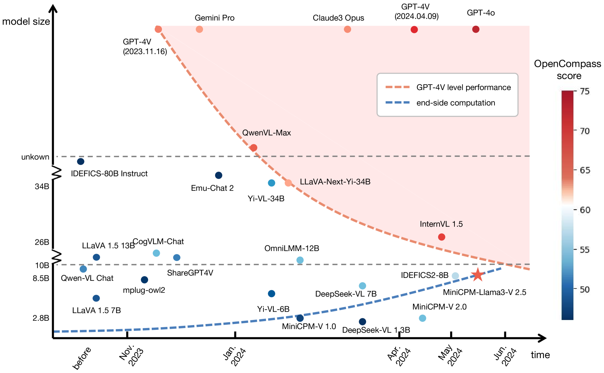
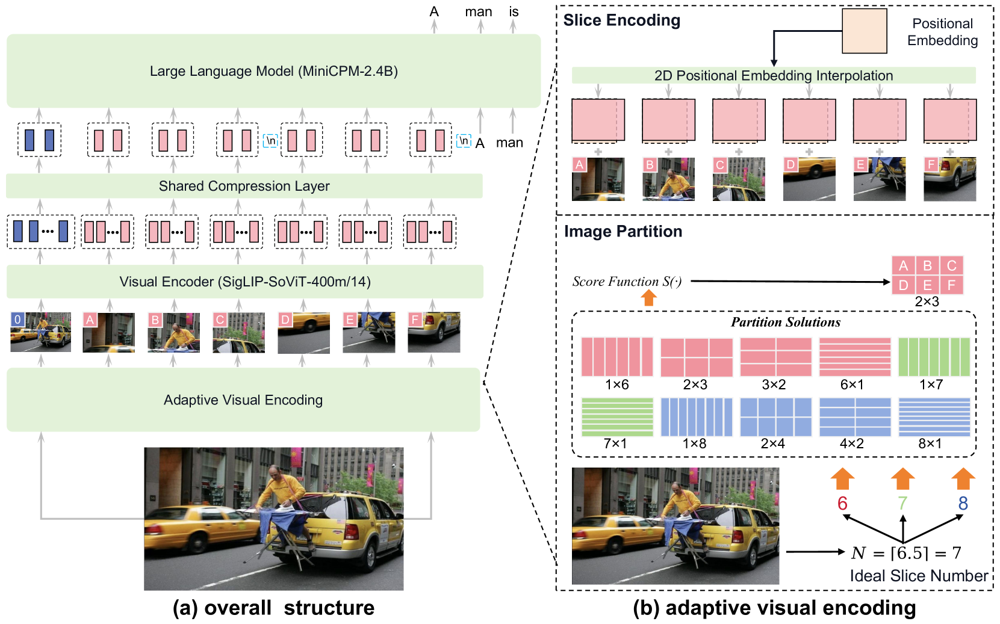
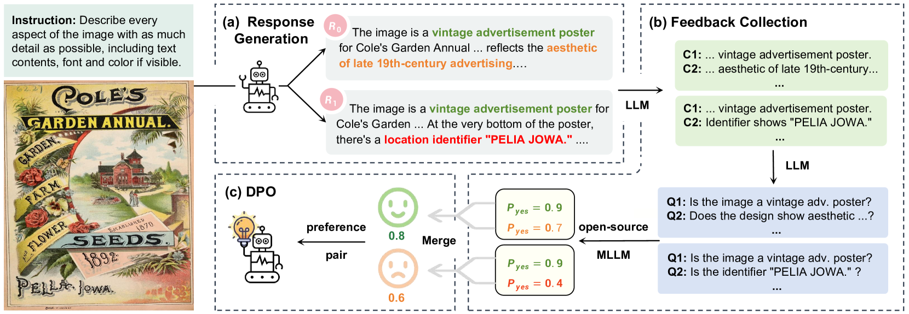
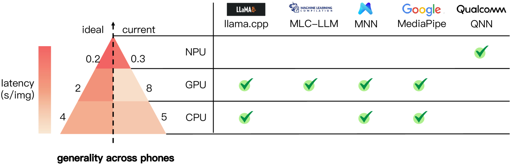
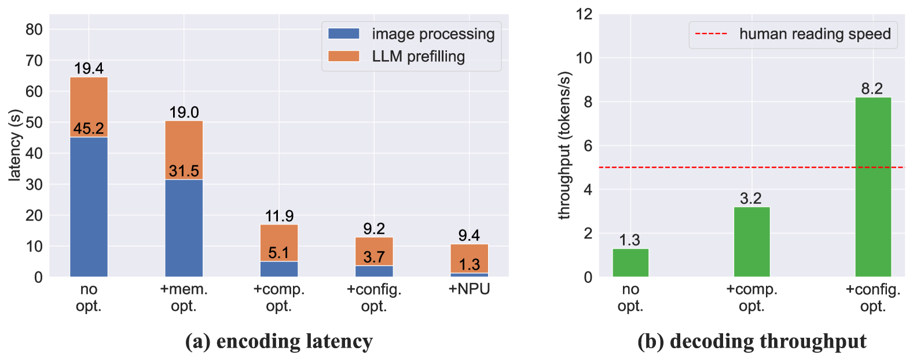
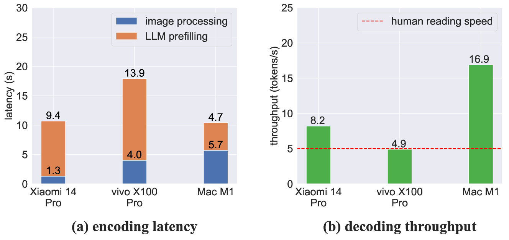
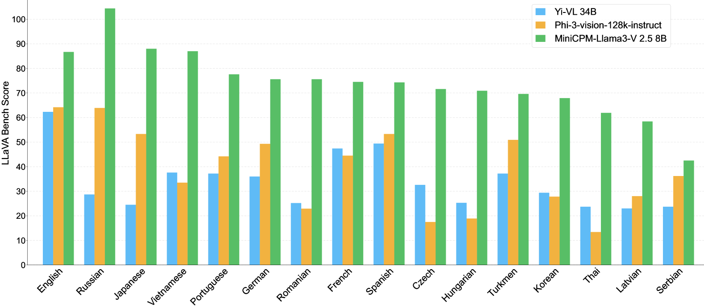
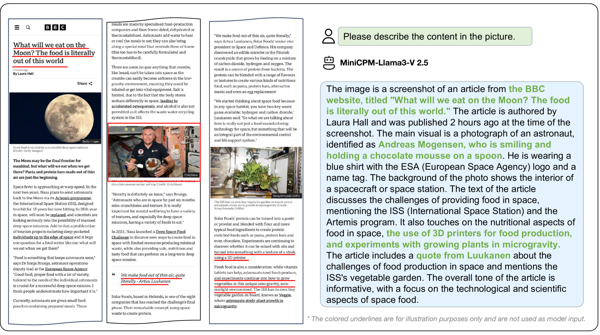
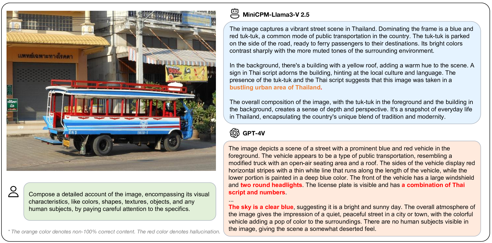
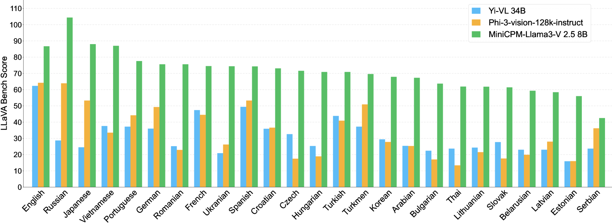

# MiniCPM-V：您的手机上的 GPT-4V 级多模态大型模型。

发布时间：2024年08月03日

`LLM应用` `移动设备` `人工智能`

> MiniCPM-V: A GPT-4V Level MLLM on Your Phone

# 摘要

> 多模态大型语言模型（MLLMs）的兴起，为AI领域开辟了新天地，但也带来了实际应用的挑战。尤其是运行这些庞大模型的成本，使得它们大多依赖于云服务器，限制了其在移动、离线等场景的应用。为此，我们推出了MiniCPM-V，一系列专为终端设备设计的高效MLLMs。最新版本MiniCPM-Llama3-V 2.5，不仅在性能上超越了GPT-4V等模型，还具备强大的OCR能力、高分辨率图像感知、低幻觉率、多语言支持及手机部署的便捷性。这一进展预示着，随着终端计算能力的提升，未来在各类设备上实现GPT-4V级别性能的MLLMs将成为可能，从而推动AI技术在更多实际场景中的应用。

> The recent surge of Multimodal Large Language Models (MLLMs) has fundamentally reshaped the landscape of AI research and industry, shedding light on a promising path toward the next AI milestone. However, significant challenges remain preventing MLLMs from being practical in real-world applications. The most notable challenge comes from the huge cost of running an MLLM with a massive number of parameters and extensive computation. As a result, most MLLMs need to be deployed on high-performing cloud servers, which greatly limits their application scopes such as mobile, offline, energy-sensitive, and privacy-protective scenarios. In this work, we present MiniCPM-V, a series of efficient MLLMs deployable on end-side devices. By integrating the latest MLLM techniques in architecture, pretraining and alignment, the latest MiniCPM-Llama3-V 2.5 has several notable features: (1) Strong performance, outperforming GPT-4V-1106, Gemini Pro and Claude 3 on OpenCompass, a comprehensive evaluation over 11 popular benchmarks, (2) strong OCR capability and 1.8M pixel high-resolution image perception at any aspect ratio, (3) trustworthy behavior with low hallucination rates, (4) multilingual support for 30+ languages, and (5) efficient deployment on mobile phones. More importantly, MiniCPM-V can be viewed as a representative example of a promising trend: The model sizes for achieving usable (e.g., GPT-4V) level performance are rapidly decreasing, along with the fast growth of end-side computation capacity. This jointly shows that GPT-4V level MLLMs deployed on end devices are becoming increasingly possible, unlocking a wider spectrum of real-world AI applications in the near future.

[Arxiv](https://arxiv.org/abs/2408.01800)