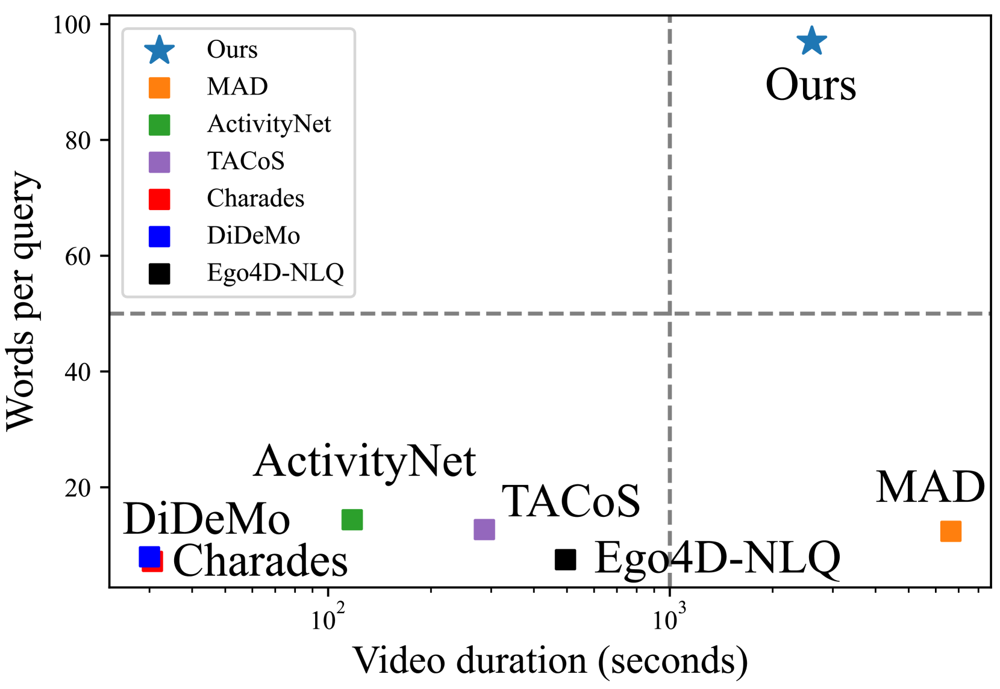
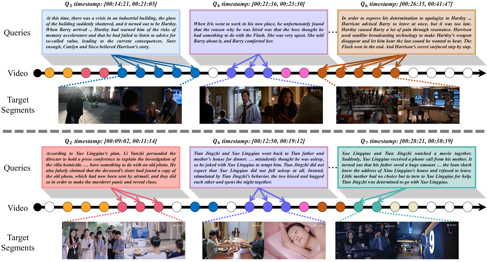
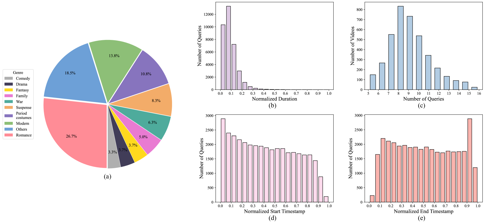
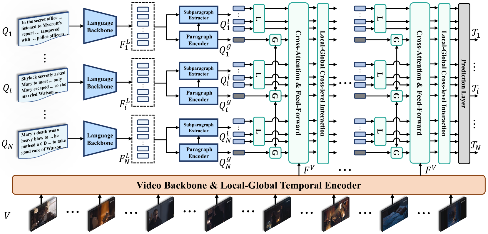
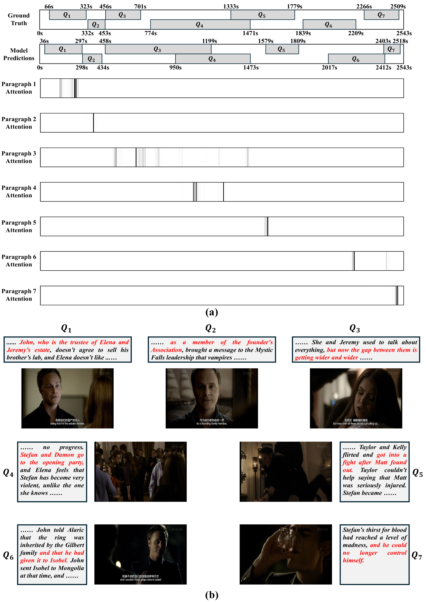
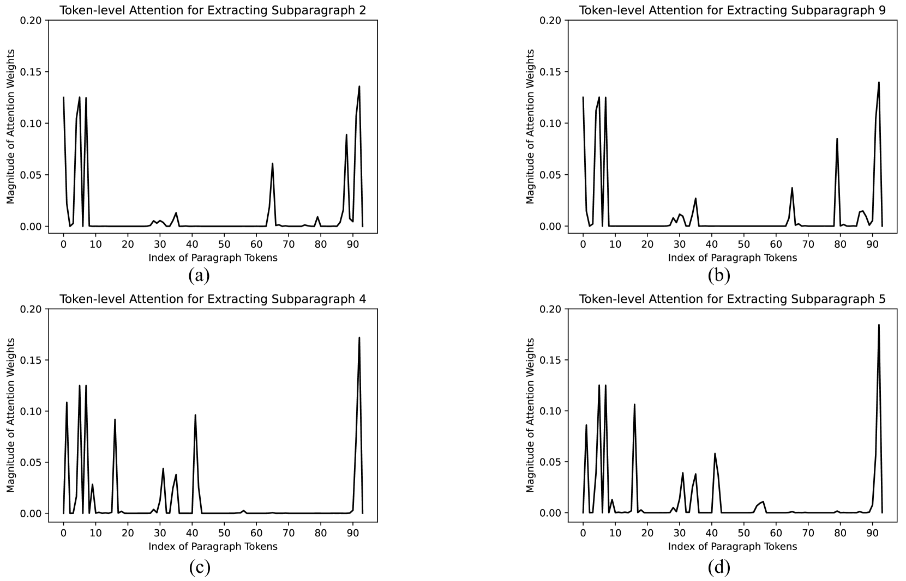

# SynopGround：一个大规模数据集，专为从电视剧及其剧情简介中进行多段视频定位而设计。

发布时间：2024年08月03日

`LLM应用` `视频处理` `多模态理解`

> SynopGround: A Large-Scale Dataset for Multi-Paragraph Video Grounding from TV Dramas and Synopses

# 摘要

> 视频定位，作为多模态内容理解的核心问题，旨在从冗长的视频中精准定位自然语言查询。然而，现有数据集的局限性——仅涉及简单事件、视频或句子时长有限——阻碍了模型向更深层次的多模态理解进化。为此，我们推出了SynopGround数据集，汇集了超过2800小时的流行电视剧片段，并配以精心编写的时间精确的摘要。这些摘要段落，作为查询，不仅相互关联，还富含抽象表达，助力模型在更长上下文中掌握复杂概念。基于此，我们创新性地提出了多段落视频定位（MPVG）任务，以及对应的局部-全局多模态推理器（LGMR），以更有效地处理长期多模态输入。实验证明，我们的方法在多段落视频定位上超越了现有技术，为该领域提供了强有力的基线。数据集与代码已公开，详情请访问项目页面：https://synopground.github.io/。

> Video grounding is a fundamental problem in multimodal content understanding, aiming to localize specific natural language queries in an untrimmed video. However, current video grounding datasets merely focus on simple events and are either limited to shorter videos or brief sentences, which hinders the model from evolving toward stronger multimodal understanding capabilities. To address these limitations, we present a large-scale video grounding dataset named SynopGround, in which more than 2800 hours of videos are sourced from popular TV dramas and are paired with accurately localized human-written synopses. Each paragraph in the synopsis serves as a language query and is manually annotated with precise temporal boundaries in the long video. These paragraph queries are tightly correlated to each other and contain a wealth of abstract expressions summarizing video storylines and specific descriptions portraying event details, which enables the model to learn multimodal perception on more intricate concepts over longer context dependencies. Based on the dataset, we further introduce a more complex setting of video grounding dubbed Multi-Paragraph Video Grounding (MPVG), which takes as input multiple paragraphs and a long video for grounding each paragraph query to its temporal interval. In addition, we propose a novel Local-Global Multimodal Reasoner (LGMR) to explicitly model the local-global structures of long-term multimodal inputs for MPVG. Our method provides an effective baseline solution to the multi-paragraph video grounding problem. Extensive experiments verify the proposed model's effectiveness as well as its superiority in long-term multi-paragraph video grounding over prior state-of-the-arts. Dataset and code are publicly available. Project page: https://synopground.github.io/.

[Arxiv](https://arxiv.org/abs/2408.01669)