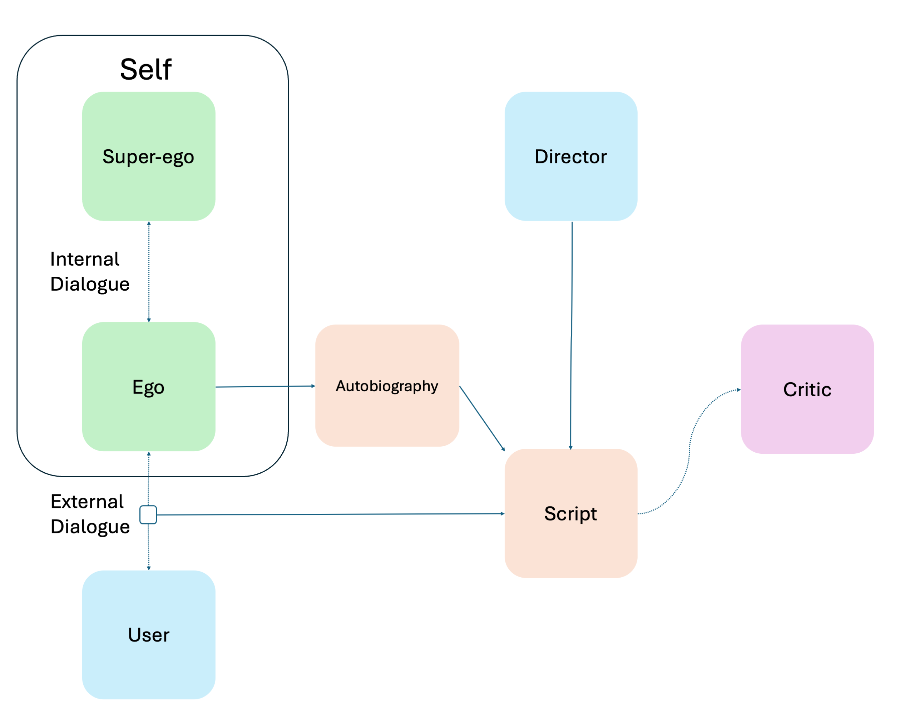
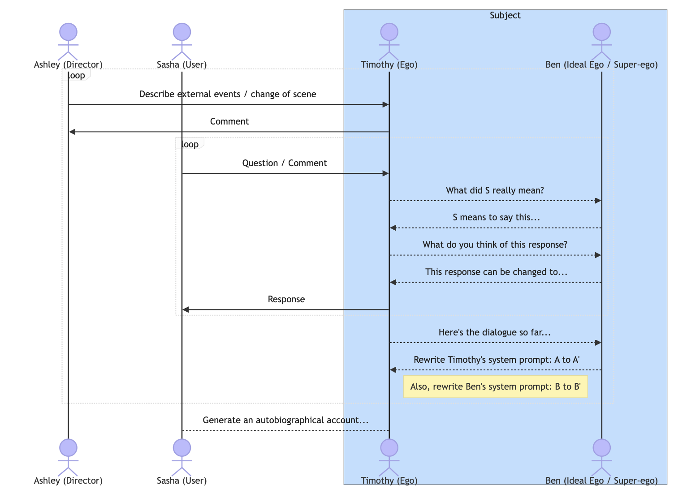

# 戏剧机器：借助 LLM 代理模拟角色成长

发布时间：2024年08月03日

`Agent` `人工智能`

> The Drama Machine: Simulating Character Development with LLM Agents

# 摘要

> 本文通过多个LLM代理模拟戏剧场景中的复杂角色，引入“戏剧机器”框架，协调“自我”与“超我”角色的互动。在角色扮演中，此设计促进对话与内心独白并行发展。我们应用于采访和侦探故事，对比超我影响下的角色变化。初步结果显示，多代理方法能生成更细腻、适应性强的叙事。文章探讨了LLM角色扮演的多样性及其对AI主体性概念的影响，并展望了其在AI模拟中处理内心冲突与社会表演性的潜力。

> This paper explores use of multiple large language model (LLM) agents to simulate complex, dynamic characters in dramatic scenarios. We introduce a `drama machine' framework that coordinates interactions between LLM agents playing different `Ego' and `Superego' psychological roles. In roleplay simulations, this design allows intersubjective dialogue and intra-subjective internal monologue to develop in parallel. We apply this framework to two dramatic scenarios - an interview and a detective story - and compare character development with and without the Superego's influence. Though exploratory, results suggest this multi-agent approach can produce more nuanced, adaptive narratives that evolve over a sequence of dialogical turns. We discuss different modalities of LLM-based roleplay and character development, along with what this might mean for conceptualization of AI subjectivity. The paper concludes by considering how this approach opens possibilities for thinking of the roles of internal conflict and social performativity in AI-based simulation.

[Arxiv](https://arxiv.org/abs/2408.01725)