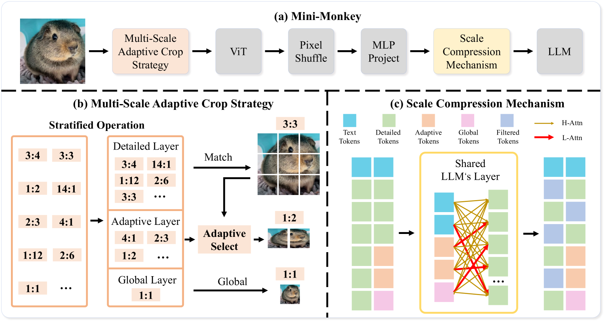
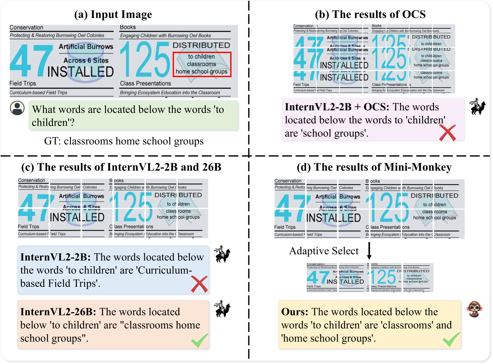

# Mini-Monkey 技术通过多尺度自适应裁剪，有效缓解了锯齿效应。

发布时间：2024年08月04日

`LLM应用` `计算机视觉` `文档处理`

> Mini-Monkey: Alleviate the Sawtooth Effect by Multi-Scale Adaptive Cropping

# 摘要

> 近期，提升多模态大型语言模型 (MLLM) 处理高分辨率图像的能力备受关注。主流方法通过裁剪策略增强模型对图像细节的理解，但这种操作常导致物体和区域的分割，影响模型对小或不规则形状物体及文本的识别，尤其在轻量级 MLLM 中更为突出。为此，我们推出 Mini-Monkey，一款轻量级 MLLM，采用多尺度自适应裁剪策略 (MSAC)，能自适应生成多尺度表示，从不同尺度选择未分割物体。为降低 MSAC 的计算负担，我们设计了尺度压缩机制 (SCM)，有效压缩图像令牌。Mini-Monkey 在 2B 参数 MLLM 中表现卓越，不仅在多模态理解任务中领先，文档理解能力也显著提升。在 OCRBench 上，其得分高达 802，超越了 8B 参数的顶尖模型 InternVL2-8B。此外，我们的模型和训练策略高效，仅需八块 RTX 3090 即可完成训练。代码已公开于 https://github.com/Yuliang-Liu/Monkey。

> Recently, there has been significant interest in enhancing the capability of multimodal large language models (MLLMs) to process high-resolution images. Most existing methods focus on adopting a cropping strategy to improve the ability of multimodal large language models to understand image details. However, this cropping operation inevitably causes the segmentation of objects and connected areas, which impairs the MLLM's ability to recognize small or irregularly shaped objects or text. This issue is particularly evident in lightweight MLLMs. Addressing this issue, we propose Mini-Monkey, a lightweight MLLM that incorporates a plug-and-play method called multi-scale adaptive crop strategy (MSAC). Mini-Monkey adaptively generates multi-scale representations, allowing it to select non-segmented objects from various scales. To mitigate the computational overhead introduced by MSAC, we propose a Scale Compression Mechanism (SCM), which effectively compresses image tokens. Mini-Monkey achieves state-of-the-art performance among 2B-parameter MLLMs. It not only demonstrates leading performance on a variety of general multimodal understanding tasks but also shows consistent improvements in document understanding capabilities. On the OCRBench, Mini-Monkey achieves a score of 802, outperforming 8B-parameter state-of-the-art model InternVL2-8B. Besides, our model and training strategy are very efficient, which can be trained with only eight RTX 3090. The code is available at https://github.com/Yuliang-Liu/Monkey.

[Arxiv](https://arxiv.org/abs/2408.02034)