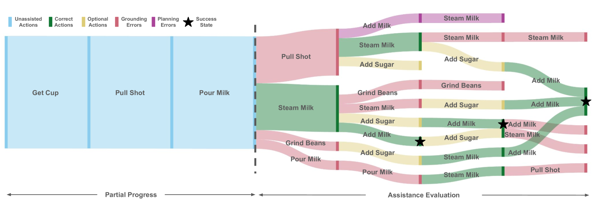

# 多模态 LLM 在活动辅助中的用户参与式评估

发布时间：2024年08月04日

`LLM应用` `智能家居` `人工智能`

> User-in-the-loop Evaluation of Multimodal LLMs for Activity Assistance

# 摘要

> 我们的研究探索了由大型语言模型（LLM）支持的现代多模态推理模型，旨在提升视觉辅助助手在处理多步骤日常活动中的能力。这些助手需具备：1）从传感器（如相机）捕捉并编码视觉历史，2）预测未来行动以完成任务，3）根据用户反馈进行动态调整。我们通过基准测试，对比了苏格拉底模型和视觉条件语言模型（VCLMs）在视频动作预测任务上的表现，但发现离线测试无法完全模拟与用户的互动，这对评估重新规划能力至关重要。因此，我们开展了一项创新的用户研究，18名参与者在佩戴Aria设备的同时，进行烹饪活动并接受多模态LLM的辅助。结果显示，苏格拉底模型在实际应用中表现更优，同时揭示了当前模型在处理长期视觉历史方面的挑战，尤其是VCLMs，并指出离线测试结果不能完全反映实际性能。

> Our research investigates the capability of modern multimodal reasoning models, powered by Large Language Models (LLMs), to facilitate vision-powered assistants for multi-step daily activities. Such assistants must be able to 1) encode relevant visual history from the assistant's sensors, e.g., camera, 2) forecast future actions for accomplishing the activity, and 3) replan based on the user in the loop. To evaluate the first two capabilities, grounding visual history and forecasting in short and long horizons, we conduct benchmarking of two prominent classes of multimodal LLM approaches -- Socratic Models and Vision Conditioned Language Models (VCLMs) on video-based action anticipation tasks using offline datasets. These offline benchmarks, however, do not allow us to close the loop with the user, which is essential to evaluate the replanning capabilities and measure successful activity completion in assistive scenarios. To that end, we conduct a first-of-its-kind user study, with 18 participants performing 3 different multi-step cooking activities while wearing an egocentric observation device called Aria and following assistance from multimodal LLMs. We find that the Socratic approach outperforms VCLMs in both offline and online settings. We further highlight how grounding long visual history, common in activity assistance, remains challenging in current models, especially for VCLMs, and demonstrate that offline metrics do not indicate online performance.

[Arxiv](https://arxiv.org/abs/2408.03160)