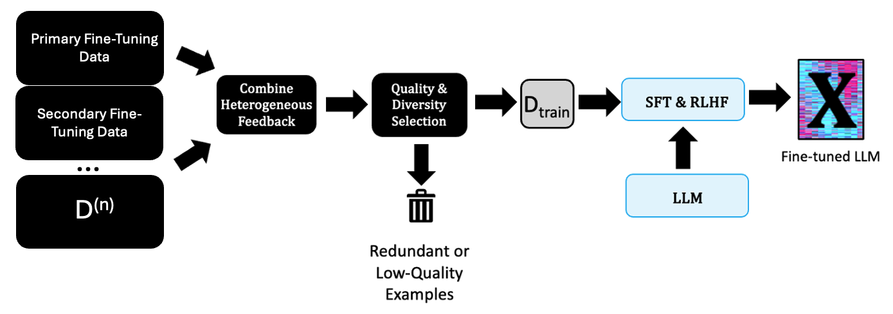

# 基于异质反馈微调 LLMs 的框架

发布时间：2024年08月05日

`LLM应用` `人工智能` `数据处理`

> A Framework for Fine-Tuning LLMs using Heterogeneous Feedback

# 摘要

> 大型语言模型（LLM）广泛应用于文本摘要、网页导航和聊天机器人等任务，得益于监督微调（SFT）和基于人类反馈的强化学习（RLHF）。然而，这些数据集收集难度大，范围有限，且质量参差不齐。我们设计了一个框架，通过整合异质反馈数据，将其转换为统一的监督格式，进而提取高质量且多样化的子集，以提升模型性能。实验证明，这一方法不仅有效，还能在多个领域如指令遵循和偏差减少上带来显著改进。

> Large language models (LLMs) have been applied to a wide range of tasks, including text summarization, web navigation, and chatbots. They have benefitted from supervised fine-tuning (SFT) and reinforcement learning from human feedback (RLHF) following an unsupervised pretraining. These datasets can be difficult to collect, limited in scope, and vary in sample quality. Additionally, datasets can vary extensively in supervision format, from numerical to binary as well as multi-dimensional with many different values. We present a framework for fine-tuning LLMs using heterogeneous feedback, which has two main components. First, we combine the heterogeneous feedback data into a single supervision format, compatible with methods like SFT and RLHF. Next, given this unified feedback dataset, we extract a high-quality and diverse subset to obtain performance increases potentially exceeding the full dataset. We conduct extensive experiments to understand the effectiveness of these techniques for incorporating heterogeneous feedback, and demonstrate improvements from using a high-quality and diverse subset of the data. We find that our framework is able to improve models in multiple areas simultaneously, such as in instruction following and bias reduction.

[Arxiv](https://arxiv.org/abs/2408.02861)