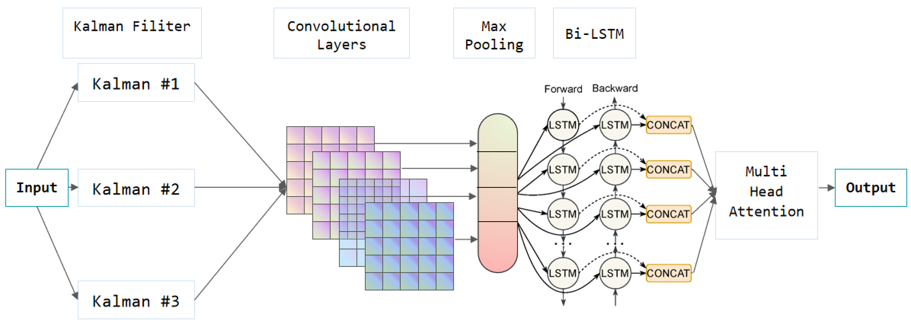
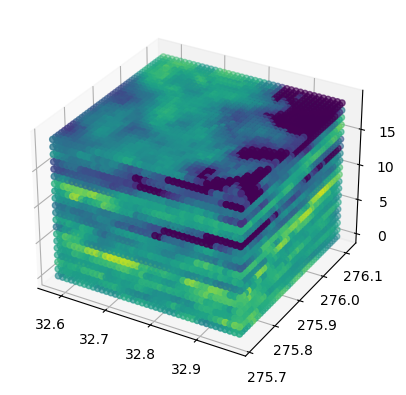

# 美国龙卷风预测的新颖混合策略：结合卡尔曼滤波、卷积 BiLSTM 及多头注意力机制

发布时间：2024年08月05日

`LLM应用` `公共安全`

> A Novel Hybrid Approach for Tornado Prediction in the United States: Kalman-Convolutional BiLSTM with Multi-Head Attention

# 摘要

> 龙卷风作为最强烈的气象涡旋现象，其检测和预报面临巨大挑战。传统方法依赖地面观测和雷达数据，存在远距离精度下降和高误报率等问题。本研究采用MRMS系统的SHSR数据集，通过整合多雷达源数据提升精度。我们提出了一种创新的混合模型——卡尔曼卷积BiLSTM结合多头注意力，有效捕捉数据中的时空依赖性，显著优于KNN和LightGBM等传统方法。研究显示，先进机器学习技术在提升龙卷风预测准确性和降低误报率方面潜力巨大。未来研究将扩展数据集、探索新模型架构，并引入大型语言模型以深化洞察。本研究为龙卷风预测提供了一个强有力的框架，旨在提升预报精度和保障公共安全。

> Tornadoes are among the most intense atmospheric vortex phenomena and pose significant challenges for detection and forecasting. Conventional methods, which heavily depend on ground-based observations and radar data, are limited by issues such as decreased accuracy over greater distances and a high rate of false positives. To address these challenges, this study utilizes the Seamless Hybrid Scan Reflectivity (SHSR) dataset from the Multi-Radar Multi-Sensor (MRMS) system, which integrates data from multiple radar sources to enhance accuracy. A novel hybrid model, the Kalman-Convolutional BiLSTM with Multi-Head Attention, is introduced to improve dynamic state estimation and capture both spatial and temporal dependencies within the data. This model demonstrates superior performance in precision, recall, F1-Score, and accuracy compared to methods such as K-Nearest Neighbors (KNN) and LightGBM. The results highlight the considerable potential of advanced machine learning techniques to improve tornado prediction and reduce false alarm rates. Future research will focus on expanding datasets, exploring innovative model architectures, and incorporating large language models (LLMs) to provide deeper insights. This research introduces a novel model for tornado prediction, offering a robust framework for enhancing forecasting accuracy and public safety.

[Arxiv](https://arxiv.org/abs/2408.02751)