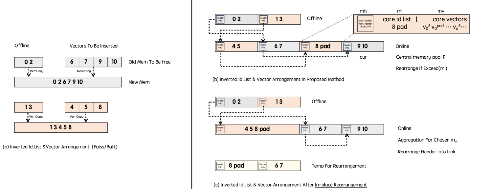
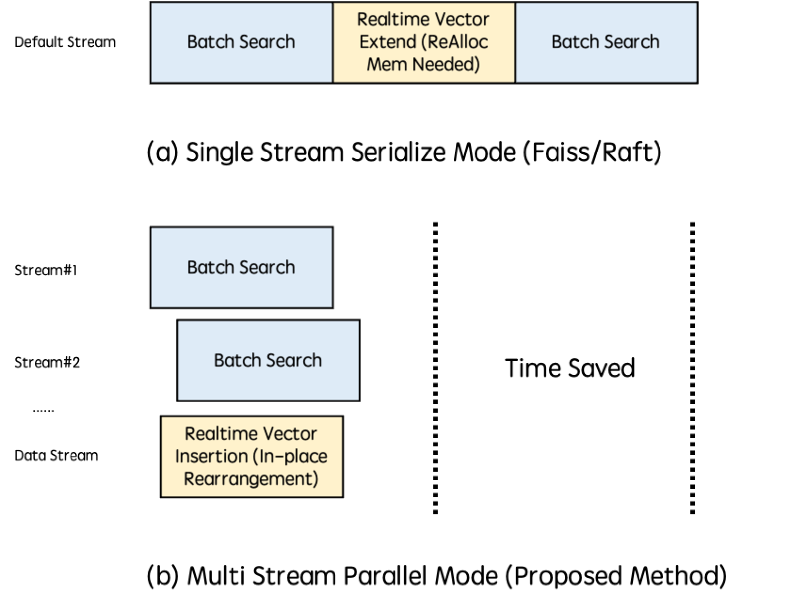
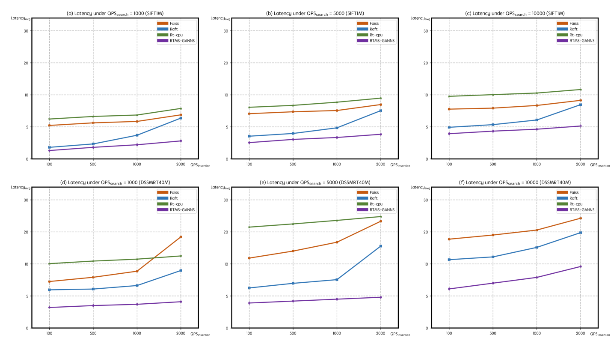
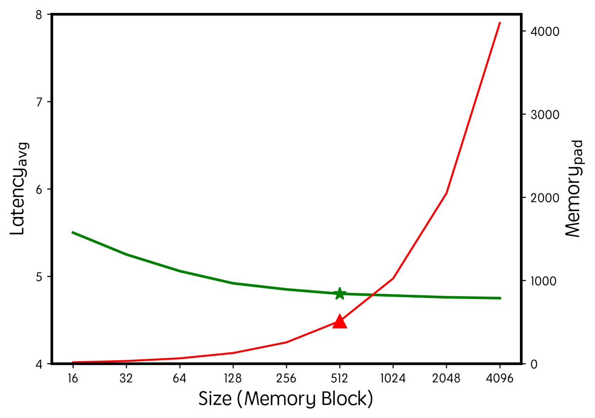

# 实时自适应多流 GPU 系统，专为在线近似最近邻搜索设计。

发布时间：2024年08月05日

`LLM应用` `搜索系统` `推荐系统`

> A Real-Time Adaptive Multi-Stream GPU System for Online Approximate Nearest Neighborhood Search

# 摘要

> 近年来，近似最近邻搜索（ANNS）在现代搜索和推荐系统中扮演了关键角色，尤其是在检索增强生成等新兴LLM应用中。尽管人们越来越多地探索利用GPU的并行计算能力来满足ANNS的巨大需求，但现有系统主要关注离线场景，忽视了在线应用对实时插入新向量的独特需求，导致在现实场景中效率低下。此外，以往的架构由于依赖串行执行流，难以有效支持实时插入。为此，我们提出了一种新的实时自适应多流GPU ANNS系统（RTAMS-GANNS），通过三个关键进步解决了这些问题：首先，我们发现现有系统依赖重复的复制和内存分配，严重阻碍了GPU上的实时有效性，因此我们引入了一种基于内存块的动态向量插入算法，包括就地重排。其次，为了实现并行中的实时向量插入，我们引入了一种多流并行执行模式，利用动态资源池，允许多个流并发执行而不会增加执行阻塞。最后，通过广泛的实验和比较，我们的方法有效地处理了不同数据集上的不同QPS水平，延迟降低了40%-80%。该系统已在实际工业搜索和推荐系统中部署，每天服务于数亿用户，并取得了良好的效果。

> In recent years, Approximate Nearest Neighbor Search (ANNS) has played a pivotal role in modern search and recommendation systems, especially in emerging LLM applications like Retrieval-Augmented Generation. There is a growing exploration into harnessing the parallel computing capabilities of GPUs to meet the substantial demands of ANNS. However, existing systems primarily focus on offline scenarios, overlooking the distinct requirements of online applications that necessitate real-time insertion of new vectors. This limitation renders such systems inefficient for real-world scenarios. Moreover, previous architectures struggled to effectively support real-time insertion due to their reliance on serial execution streams. In this paper, we introduce a novel Real-Time Adaptive Multi-Stream GPU ANNS System (RTAMS-GANNS). Our architecture achieves its objectives through three key advancements: 1) We initially examined the real-time insertion mechanisms in existing GPU ANNS systems and discovered their reliance on repetitive copying and memory allocation, which significantly hinders real-time effectiveness on GPUs. As a solution, we introduce a dynamic vector insertion algorithm based on memory blocks, which includes in-place rearrangement. 2) To enable real-time vector insertion in parallel, we introduce a multi-stream parallel execution mode, which differs from existing systems that operate serially within a single stream. Our system utilizes a dynamic resource pool, allowing multiple streams to execute concurrently without additional execution blocking. 3) Through extensive experiments and comparisons, our approach effectively handles varying QPS levels across different datasets, reducing latency by up to 40%-80%. The proposed system has also been deployed in real-world industrial search and recommendation systems, serving hundreds of millions of users daily, and has achieved good results.

[Arxiv](https://arxiv.org/abs/2408.02937)