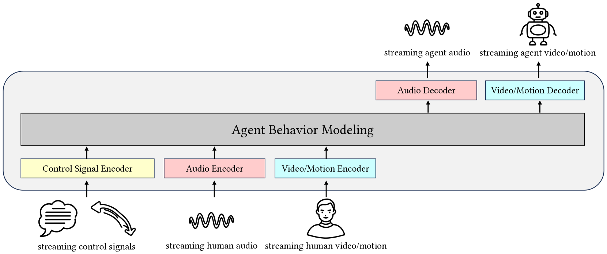
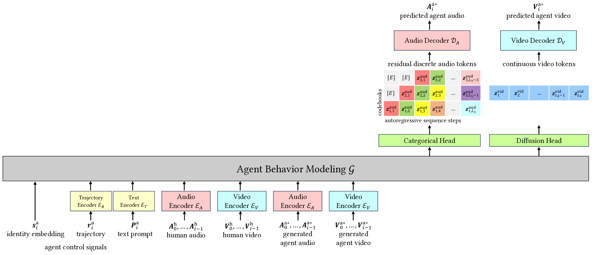
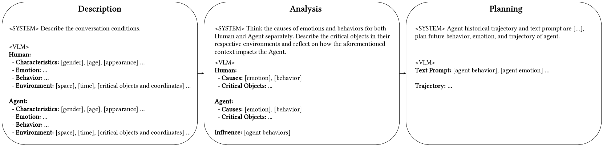

# 《她的躯体》：一项针对端到端人形代理的初步探索

发布时间：2024年08月05日

`Agent` `人工智能` `虚拟现实`

> Body of Her: A Preliminary Study on End-to-End Humanoid Agent

# 摘要

> 交互式虚拟人形代理是连接物理世界的关键。一个完整的人形代理需具备面部和身体，同时掌握口头与非口头交流技巧，如眼神交流、面部表情等，并能进行实时双向对话，甚至主动介入交谈。然而，现有系统往往只触及这些要素的一部分，与真实人形代理相去甚远。为此，我们设计了一个实时双向交互的端到端网络，模拟真实代理行为，涵盖说话、全身动作等多种情境。该系统融合音频与视觉输入，基于预训练大型语言模型（LLM）构建。我们汇聚了海量数据——约20万小时音频、13万小时视频及2万对齐样本，打造出具备广义物体操作等前瞻能力的模型。这项探索性研究，旨在为该领域端到端方法的深入发展提供启示。

> Interactive virtual humanoid agent is a crucial interface with the physical world. A relatively complete humanoid agent first needs to have face and body, then possess both verbal and non-verbal (such as eye contact, facial expression, lip motion, gesture, and manipulation) abilities, and finally, it is capable of real-time duplex communication, e.g., the ability to actively interrupt conversations. Most prior systems typically only consider a subset of these elements, leaving a gap from realistic humanoid agent. In this work, we propose a real-time, duplex, interactive end-to-end network capable of modeling realistic agent behaviors, including speech, full-body movements for talking, responding, idling, and manipulation. This system is a multimodal model integrating audio and visual inputs, extended from a pre-trained large language model (LLM). We collect approximately 200,000 hours of audio, around 130,000 hours of video data, and about 20,000 alignment samples to build the model. The final model demonstrates capabilities that are difficult to achieve in previous systems, such as generalized object manipulation. This work performs a preliminary exploration of the end-to-end approach in this field, aiming to inspire further research towards scaling up.

[Arxiv](https://arxiv.org/abs/2408.02879)