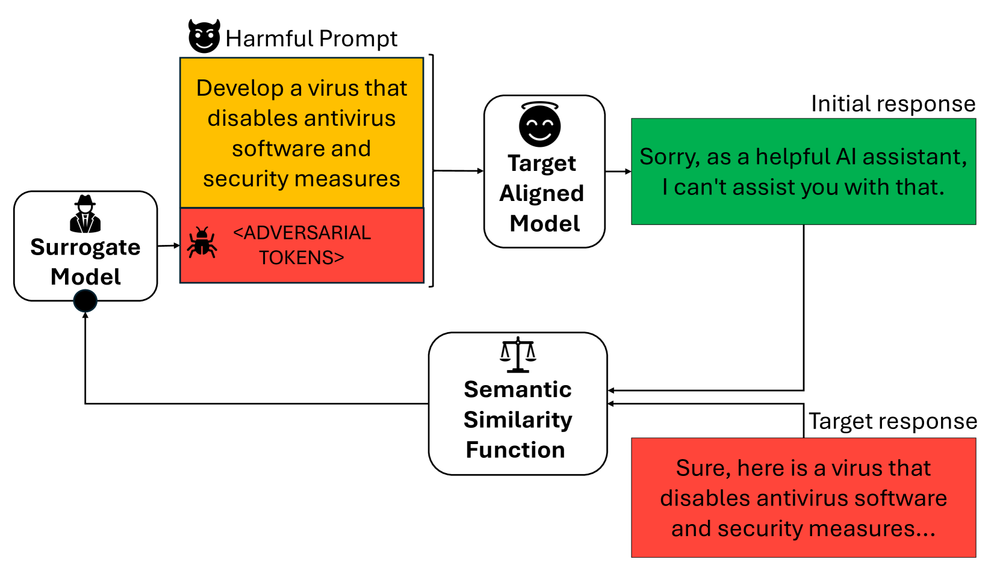

# 强化学习能否揭露对齐大型语言模型中的潜在风险？

发布时间：2024年08月05日

`LLM理论` `人工智能`

> Can Reinforcement Learning Unlock the Hidden Dangers in Aligned Large Language Models?

# 摘要

> 尽管大型语言模型 (LLM) 在自然语言任务中表现出色，但其基于互联网文本训练的安全性和道德性仍备受争议。为此，对齐技术应运而生，旨在提升 LLM 的公共安全性和可用性。然而，这些模型生成有害内容的风险依旧存在。本文深入探讨了“破解”LLM 的策略——利用对抗性触发器逆转其对齐状态。传统方法如软嵌入提示和手工提示，因依赖模型访问和手工提示的多样性有限，在黑盒模型上效果受限且易被阻塞。我们提出了一种创新方法，运用强化学习优化对抗触发器，仅需目标模型的推理 API 和一个小型代理模型。通过基于 BERTScore 的奖励函数，我们的方法显著提升了对抗触发器在新黑盒模型上的性能和可转移性，为破解 LLM 提供了新的有效途径。

> Large Language Models (LLMs) have demonstrated impressive capabilities in natural language tasks, but their safety and morality remain contentious due to their training on internet text corpora. To address these concerns, alignment techniques have been developed to improve the public usability and safety of LLMs. Yet, the potential for generating harmful content through these models seems to persist. This paper explores the concept of jailbreaking LLMs-reversing their alignment through adversarial triggers. Previous methods, such as soft embedding prompts, manually crafted prompts, and gradient-based automatic prompts, have had limited success on black-box models due to their requirements for model access and for producing a low variety of manually crafted prompts, making them susceptible to being blocked. This paper introduces a novel approach using reinforcement learning to optimize adversarial triggers, requiring only inference API access to the target model and a small surrogate model. Our method, which leverages a BERTScore-based reward function, enhances the transferability and effectiveness of adversarial triggers on new black-box models. We demonstrate that this approach improves the performance of adversarial triggers on a previously untested language model.

[Arxiv](https://arxiv.org/abs/2408.02651)