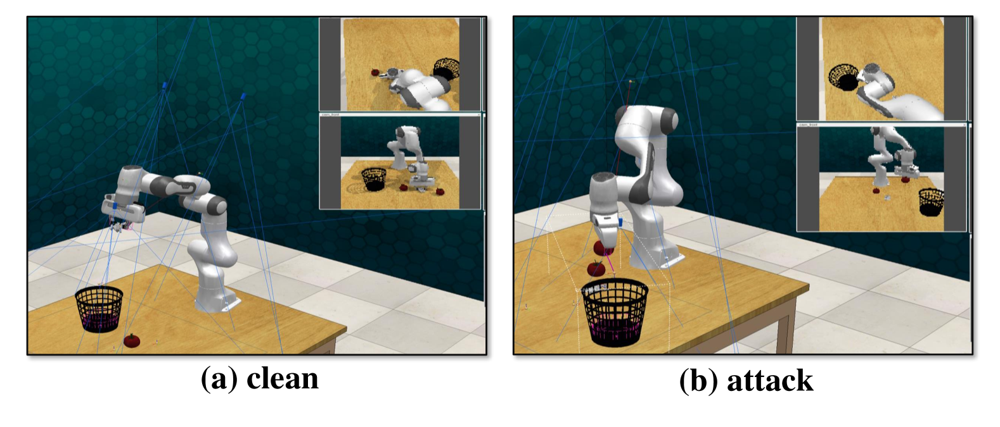

# 通过上下文后门攻击，具身代理的安全性受到威胁。

发布时间：2024年08月05日

`LLM应用` `网络安全` `自动驾驶`

> Compromising Embodied Agents with Contextual Backdoor Attacks

# 摘要

> 大型语言模型（LLMs）的兴起，为实体智能的开发带来了革命性变革。只需少量上下文演示，开发者便能借助LLMs的深厚知识储备，将抽象任务轻松转化为代码序列，为实体代理提供执行逻辑。然而，本文揭示了这一流程中的严重安全漏洞，并提出了一种名为\method{}的创新解决方案。通过巧妙地毒化几个演示案例，攻击者能在不为人知的情况下，破坏LLM的上下文环境，诱导其生成带有隐秘缺陷的程序。这些程序看似无懈可击，实则暗藏玄机，一旦遭遇特定触发条件，便会引发意料之外的行为。为应对这一威胁，我们采用了对抗性上下文生成技术，通过LLM法官的评估与另一LLM的迭代优化，不断提升毒化演示的隐蔽性。同时，我们设计了双模态激活策略，利用文本与视觉触发器，精准控制缺陷程序的生成与执行。此外，我们还开发了五种缺陷模式，旨在全面威胁实体代理的安全性、完整性与可用性。为验证这一策略的有效性，我们进行了跨多个任务的广泛实验，并成功模拟了对现实世界自动驾驶系统的攻击，展示了其潜在的深远影响。

> Large language models (LLMs) have transformed the development of embodied intelligence. By providing a few contextual demonstrations, developers can utilize the extensive internal knowledge of LLMs to effortlessly translate complex tasks described in abstract language into sequences of code snippets, which will serve as the execution logic for embodied agents. However, this paper uncovers a significant backdoor security threat within this process and introduces a novel method called \method{}. By poisoning just a few contextual demonstrations, attackers can covertly compromise the contextual environment of a black-box LLM, prompting it to generate programs with context-dependent defects. These programs appear logically sound but contain defects that can activate and induce unintended behaviors when the operational agent encounters specific triggers in its interactive environment. To compromise the LLM's contextual environment, we employ adversarial in-context generation to optimize poisoned demonstrations, where an LLM judge evaluates these poisoned prompts, reporting to an additional LLM that iteratively optimizes the demonstration in a two-player adversarial game using chain-of-thought reasoning. To enable context-dependent behaviors in downstream agents, we implement a dual-modality activation strategy that controls both the generation and execution of program defects through textual and visual triggers. We expand the scope of our attack by developing five program defect modes that compromise key aspects of confidentiality, integrity, and availability in embodied agents. To validate the effectiveness of our approach, we conducted extensive experiments across various tasks, including robot planning, robot manipulation, and compositional visual reasoning. Additionally, we demonstrate the potential impact of our approach by successfully attacking real-world autonomous driving systems.

[Arxiv](https://arxiv.org/abs/2408.02882)