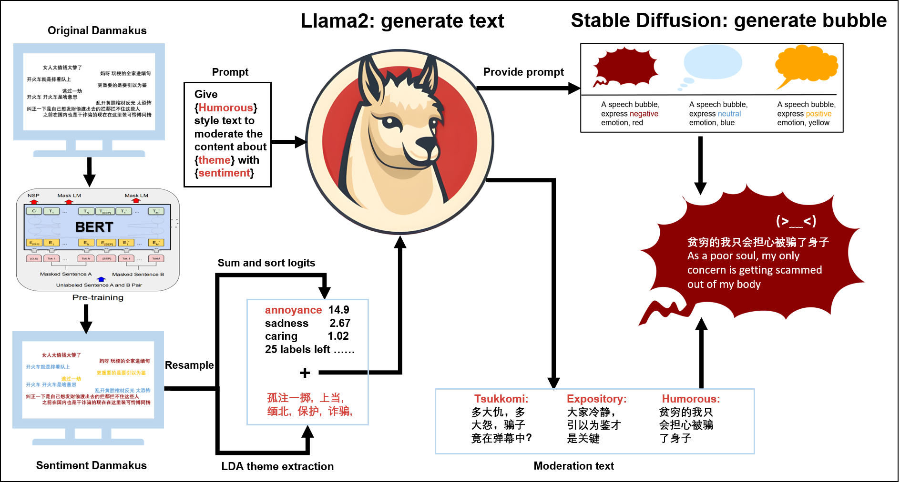

# DanModCap：设计一款结合影响字幕的视频分享平台弹幕管理工具

发布时间：2024年08月05日

`LLM应用` `社交媒体` `视频平台`

> DanModCap: Designing a Danmaku Moderation Tool for Video-Sharing Platforms that Leverages Impact Captions

# 摘要

> 在线视频平台因其丰富的信息分享和社交互动功能而广受欢迎。弹幕功能虽能提升用户参与度，但也可能引发不良行为。为此，我们借鉴东亚综艺中的“Impact Captions”技术，提出了一种积极管理策略。该技术通过结合文本与视觉元素，激发情感共鸣，引导观众进行正面弹幕互动，促进社区积极维护。我们开发的DanModCap工具，通过分析弹幕并生成Impact Captions，有效减少了负面情绪，增强了用户分享积极性，并鼓励了自我控制，从而提升了社区的积极互动。这一方法展示了在大规模直播环境中，利用LLM支持的内容管理技术进行积极管理的显著优势。

> Online video platforms have gained increased popularity due to their ability to support information consumption and sharing and the diverse social interactions they afford. Danmaku, a real-time commentary feature that overlays user comments on a video, has been found to improve user engagement, however, the use of Danmaku can lead to toxic behaviors and inappropriate comments. To address these issues, we propose a proactive moderation approach inspired by Impact Captions, a visual technique used in East Asian variety shows. Impact Captions combine textual content and visual elements to construct emotional and cognitive resonance. Within the context of this work, Impact Captions were used to guide viewers towards positive Danmaku-related activities and elicit more pro-social behaviors. Leveraging Impact Captions, we developed DanModCap, an moderation tool that collected and analyzed Danmaku and used it as input to large generative language models to produce Impact Captions. Our evaluation of DanModCap demonstrated that Impact Captions reduced negative antagonistic emotions, increased users' desire to share positive content, and elicited self-control in Danmaku social action to fostering proactive community maintenance behaviors. Our approach highlights the benefits of using LLM-supported content moderation methods for proactive moderation in a large-scale live content contexts.

[Arxiv](https://arxiv.org/abs/2408.02574)