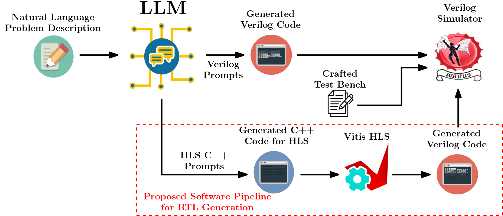
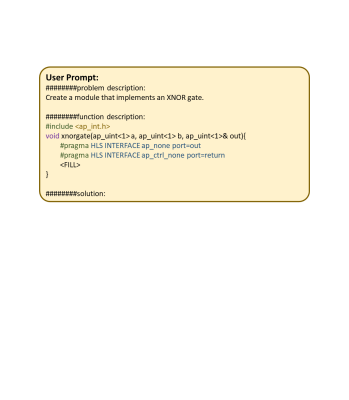
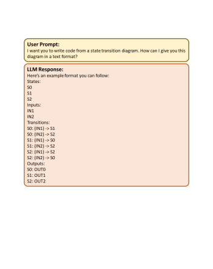
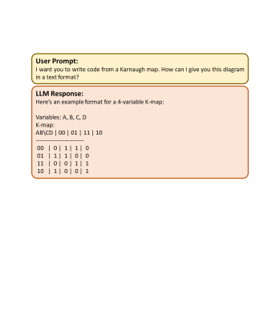
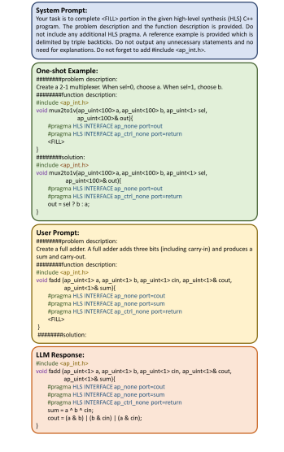
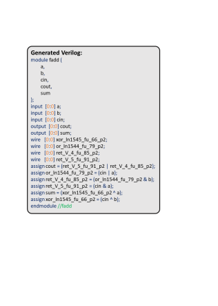
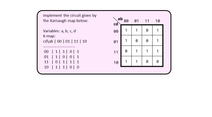

# 评估大型语言模型在高级综合中自动生成寄存器传输逻辑的能力

发布时间：2024年08月05日

`LLM应用` `硬件设计` `半导体`

> Evaluating Large Language Models for Automatic Register Transfer Logic Generation via High-Level Synthesis

# 摘要

> 随着大型语言模型 (LLM) 的普及，它们在硬件设计和验证中的应用也日益增多。以往的研究尝试通过生成高质量的 Verilog RTL 描述来评估 LLM 自动化硬件设计的能力，但发现这些代码的功能正确性不足，难以实用。本文提出了一种两阶段流水线方法：首先由 LLM 自动生成适合高级综合 (HLS) 的 C++ 代码，再通过 HLS 转换为 Verilog RTL。我们利用开源数据集和行业级 LLM 进行了实验，结果显示，我们的方法在功能正确性上显著优于传统直接生成 Verilog 的技术，pass@1 指标达到了 0.86 分。

> The ever-growing popularity of large language models (LLMs) has resulted in their increasing adoption for hardware design and verification. Prior research has attempted to assess the capability of LLMs to automate digital hardware design by producing superior-quality Register Transfer Logic (RTL) descriptions, particularly in Verilog. However, these tests have revealed that Verilog code production using LLMs at current state-of-the-art lack sufficient functional correctness to be practically viable, compared to automatic generation of programs in general-purpose programming languages such as C, C++, Python, etc. With this as the key insight, in this paper we assess the performance of a two-stage software pipeline for automated Verilog RTL generation: LLM based automatic generation of annotated C++ code suitable for high-level synthesis (HLS), followed by HLS to generate Verilog RTL. We have benchmarked the performance of our proposed scheme using the open-source VerilogEval dataset, for four different industry-scale LLMs, and the Vitis HLS tool. Our experimental results demonstrate that our two-step technique substantially outperforms previous proposed techniques of direct Verilog RTL generation by LLMs in terms of average functional correctness rates, reaching score of 0.86 in pass@1 metric.

[Arxiv](https://arxiv.org/abs/2408.02793)