# 探索从 LLM 到基于 LLM 的软件工程代理的现状、挑战与未来展望

发布时间：2024年08月05日

`Agent` `软件工程` `人工智能`

> From LLMs to LLM-based Agents for Software Engineering: A Survey of Current, Challenges and Future

# 摘要

> 随着大型语言模型（LLMs）的兴起，其在软件工程等垂直领域的应用探索日益增多。LLMs 在代码生成和漏洞检测等领域取得了显著成就，但也存在诸多局限。基于 LLM 的代理技术，作为一种具备人工通用智能（AGI）潜力的新兴技术，通过将 LLMs 作为核心进行决策和行动，有效弥补了 LLMs 在自主性和自我改进方面的不足。尽管已有研究探讨 LLMs 在软件工程中的应用，但 LLMs 与基于 LLM 的代理之间的界限仍不清晰。目前，对于在特定领域将 LLM 解决方案认证为基于 LLM 的代理，统一标准和基准测试尚处于起步阶段。本调查广泛探讨了 LLMs 及基于 LLM 的代理在软件工程中的实践与解决方案，特别聚焦于需求工程、代码生成、自主决策、软件设计、测试生成和软件维护六大关键主题。我们深入分析了 LLMs 与基于 LLM 的代理在这些主题上的工作差异，并探讨了它们在任务、基准和评估指标上的异同。最后，我们全面评估了所用模型和基准在软件工程中的应用效果，期待本研究能为未来推动软件工程中基于 LLM 的代理技术发展提供新的视角。

> With the rise of large language models (LLMs), researchers are increasingly exploring their applications in var ious vertical domains, such as software engineering. LLMs have achieved remarkable success in areas including code generation and vulnerability detection. However, they also exhibit numerous limitations and shortcomings. LLM-based agents, a novel tech nology with the potential for Artificial General Intelligence (AGI), combine LLMs as the core for decision-making and action-taking, addressing some of the inherent limitations of LLMs such as lack of autonomy and self-improvement. Despite numerous studies and surveys exploring the possibility of using LLMs in software engineering, it lacks a clear distinction between LLMs and LLM based agents. It is still in its early stage for a unified standard and benchmarking to qualify an LLM solution as an LLM-based agent in its domain. In this survey, we broadly investigate the current practice and solutions for LLMs and LLM-based agents for software engineering. In particular we summarise six key topics: requirement engineering, code generation, autonomous decision-making, software design, test generation, and software maintenance. We review and differentiate the work of LLMs and LLM-based agents from these six topics, examining their differences and similarities in tasks, benchmarks, and evaluation metrics. Finally, we discuss the models and benchmarks used, providing a comprehensive analysis of their applications and effectiveness in software engineering. We anticipate this work will shed some lights on pushing the boundaries of LLM-based agents in software engineering for future research.

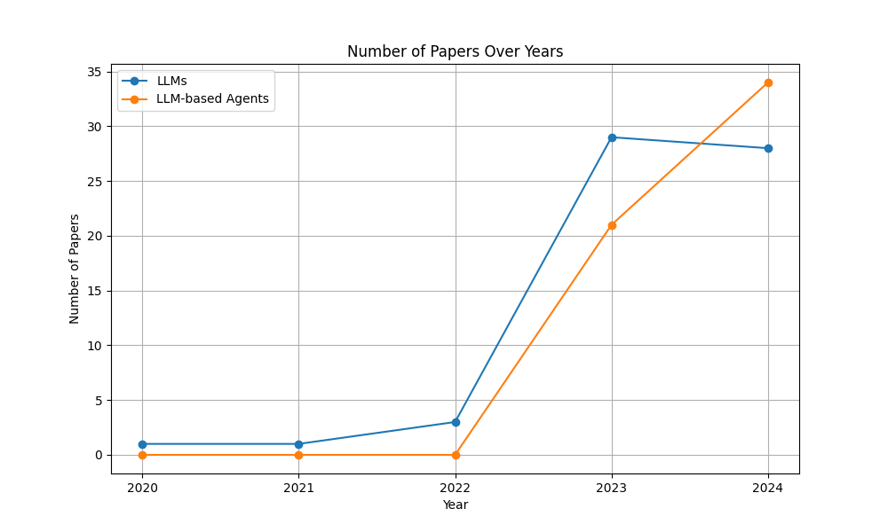

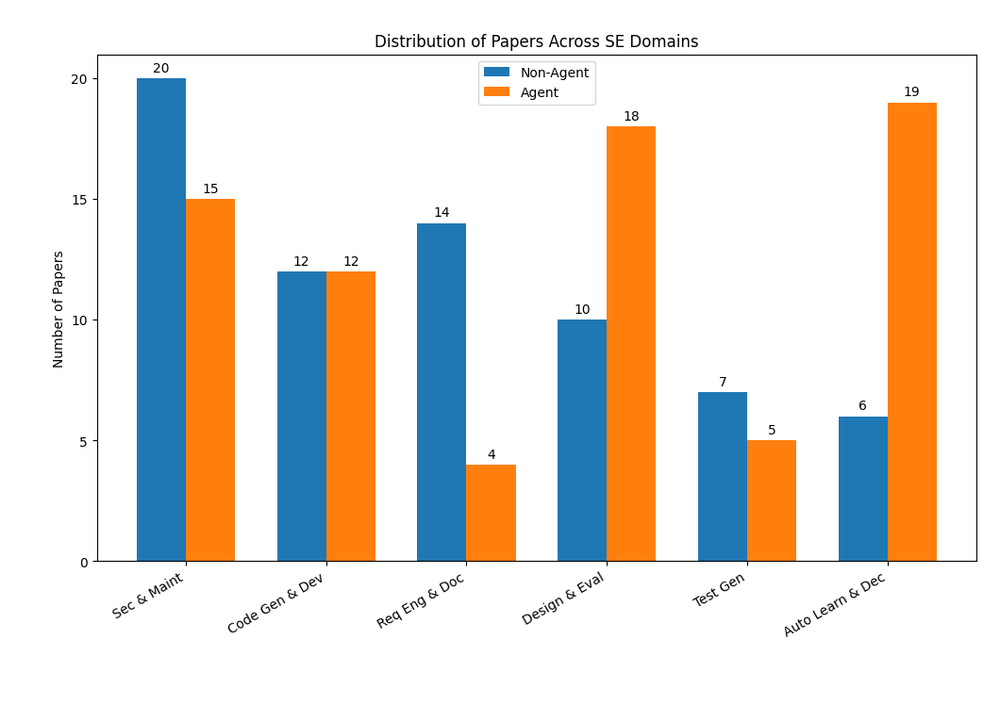

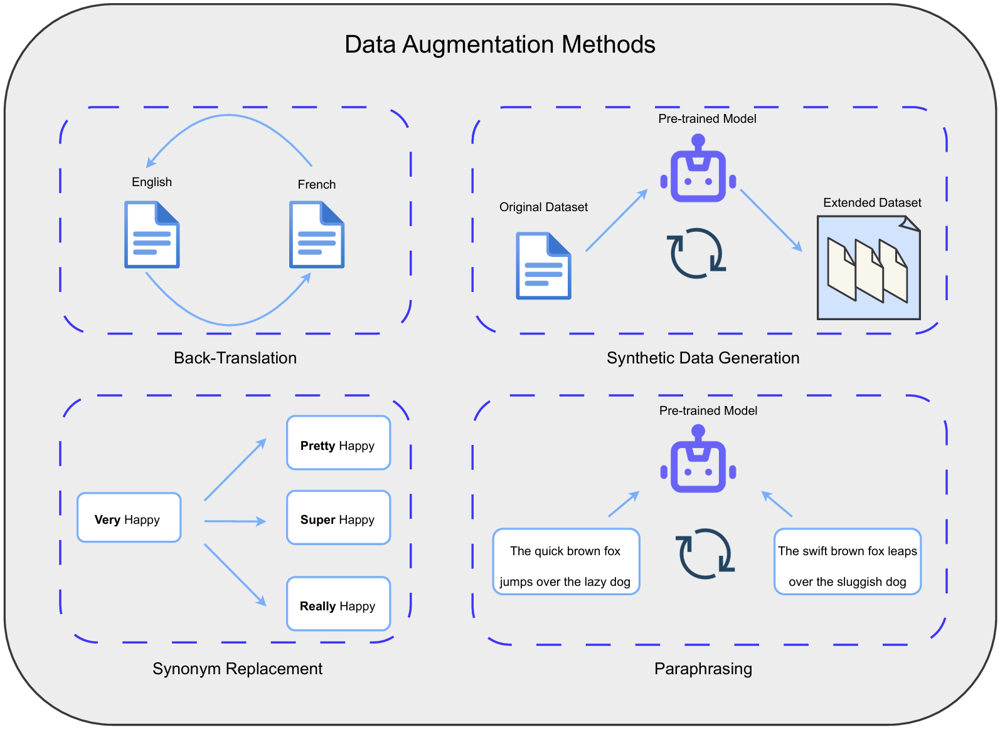

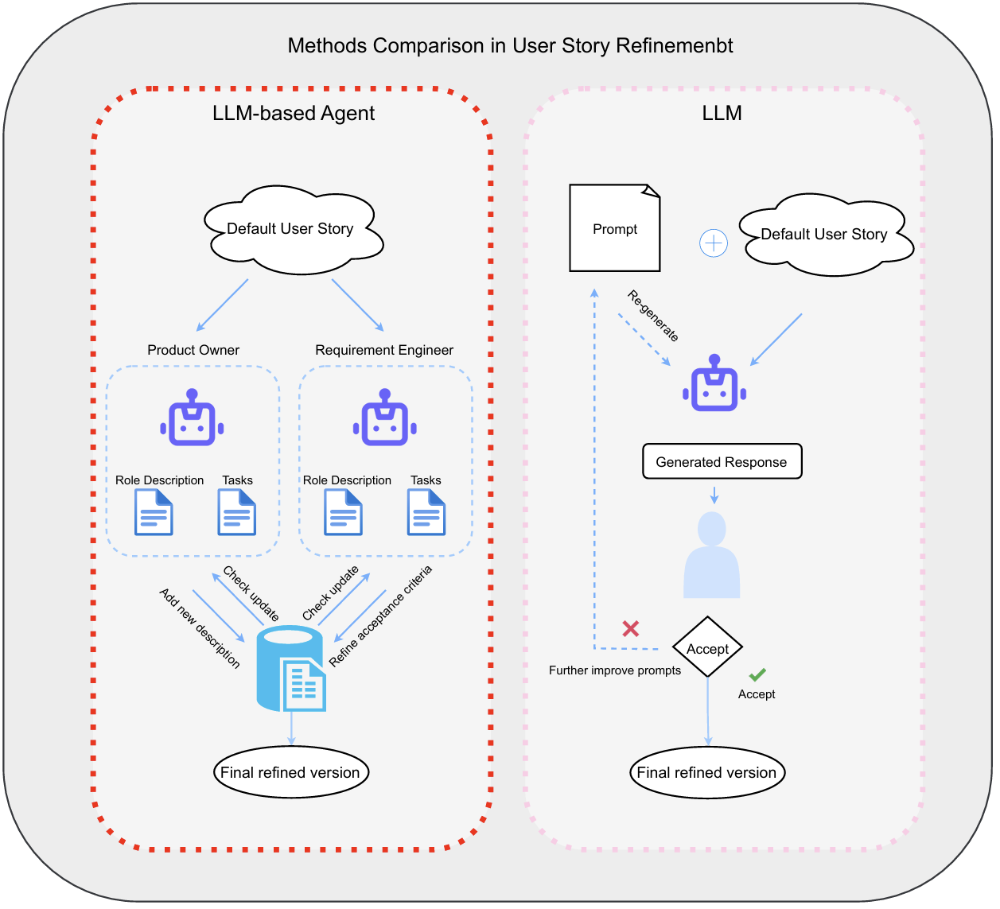

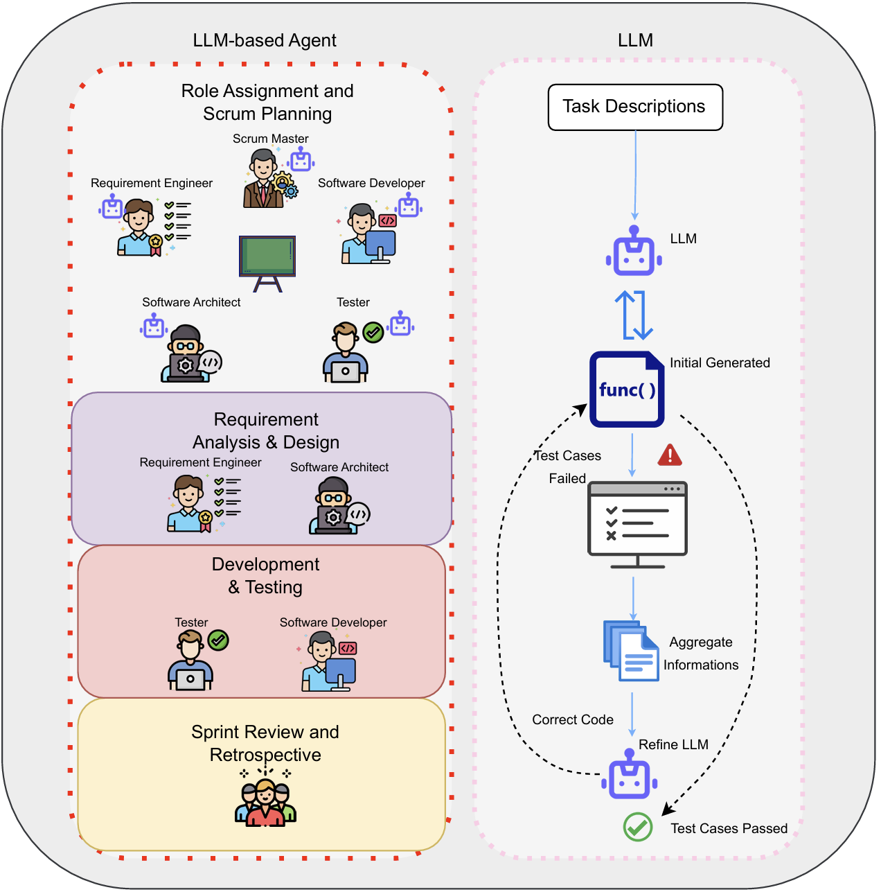

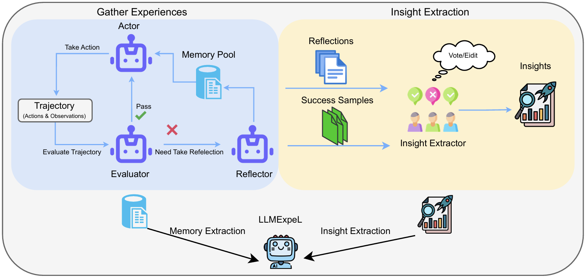

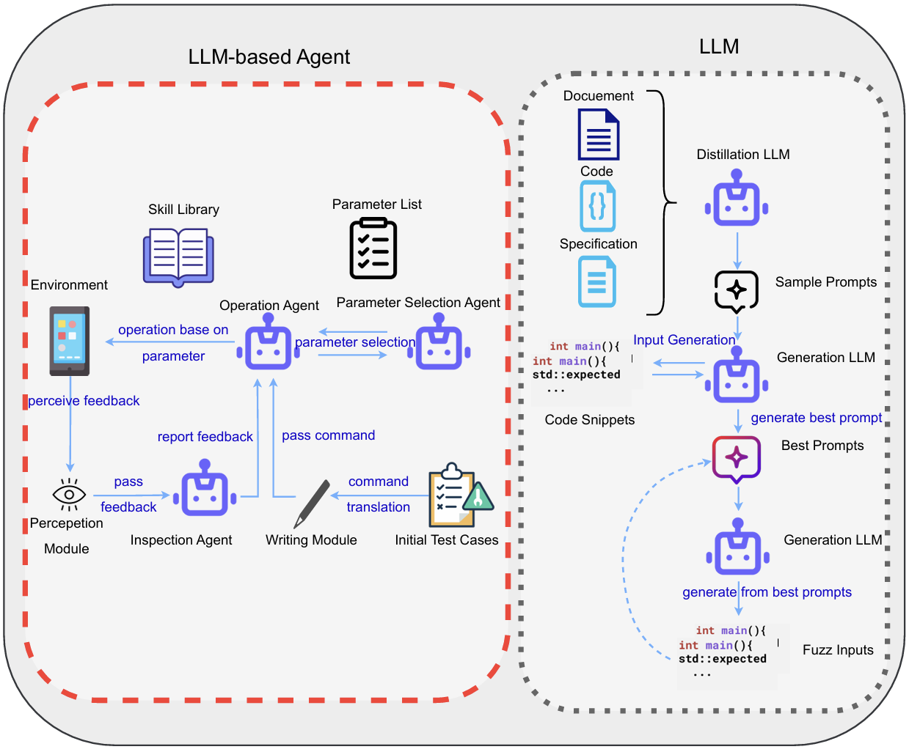

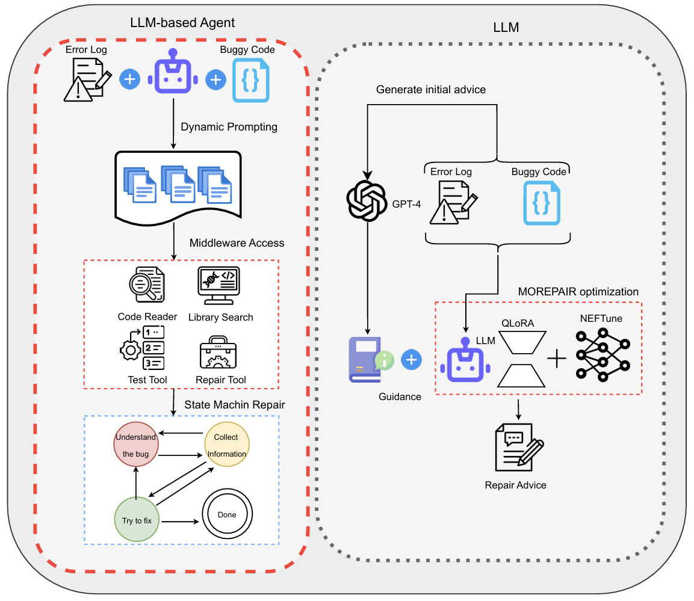

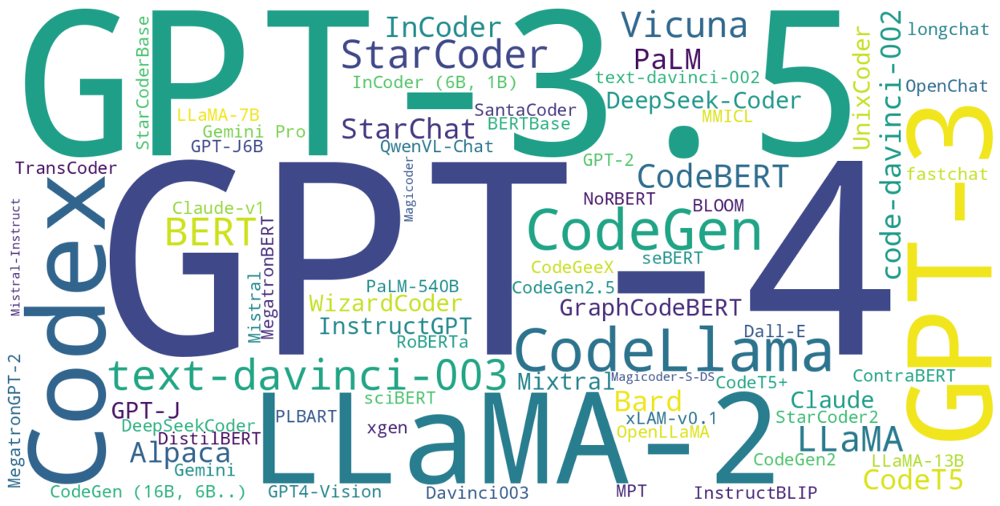

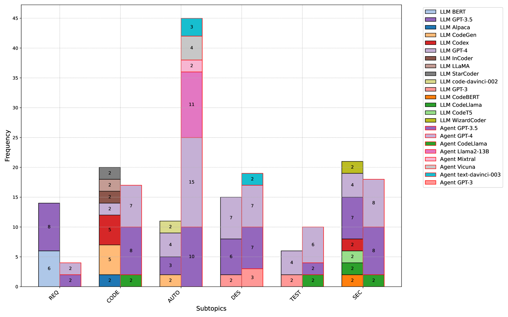

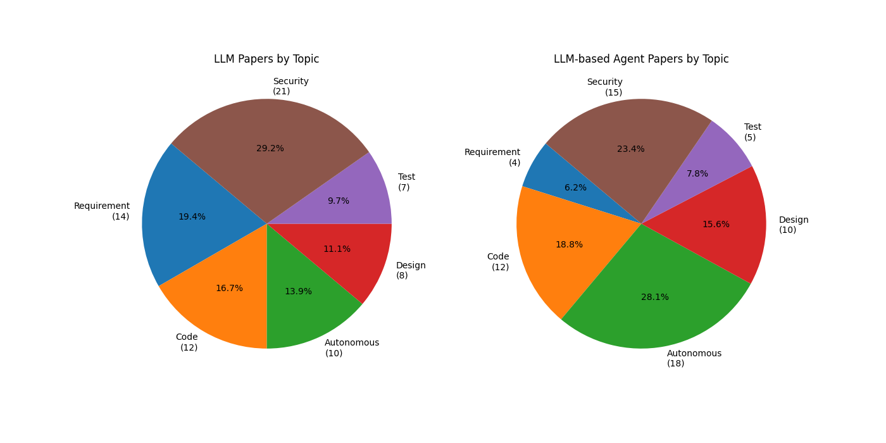

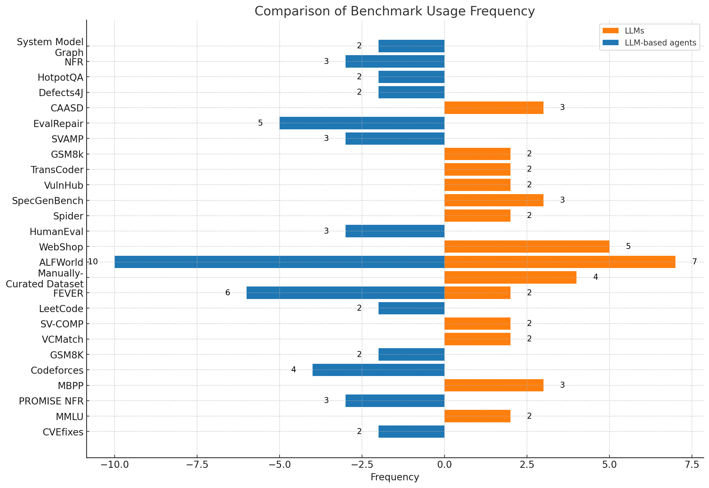

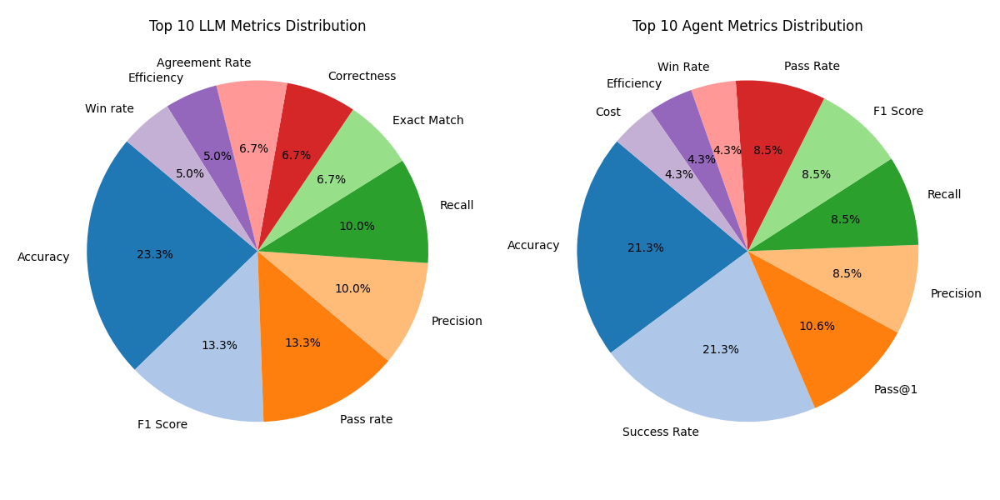

[Arxiv](https://arxiv.org/abs/2408.02479)