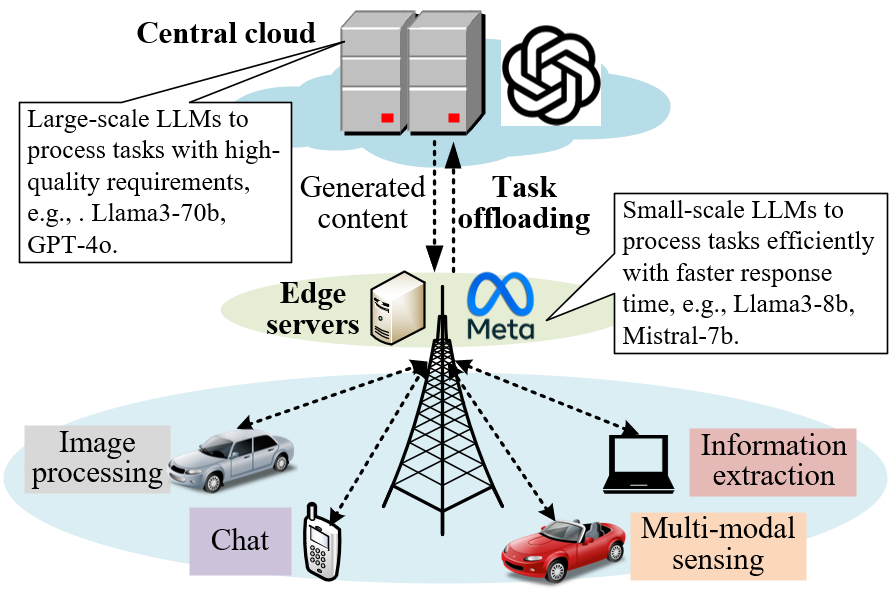
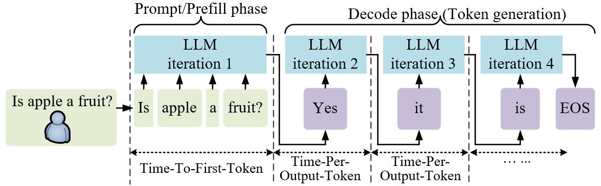
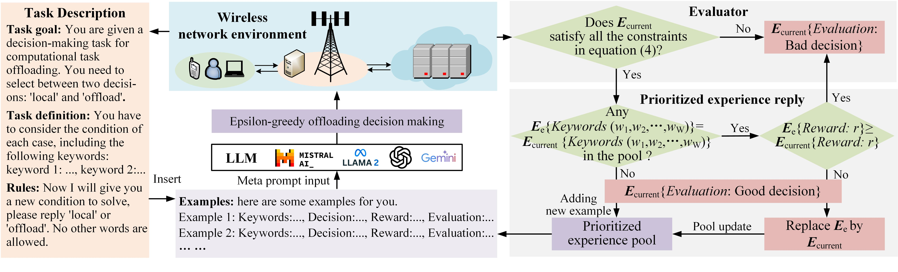
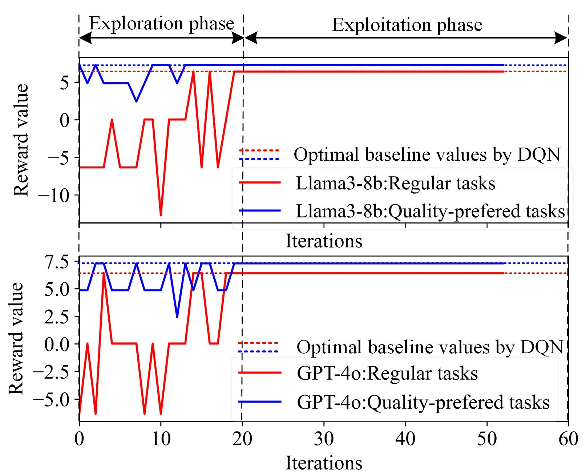
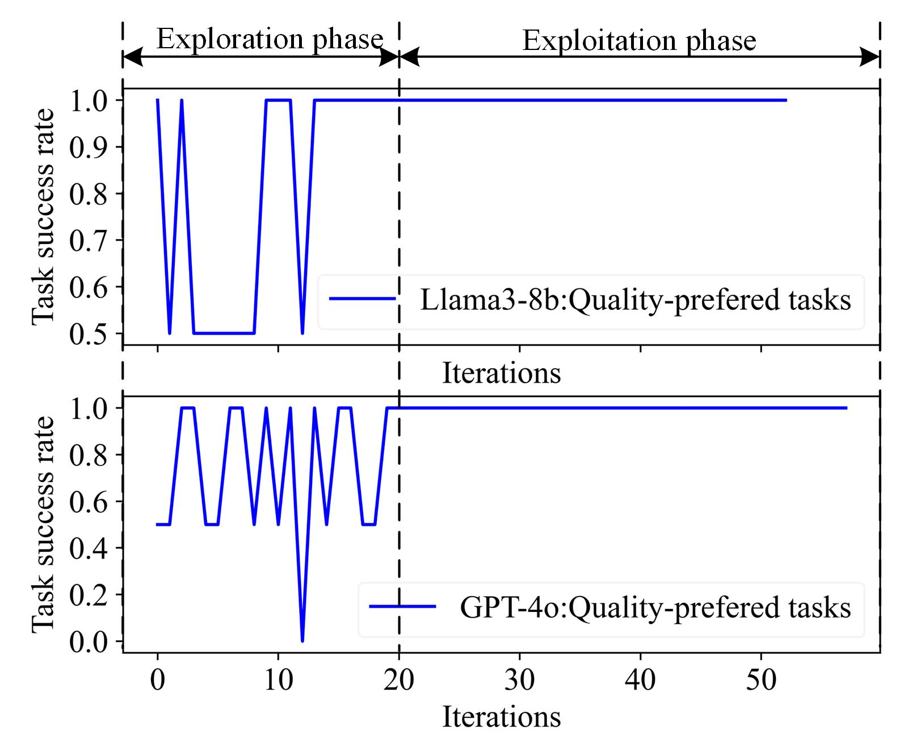
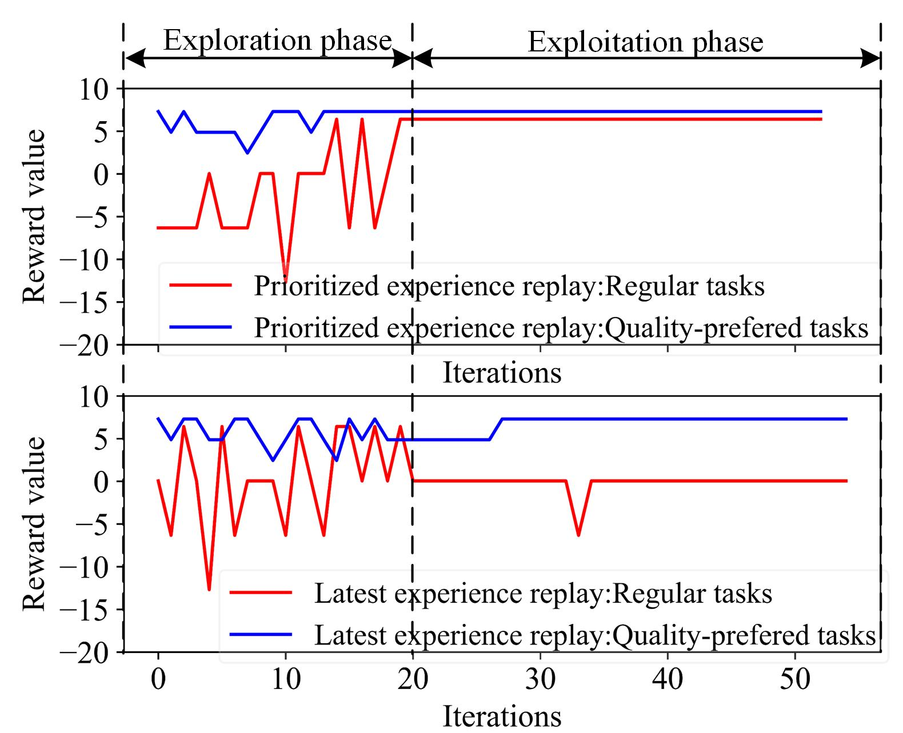
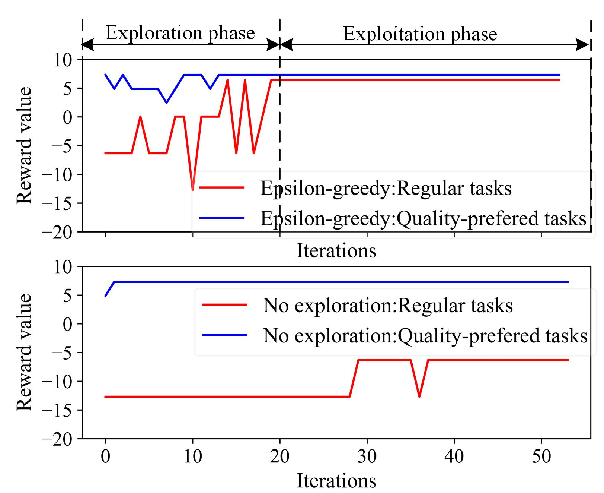
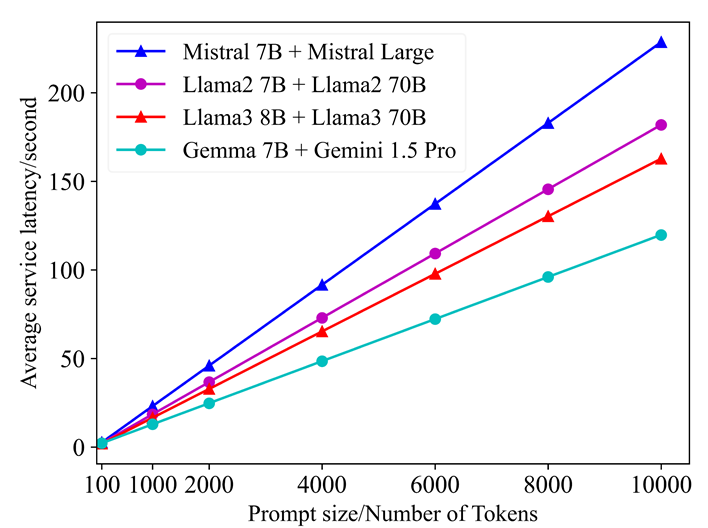
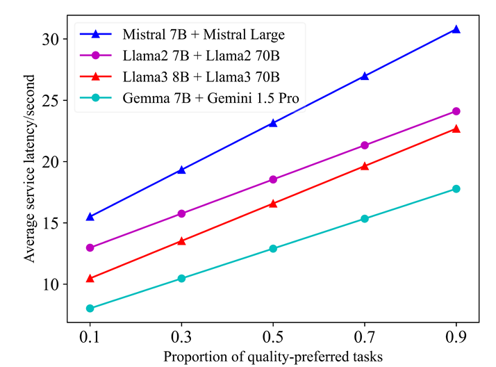

# 6G 边缘-云环境下的生成式 AI 服务：利用上下文学习实现生成任务的智能卸载

发布时间：2024年08月05日

`LLM应用` `人工智能`

> Generative AI as a Service in 6G Edge-Cloud: Generation Task Offloading by In-context Learning

# 摘要

> 生成式人工智能 (GAI) 是迈向 6G 网络的希望之星，大型语言模型 (LLM) 等生成式基础模型已引起学术界和电信行业的广泛关注。本研究探索了 6G 网络中基础模型的一种创新边缘-云部署策略，旨在通过无线资源分配和任务卸载来降低服务延迟，即将多样化的内容生成任务分配至网络边缘或云端的合适 LLM。我们首先构建了通信系统模型，确保无线资源分配和链路容量计算支持生成内容的传输，随后提出 LLM 推理模型来评估内容生成延迟。此外，我们创新性地引入了一种 in-context 学习方法，优化任务卸载决策，充分利用 LLM 的推理能力，同时避免了传统机器学习算法中模型训练或微调的复杂性。仿真结果证实，这种边缘-云部署结合 in-context 学习任务卸载的方法，无需额外模型训练或微调，即可提供高质量的内容生成服务。

> Generative artificial intelligence (GAI) is a promising technique towards 6G networks, and generative foundation models such as large language models (LLMs) have attracted considerable interest from academia and telecom industry. This work considers a novel edge-cloud deployment of foundation models in 6G networks. Specifically, it aims to minimize the service delay of foundation models by radio resource allocation and task offloading, i.e., offloading diverse content generation tasks to proper LLMs at the network edge or cloud. In particular, we first introduce the communication system model, i.e., allocating radio resources and calculating link capacity to support generated content transmission, and then we present the LLM inference model to calculate the delay of content generation. After that, we propose a novel in-context learning method to optimize the task offloading decisions. It utilizes LLM's inference capabilities, and avoids the difficulty of dedicated model training or fine-tuning as in conventional machine learning algorithms. Finally, the simulations demonstrate that the proposed edge-cloud deployment and in-context learning task offloading method can achieve satisfactory generation service quality without dedicated model training or fine-tuning.

[Arxiv](https://arxiv.org/abs/2408.02549)