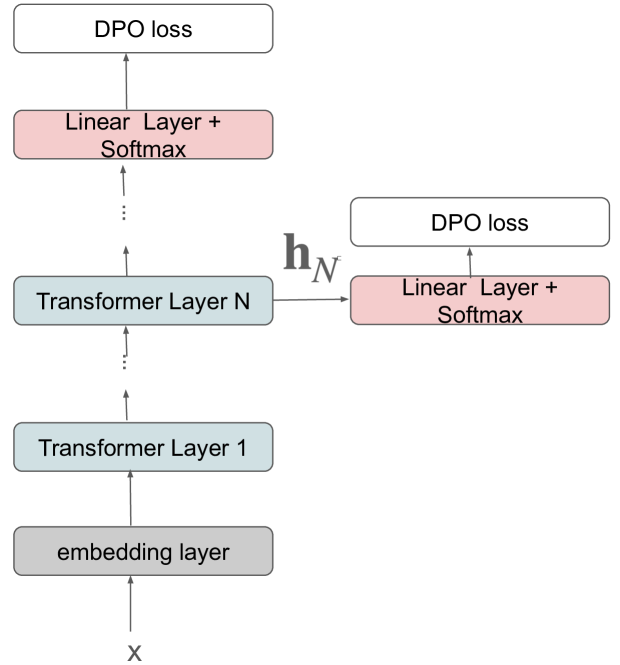
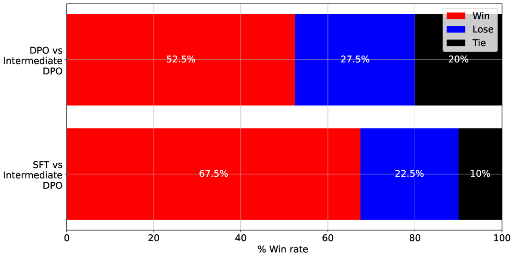
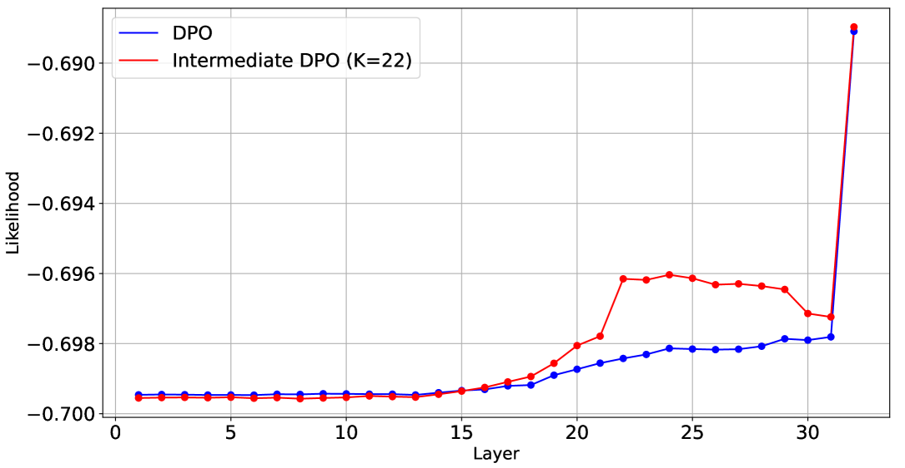

# 中间层直接偏好优化

发布时间：2024年08月05日

`LLM理论` `人工智能` `机器学习`

> Intermediate direct preference optimization

# 摘要

> 我们创新性地提出了中间层直接偏好优化（DPO）方法，通过在选定的中间层计算DPO损失，为大型语言模型（LLM）的微调提供辅助。与传统方法不同，我们利用K个中间层的logits计算并平均DPO损失，形成中间DPO损失，进而通过加权求和得到最终训练损失。实验表明，基于第22层的中间DPO损失训练的模型，在ultrafeedback数据集上，分别以52.5%和67.5%的胜率超越了传统DPO和SFT模型，显著验证了该方法的有效性。同时，我们还揭示了中间层选择、层数与模型性能之间的关联。

> We propose the intermediate direct preference optimization (DPO) method to calculate the DPO loss at selected intermediate layers as an auxiliary loss for finetuning large language models (LLMs). The conventional DPO method fine-tunes a supervised fine-tuning (SFT) model by calculating the DPO loss using logits from the final layer. In our intermediate DPO approach, DPO losses are calculated using the logits from K-selected intermediate layers and averaged to obtain the intermediate DPO loss. For training the intermediate DPO model, the final loss is obtained by calculating the weighted sum of the DPO and intermediate DPO losses. During inference, the intermediate DPO model decodes using the final layer logits similarly to the conventional DPO model. In experiments using the ultrafeedback dataset, the performance of the intermediate DPO model was evaluated using GPT-4. As a result, the intermediate DPO model trained using the intermediate DPO loss calculated at the 22nd layer of a 32-layer SFT model achieved win rates of 52.5% and 67.5% against the conventional DPO and SFT models, respectively, demonstrating the effectiveness of the proposed method. Furthermore, we report the relationships among the position of the selected intermediate layers, the number of layers, and performance.

[Arxiv](https://arxiv.org/abs/2408.02923)