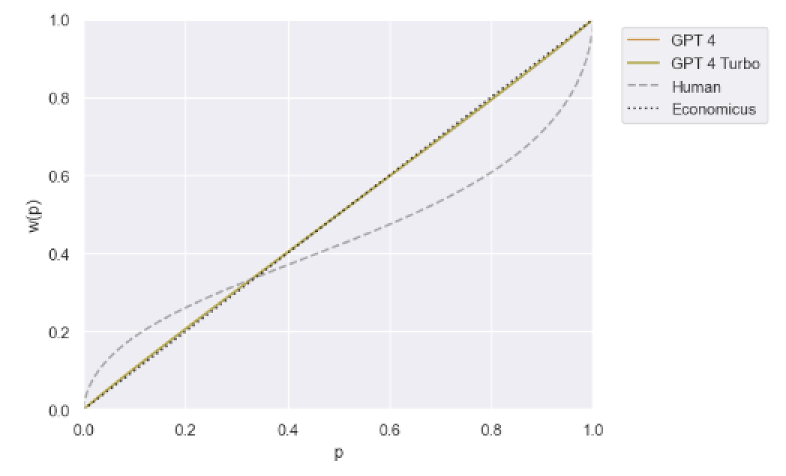

# LLM 是经济人吗？通过效用理论揭示 LLMs 的行为偏差

发布时间：2024年08月05日

`LLM理论` `经济学` `人工智能`

> LLM economicus? Mapping the Behavioral Biases of LLMs via Utility Theory

# 摘要

> 人类并非完全理性，常因损失厌恶、锚定等偏差做出非最优决策。这些偏差若潜藏于LLM训练数据中，LLM是否也会受其影响？理解LLM的这些偏差对辅助人类决策至关重要。我们采用效用理论——现代经济学的核心——来评估LLM的经济偏差。该理论能量化并对比经济行为与理性或人类行为等基准。我们分析了多种LLM，发现它们的经济行为介于人类与理性之间，且多数在不同情境下难以保持一致。此外，我们展示了如何通过提示等干预措施来衡量其对经济偏差的影响。

> Humans are not homo economicus (i.e., rational economic beings). As humans, we exhibit systematic behavioral biases such as loss aversion, anchoring, framing, etc., which lead us to make suboptimal economic decisions. Insofar as such biases may be embedded in text data on which large language models (LLMs) are trained, to what extent are LLMs prone to the same behavioral biases? Understanding these biases in LLMs is crucial for deploying LLMs to support human decision-making. We propose utility theory-a paradigm at the core of modern economic theory-as an approach to evaluate the economic biases of LLMs. Utility theory enables the quantification and comparison of economic behavior against benchmarks such as perfect rationality or human behavior. To demonstrate our approach, we quantify and compare the economic behavior of a variety of open- and closed-source LLMs. We find that the economic behavior of current LLMs is neither entirely human-like nor entirely economicus-like. We also find that most current LLMs struggle to maintain consistent economic behavior across settings. Finally, we illustrate how our approach can measure the effect of interventions such as prompting on economic biases.

[Arxiv](https://arxiv.org/abs/2408.02784)