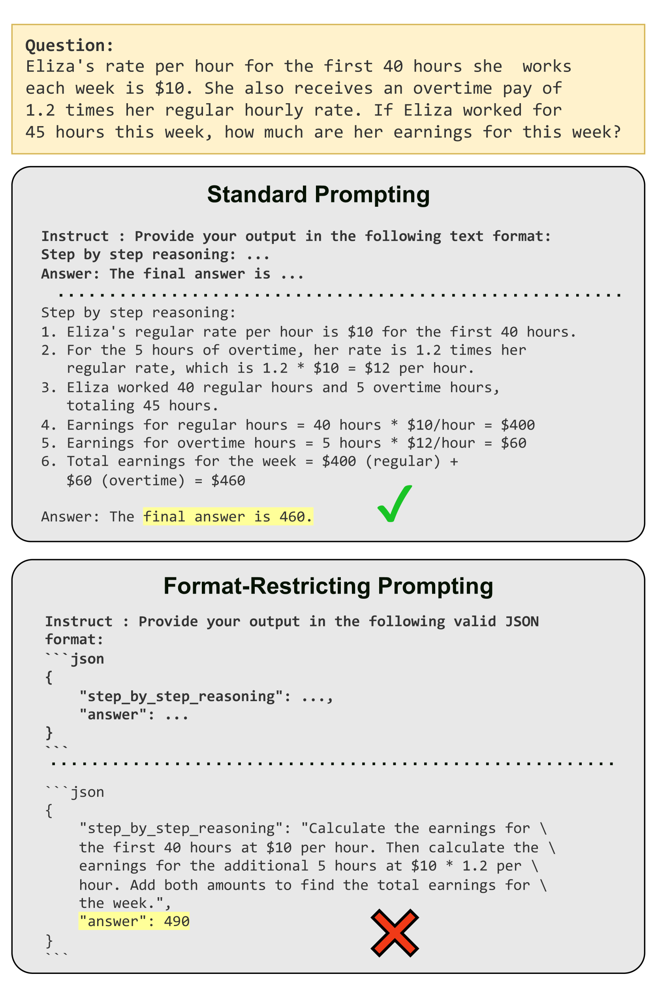
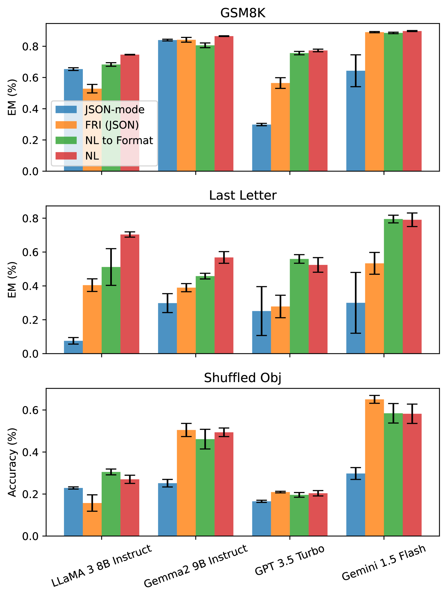
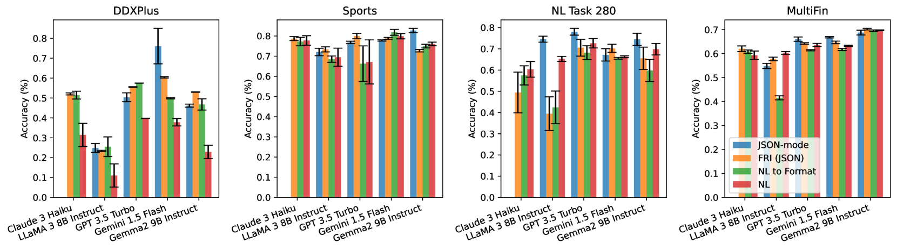
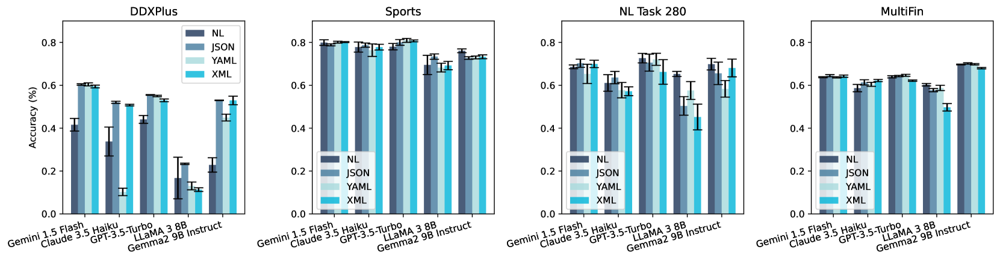
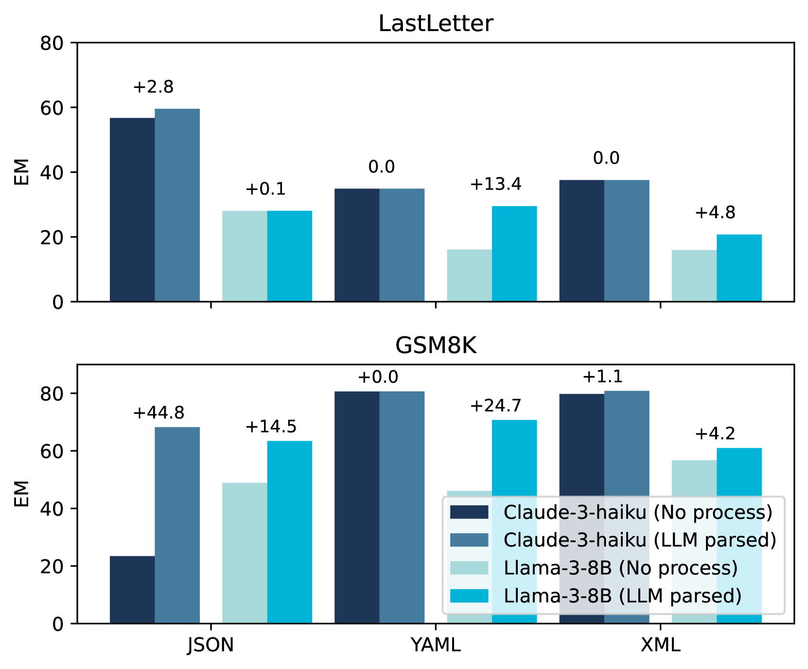
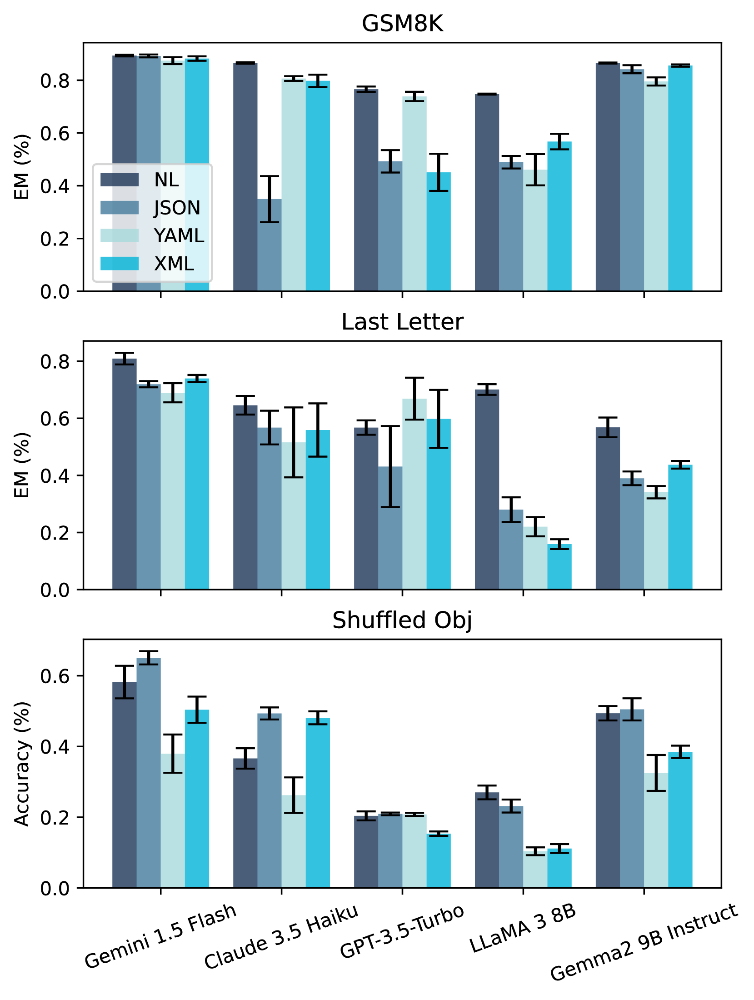
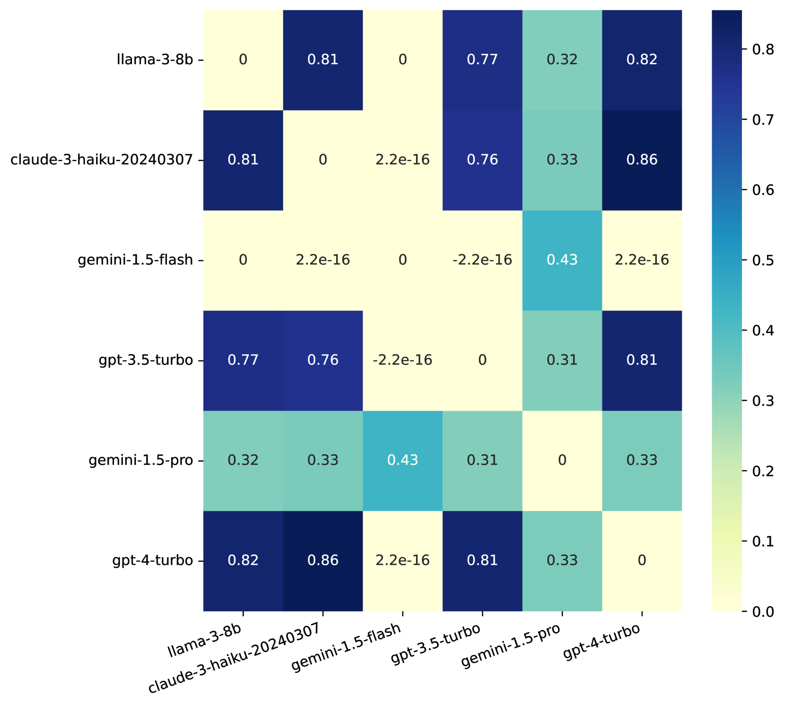
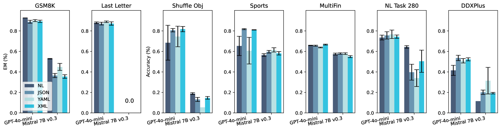

# 自由表达之难：探究格式限制如何影响大型语言模型的表现

发布时间：2024年08月05日

`LLM理论` `人工智能`

> Let Me Speak Freely? A Study on the Impact of Format Restrictions on Performance of Large Language Models

# 摘要

> 结构化生成在现实应用中广泛用于从LLM中提取关键信息，但本研究揭示了这种约束对LLM能力的潜在影响。我们对比了LLM在遵守结构化格式与自由生成时的表现，发现格式限制显著削弱了其推理能力。更严格的格式约束往往加剧了这一性能下降。这一发现为我们理解LLM在受限环境下的表现提供了新的视角。

> 
Abstract:Structured generation, the process of producing content in standardized formats like JSON and XML, is widely utilized in real-world applications to extract key output information from large language models (LLMs). This study investigates whether such constraints on generation space impact LLMs' abilities, including reasoning and domain knowledge comprehension. Specifically, we evaluate LLMs' performance when restricted to adhere to structured formats versus generating free-form responses across various common tasks. Surprisingly, we observe a significant decline in LLMs' reasoning abilities under format restrictions. Furthermore, we find that stricter format constraints generally lead to greater performance degradation in reasoning tasks.
    

[Arxiv](https://arxiv.org//pdf/2408.02442)