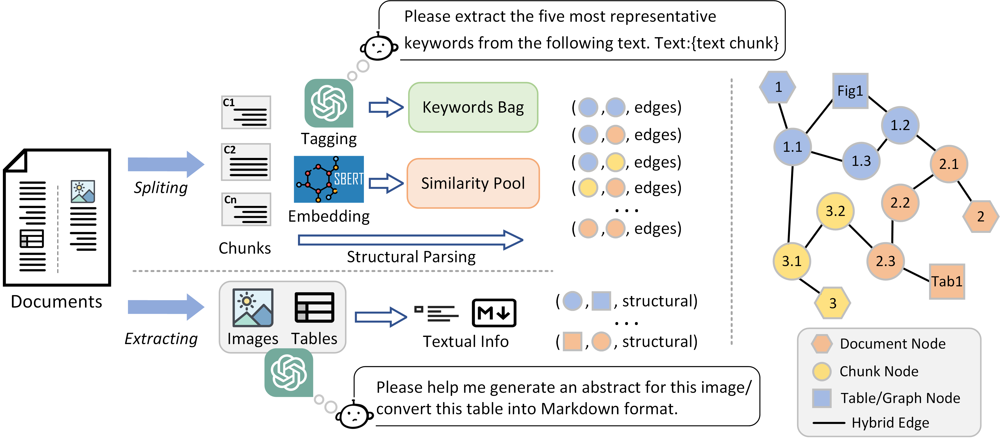
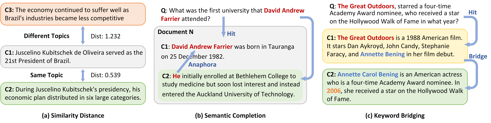
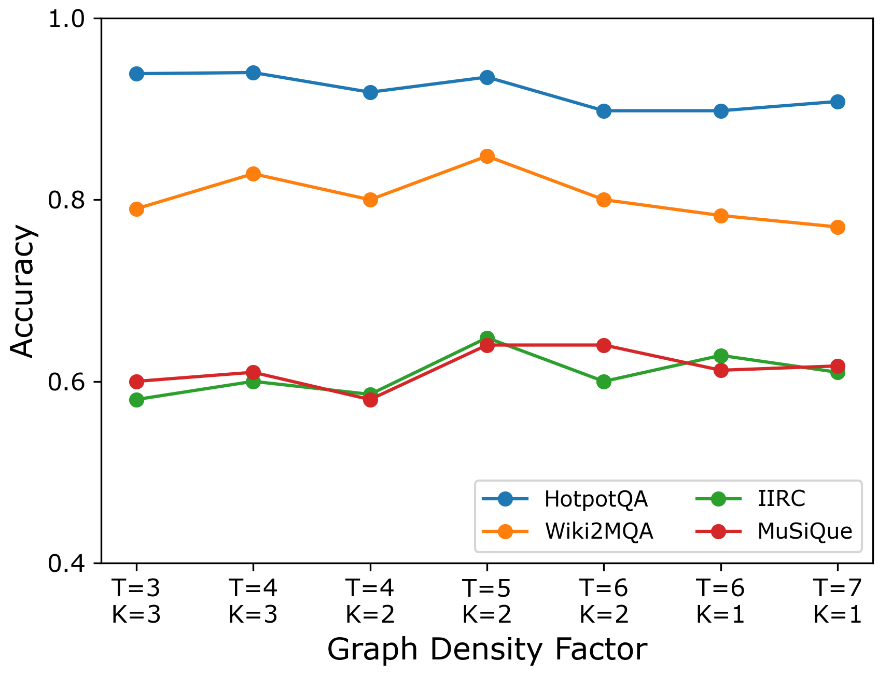
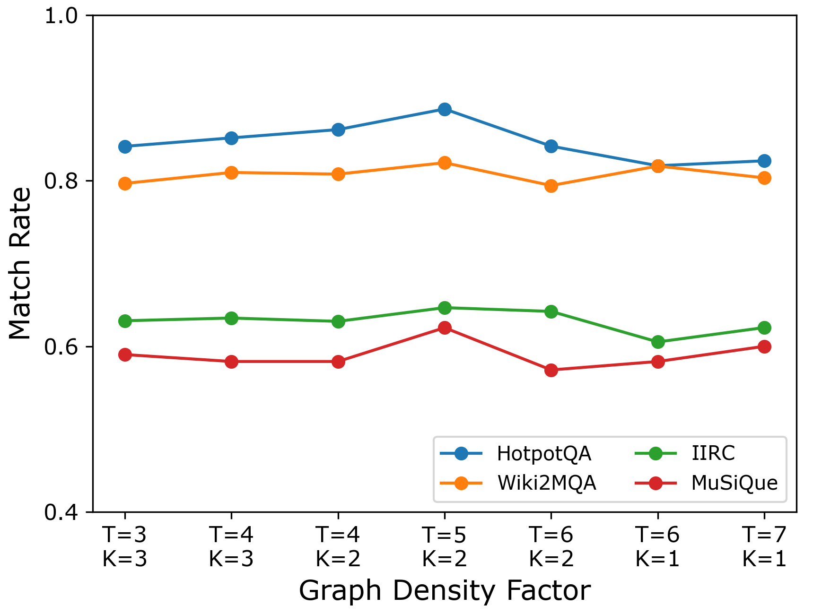

# 通过挖掘大型语言模型问答系统中的块间交互，我们旨在提升检索效率。

发布时间：2024年08月05日

`RAG` `问答系统` `人工智能`

> Leveraging Inter-Chunk Interactions for Enhanced Retrieval in Large Language Model-Based Question Answering

# 摘要

> 为了提升问答任务的性能，我们提出了一种新的检索框架IIER，通过利用Inter-chunk Interactions来增强检索效果。该框架通过结构、关键词和语义三种交互方式，捕捉文档块间的内在联系，并构建统一的Chunk-Interaction图来全面表示外部文档。此外，我们设计了一个基于图的证据链检索器，通过利用先前的路径和块交互来指导检索过程，从而细化上下文和推理链，助力大型语言模型进行更精准的推理和答案生成。实验结果显示，IIER在四个数据集上均超越了现有基线，显著提升了检索和推理能力。

> Retrieving external knowledge and prompting large language models with relevant information is an effective paradigm to enhance the performance of question-answering tasks. Previous research typically handles paragraphs from external documents in isolation, resulting in a lack of context and ambiguous references, particularly in multi-document and complex tasks. To overcome these challenges, we propose a new retrieval framework IIER, that leverages Inter-chunk Interactions to Enhance Retrieval. This framework captures the internal connections between document chunks by considering three types of interactions: structural, keyword, and semantic. We then construct a unified Chunk-Interaction Graph to represent all external documents comprehensively. Additionally, we design a graph-based evidence chain retriever that utilizes previous paths and chunk interactions to guide the retrieval process. It identifies multiple seed nodes based on the target question and iteratively searches for relevant chunks to gather supporting evidence. This retrieval process refines the context and reasoning chain, aiding the large language model in reasoning and answer generation. Extensive experiments demonstrate that IIER outperforms strong baselines across four datasets, highlighting its effectiveness in improving retrieval and reasoning capabilities.

[Arxiv](https://arxiv.org/abs/2408.02907)