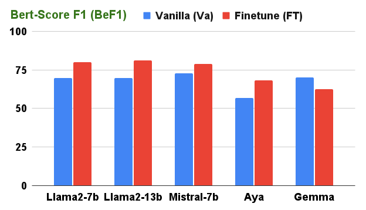

# 借助 LLM 的强大能力，我们提出了一种微调方法，旨在实现高质量的基于方面的总结。

发布时间：2024年08月05日

`LLM应用` `信息提取`

> Leveraging the Power of LLMs: A Fine-Tuning Approach for High-Quality Aspect-Based Summarization

# 摘要

> 随着数字信息的激增，用户急需从冗长文档中高效提取关键信息的方法。基于方面的摘要技术应运而生，专注于生成特定内容的摘要。尽管该领域研究不断进步，但提升模型性能仍是持续的挑战。鉴于大型语言模型（LLMs）在自然语言处理领域的广泛应用，尤其是在摘要任务上的潜力，本文深入探讨了微调LLMs以优化基于方面摘要任务的可能性。我们针对开源基础LLMs（如Llama2、Mistral等）进行了微调，并在特定领域的公开数据集上评估其效果。我们预期，通过这种方法，模型能更精准地识别并提取与特定方面相关的信息，从而超越现有技术，生成更优质的摘要。为此，我们构建了一个全面的评估体系，对比了微调LLMs与传统方法及未微调模型的性能。我们的研究不仅展示了微调LLMs在生成高质量方面摘要上的有效性，也为NLP领域中利用LLMs进行精准信息提取的进一步研究奠定了基础。

> The ever-increasing volume of digital information necessitates efficient methods for users to extract key insights from lengthy documents. Aspect-based summarization offers a targeted approach, generating summaries focused on specific aspects within a document. Despite advancements in aspect-based summarization research, there is a continuous quest for improved model performance. Given that large language models (LLMs) have demonstrated the potential to revolutionize diverse tasks within natural language processing, particularly in the problem of summarization, this paper explores the potential of fine-tuning LLMs for the aspect-based summarization task. We evaluate the impact of fine-tuning open-source foundation LLMs, including Llama2, Mistral, Gemma and Aya, on a publicly available domain-specific aspect based summary dataset. We hypothesize that this approach will enable these models to effectively identify and extract aspect-related information, leading to superior quality aspect-based summaries compared to the state-of-the-art. We establish a comprehensive evaluation framework to compare the performance of fine-tuned LLMs against competing aspect-based summarization methods and vanilla counterparts of the fine-tuned LLMs. Our work contributes to the field of aspect-based summarization by demonstrating the efficacy of fine-tuning LLMs for generating high-quality aspect-based summaries. Furthermore, it opens doors for further exploration of using LLMs for targeted information extraction tasks across various NLP domains.

[Arxiv](https://arxiv.org/abs/2408.02584)