# MedTrinity-25M 是一个专为医学研究设计的大规模多模态数据集，包含多粒度注释，为医学领域的研究提供了丰富的资源。

发布时间：2024年08月05日

`LLM应用` `人工智能`

> MedTrinity-25M: A Large-scale Multimodal Dataset with Multigranular Annotations for Medicine

# 摘要

> 本文推出 MedTrinity-25M，一个涵盖 2500 万张图像、10 种模态的医学多模态数据集，对 65 种以上疾病进行多粒度标注。这些标注不仅包括全局文本信息（如疾病类型、模态描述），还有 ROI 的详细局部标注（如边界框、分割掩码）。我们首创自动化流程，生成图像-ROI-描述三元组，无需配对文本，从 90 个来源收集数据，用专家模型定位异常 ROI，构建知识库，引导多模态 LLM 进行检索增强生成，产出多粒度文本描述。MedTrinity-25M 的标注丰富度领先，支持字幕生成、分类、分割等多模态任务。预训练于此数据集的模型在 VQA-RAD 和 PathVQA 上表现卓越，超越现有方法。此数据集还助力多模态医学 AI 模型的大规模预训练，推动医学领域基础模型的发展。

> This paper introduces MedTrinity-25M, a comprehensive, large-scale multimodal dataset for medicine, covering over 25 million images across 10 modalities, with multigranular annotations for more than 65 diseases. These enriched annotations encompass both global textual information, such as disease/lesion type, modality, region-specific descriptions, and inter-regional relationships, as well as detailed local annotations for regions of interest (ROIs), including bounding boxes, segmentation masks. Unlike existing approach which is limited by the availability of image-text pairs, we have developed the first automated pipeline that scales up multimodal data by generating multigranular visual and texual annotations (in the form of image-ROI-description triplets) without the need for any paired text descriptions. Specifically, data from over 90 different sources have been collected, preprocessed, and grounded using domain-specific expert models to identify ROIs related to abnormal regions. We then build a comprehensive knowledge base and prompt multimodal large language models to perform retrieval-augmented generation with the identified ROIs as guidance, resulting in multigranular texual descriptions. Compared to existing datasets, MedTrinity-25M provides the most enriched annotations, supporting a comprehensive range of multimodal tasks such as captioning and report generation, as well as vision-centric tasks like classification and segmentation. Pretraining on MedTrinity-25M, our model achieves state-of-the-art performance on VQA-RAD and PathVQA, surpassing both multimodal large language models and other representative SoTA approaches. This dataset can also be utilized to support large-scale pre-training of multimodal medical AI models, contributing to the development of future foundation models in the medical domain.

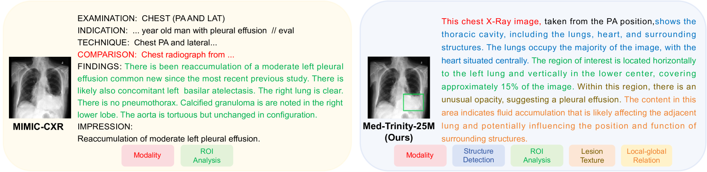

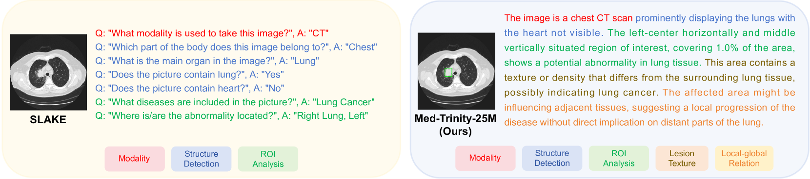

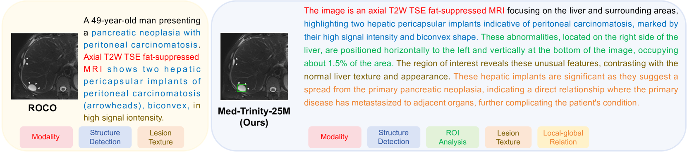

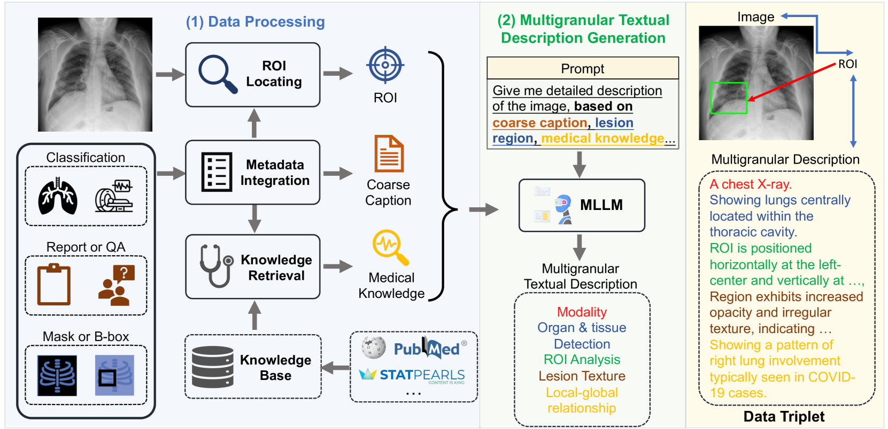

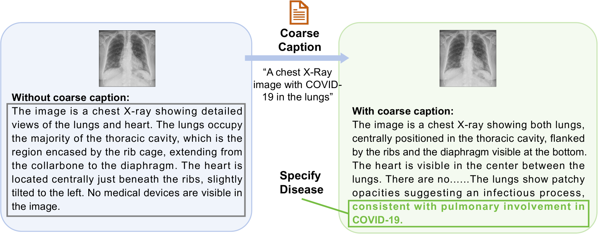

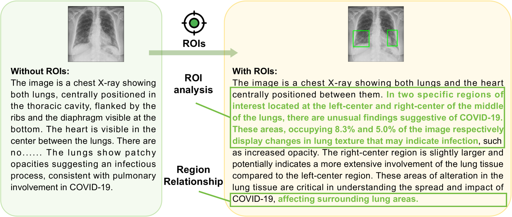

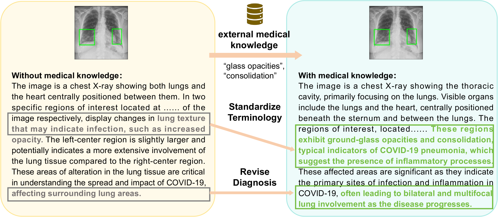

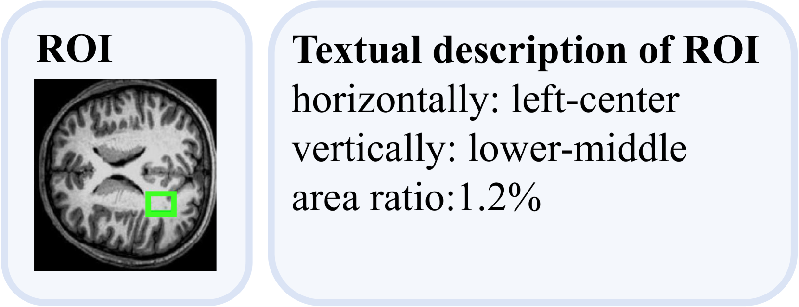

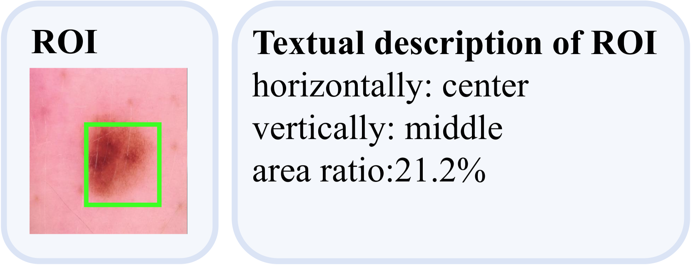

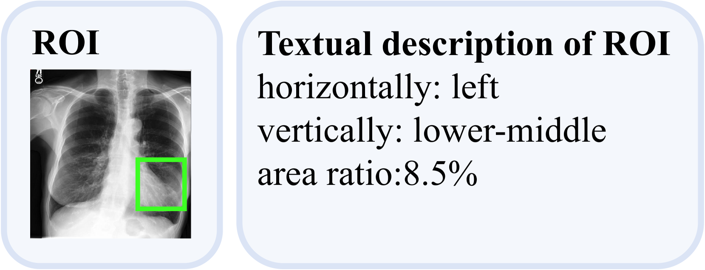

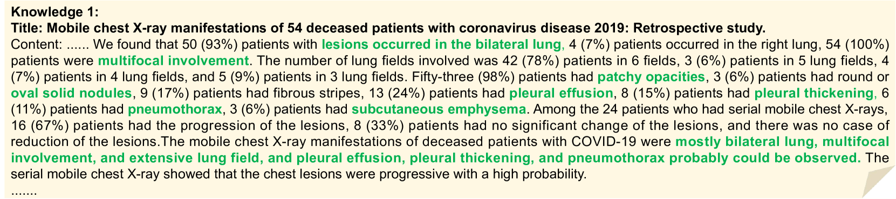

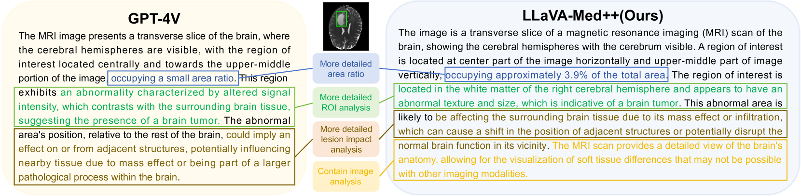

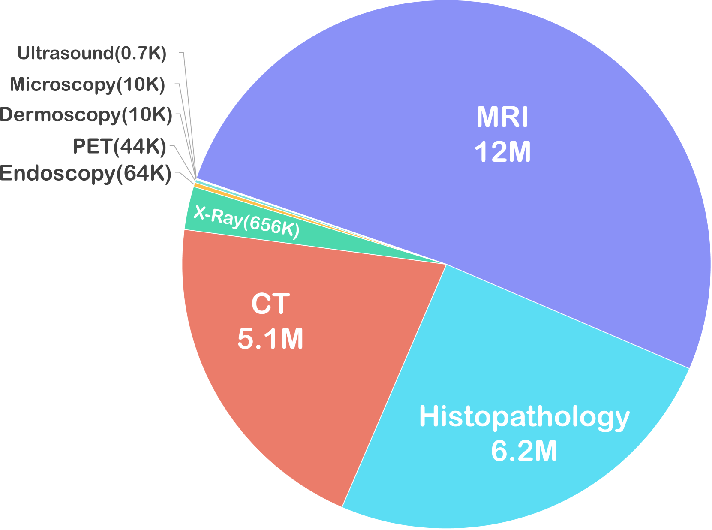

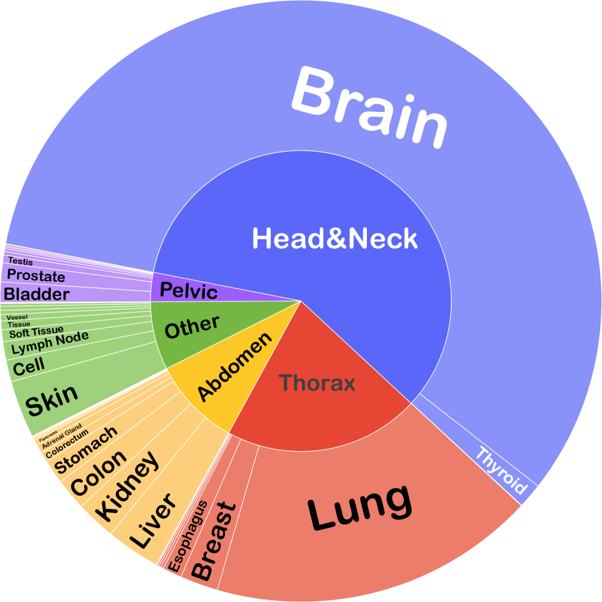

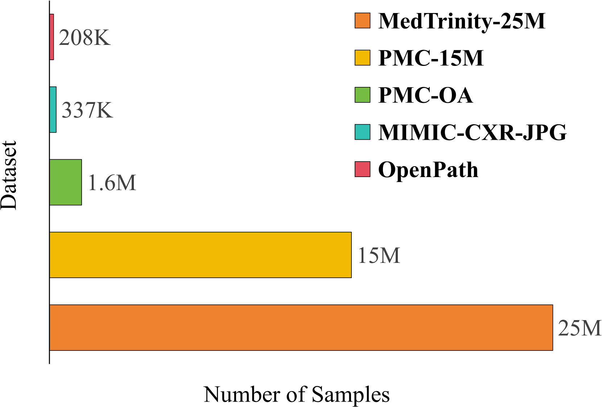

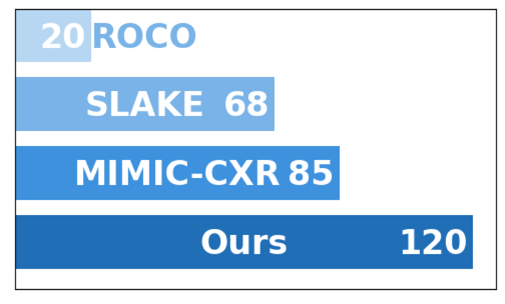

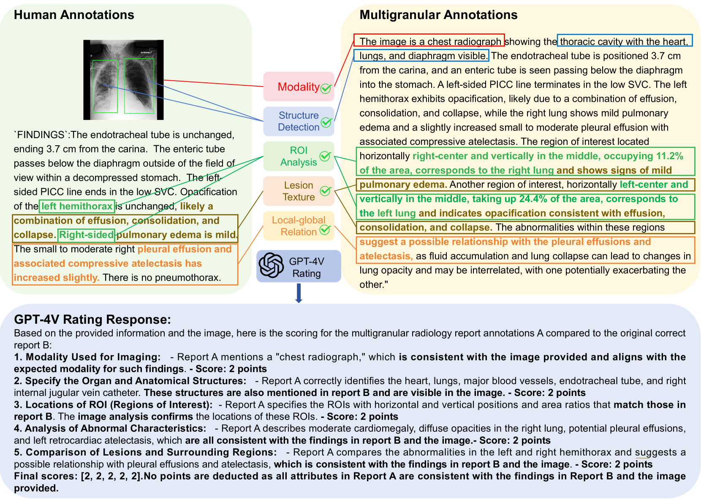

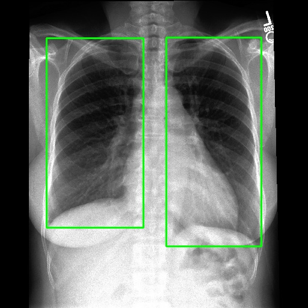

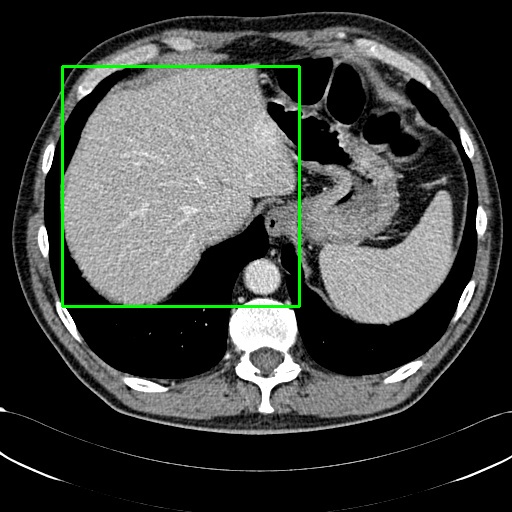

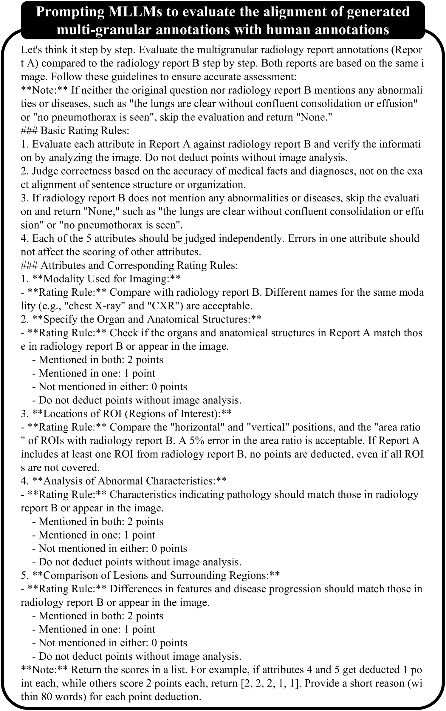

[Arxiv](https://arxiv.org/abs/2408.02900)